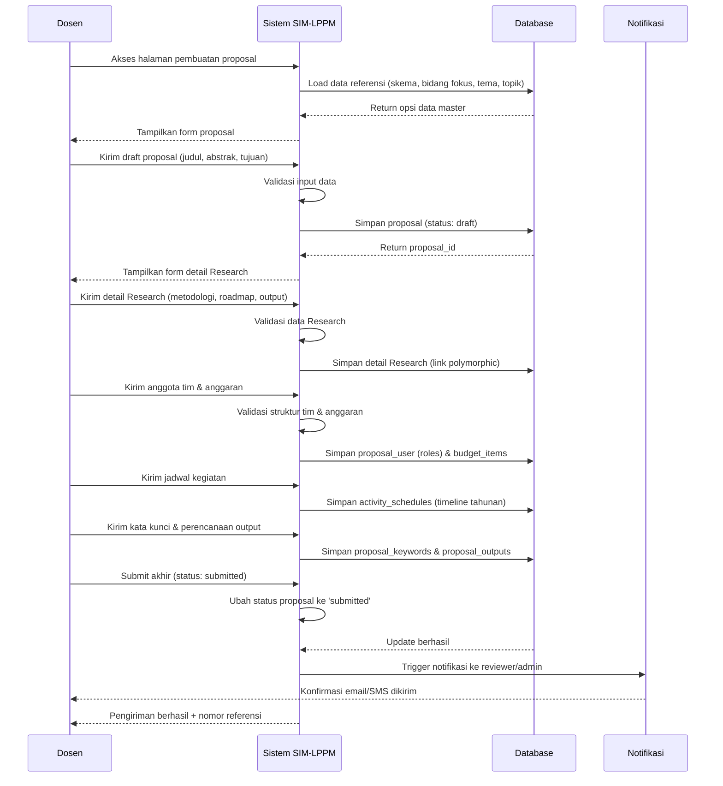
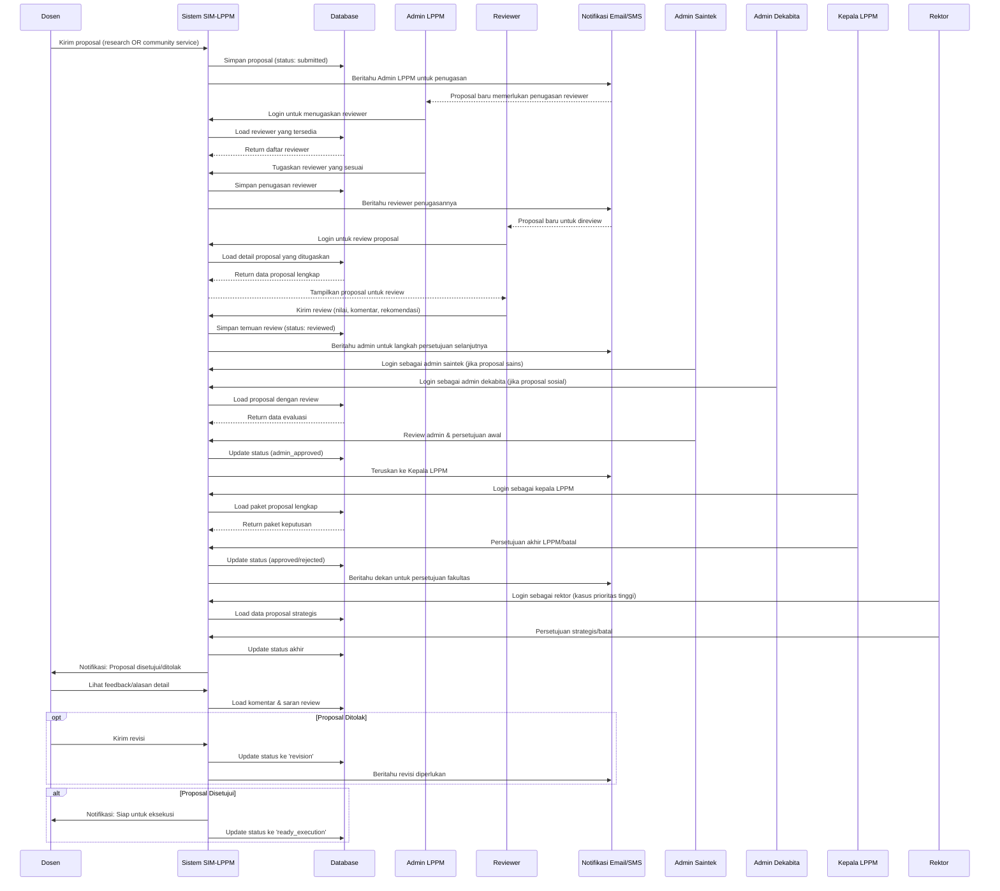
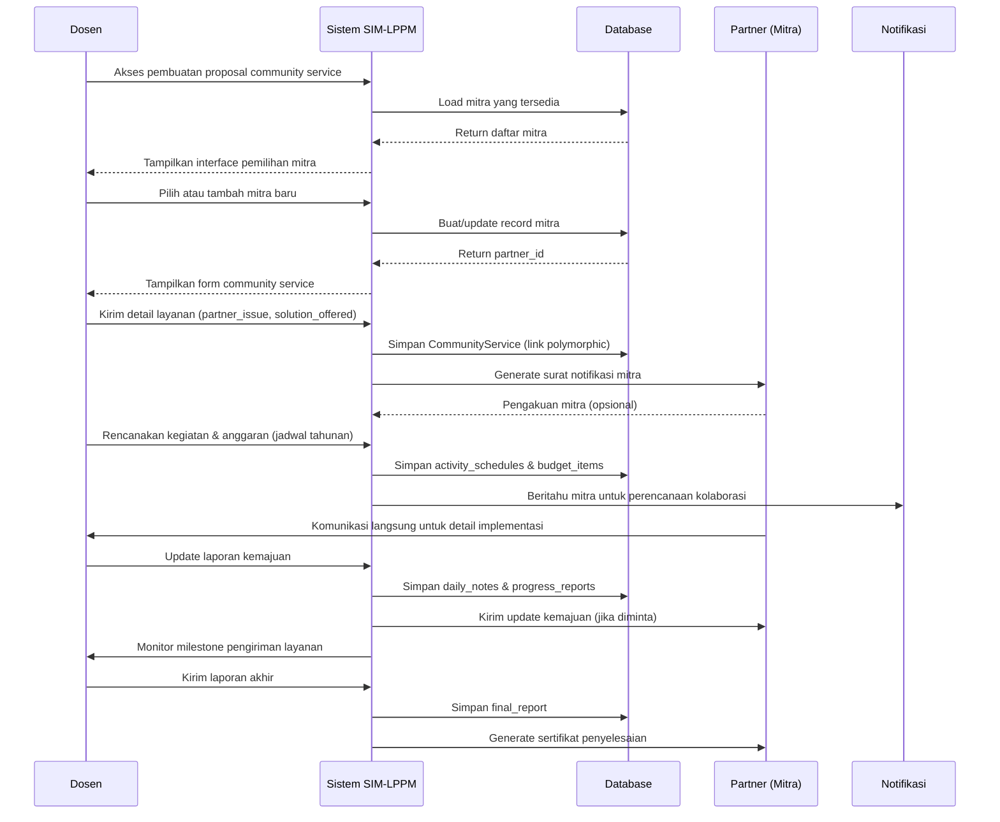
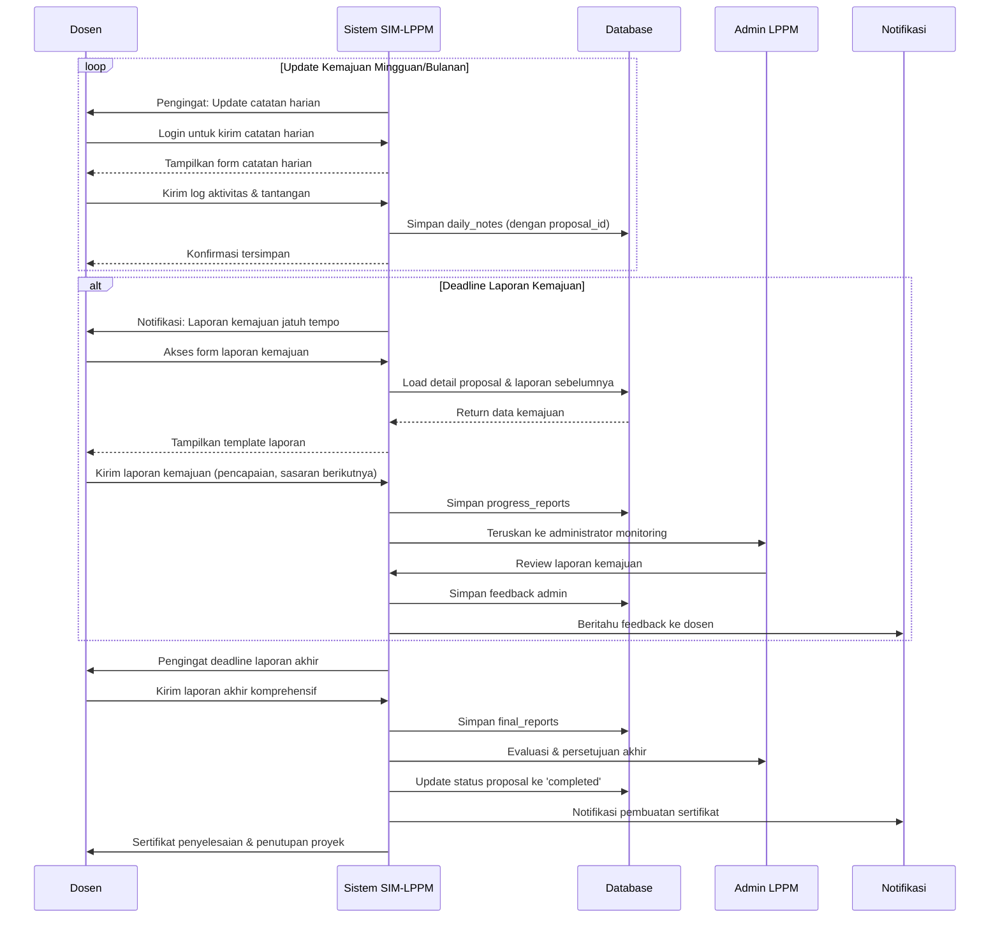
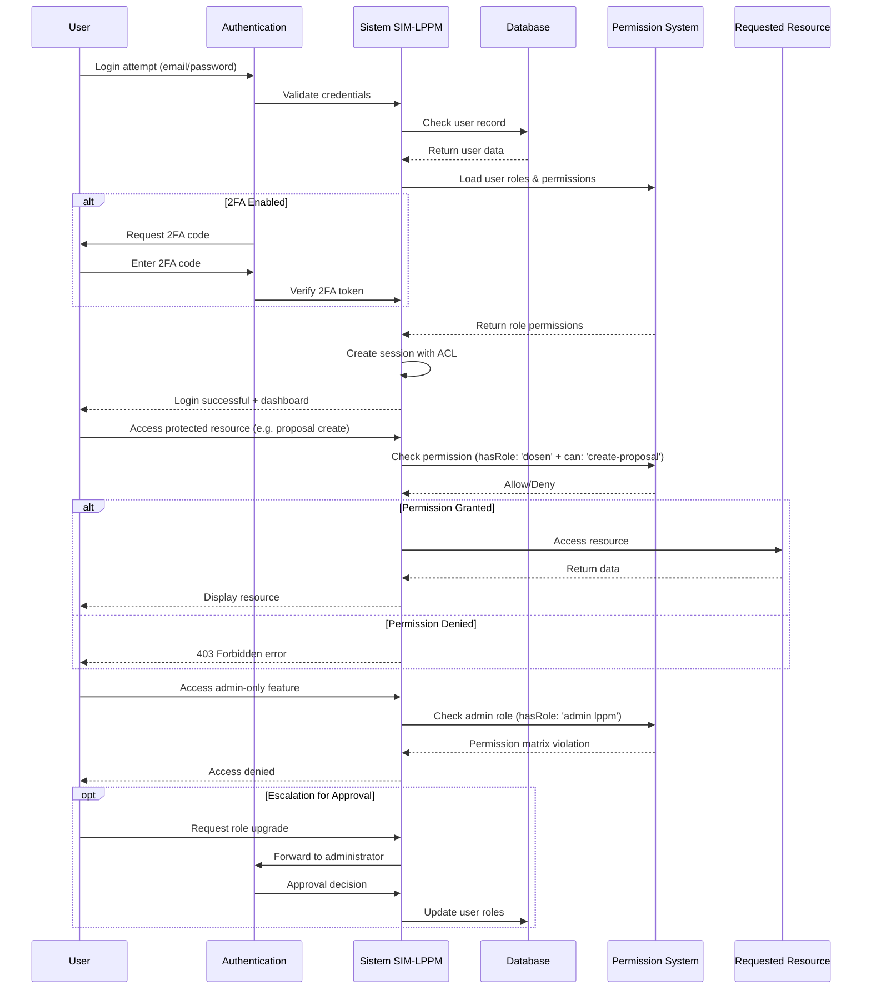
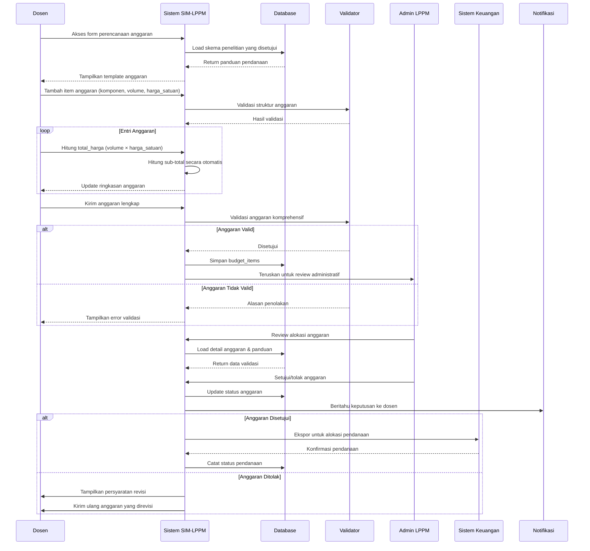

# SIM-LPPM Sequence Diagrams

## Gambaran Sistem
Dokumen ini berisi diagram urutan untuk SIM-LPPM (Sistem Manajemen Penelitian Akademik dan Pengabdian kepada Masyarakat) yang menunjukkan bagaimana berbagai peran pengguna berinteraksi dengan sistem sepanjang siklus proposal.

## Peran Pengguna & Matriks Otorisasi

### Hierarki Peran & Izin
```
superadmin (Level Sistem)
├── Akses sistem penuh
├── Pengembang IT/perawatan
└── Dapat memodifikasi semua data

rektor (Level Universitas)
├── Lihat semua proposal
├── Setujui penelitian prioritas tinggi
├── Pengawasan strategis
└── Otoritas persetujuan akhir

dekan (Level Fakultas)
├── Proposal khusus fakultas
├── Persetujuan teknis
├── Pengawasan anggaran fakultas
└── Koordinasi penelitian fakultas

kepala lppm (Direktur LPPM)
├── Pengawasan operasi LPPM
├── Koordinasi lintas disiplin
├── Implementasi kebijakan
└── Standarisasi proses

admin lppm (Admin LPPM Umum)
├── Manajemen pengguna
├── Administrasi proposal dasar
├── Konfigurasi sistem
└── Perawatan umum

admin lppm saintek (Admin LPPM Saintek)
└── Spesialisasi proposal sains/teknologi

admin lppm dekabita (Admin LPPM Dekabita)
└── Spesialisasi proposal sosial/humaniora

reviewer (Reviewer Khusus)
├── Evaluasi teknis
├── Input keahlian domain
├── Penilaian proposal
└── Rekomendasi review

dosen (Dosen)
├── Pengiriman proposal
├── Pelaporan kemajuan
├── Manajemen proyek
└── Penyampaian penelitian
```

---

## 1. Research Proposal Submission Workflow



---

## 2. Proposal Review & Approval Process



---

## 3. Community Service Partnership Management



---

## 4. Progress Monitoring & Reporting System



---

## 5. Authorization & Access Control Flow



---

## 6. Budget Management Workflow



---

## Aturan Bisnis & Kendala Sistem

### 1. Kendala Tipe Proposal
- **Proposal Penelitian**: Harus memiliki metodologi, roadmap_data, final_tkt_target
- **Pengabdian kepada Masyarakat**: Harus memiliki partner_id, partner_issue_summary
- **Eksklusif Bersama**: Tidak dapat menjadi penelitian DAN pengabdian masyarakat bersamaan

### 2. Aturan Struktur Tim
- **Kepemimpinan**: Setiap proposal harus memiliki satu 'ketua' (pemimpin)
- **Batas Ukuran**: Minimum 1 anggota, maksimum dapat dikontrol berdasarkan peran
- **Penugasan Peran**: Hanya satu ketua per proposal
- **Penugasan Tugas**: Setiap anggota harus memiliki tugas yang ditentukan

### 3. Aturan Validasi Anggaran
- **Integrasi SBK**: Nilai anggaran harus sesuai dengan SBK_value
- **Klasifikasi Kategori**: Harus mengikuti kelompok anggaran standar
- **Perhitungan Total**: Dihitung otomatis, mencegah penggantian manual
- **Level Persetujuan**: Hierarki persetujuan berbeda berdasarkan ukuran anggaran

### 4. Corrected Approval Workflow Matrix

| Stage Order | Role/Process                         | Description                                                   |
| ----------- | ------------------------------------ | ------------------------------------------------------------- |
| 1           | **Admin LPPM Assignment**            | Assigns appropriate reviewer based on proposal type           |
| 2           | **Reviewer Evaluation**              | Technical/domain expert reviews proposal content              |
| 3           | **Admin LPPM Review**                | LPPM admin reviews based on specialization (saintek/dekabita) |
| 4           | **Kepala LPPM Approval**             | LPPM director final institutional approval                    |
| 5           | **Dekan Approval** (Optional)        | Faculty dean approval for certain proposals                   |
| 6           | **Rektor Approval** (Strategic only) | University rector approval for high-impact proposals          |

*Only for strategic/high-impact proposals

### 5. Kadensi Pelaporan
- **Catatan Harian**: Basis mingguan selama eksekusi aktif
- **Laporan Kemajuan**: Bulanan untuk monitoring
- **Laporan Keuangan**: Triwulanan untuk kepatuhan anggaran
- **Laporan Akhir**: Milestone penyelesaian proyek

### 6. Proses Penugasan Reviewer
- **Penugasan Admin LPPM**: Semua proposal yang dikirim memerlukan penugasan reviewer manual
- **Pencocokan Spesialisasi**: Reviewer ditugaskan berdasarkan tipe proposal (penelitian/pengabdian)
- **Keahlian Domain**: Reviewer teknis dicocokkan dengan bidang ilmu proposal
- **Penyeimbangan Beban Kerja**: Sistem harus menyeimbangkan beban kerja reviewer
- **Pelacakan Penugasan**: Semua penugasan dicatat dengan timestamp

### 7. Eskalasi Otorisasi
- **Penugasan Otomatis**: Berdasarkan karakteristik proposal
- **Penggantian Manual**: Admin senior dapat meningkatkan/mengalihkan
- **Pemrosesan Paralel**: Beberapa reviewer dapat bekerja secara simultan
- **Persyaratan Konsensus**: Ambang batas persetujuan yang dapat dikonfigurasi

---

## Penanganan Error & Alur Pengecualian

### Skenario Kegagalan Umum

1. **Alur Izin Ditolak**
```
User → Request → System → Check ACL → DENIED → Halaman Error → Proses Banding User
```

2. **Kegagalan Validasi Data**
```
User → Submit → System → Validate → ERRORS → Tampilkan Form dengan Error → User Perbaiki
```

3. **Kegagalan Layanan Eksternal**
```
System → External API → TIMEOUT → Fallback → Notifikasi → Antrian Retry → Sukses
```

### Mekanisme Pemulihan
- **Rollback Transaksi**: Kendala database memastikan atomisitas
- **Jejak Audit**: Semua tindakan dicatat untuk penyelesaian perselisihan
- **Kontrol Versi**: Perubahan proposal dilacak dengan riwayat
- **Auto-save**: Pencegahan kehilangan data pada draft
