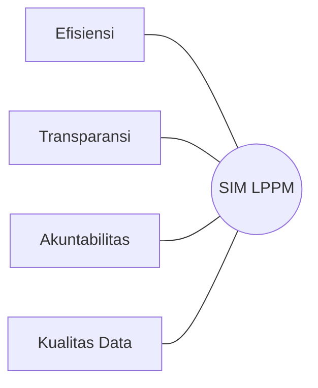

# 01. Product Requirements Document (PRD)
## SIM LPPM ITSNU – Sistem Informasi Manajemen Penelitian & Pengabdian

**Versi Dokumen:** 3.0  
**Tanggal:** 07 Januari 2026  
**Status:** Aktif  
**Target:** Institut Teknologi dan Sains Nahdlatul Ulama (ITSNU) Pekalongan

---

## 1. Pendahuluan
SIM LPPM ITSNU adalah platform digital terintegrasi yang dirancang khusus untuk mengelola seluruh siklus hidup hibah penelitian dan pengabdian kepada masyarakat di lingkungan ITSNU Pekalongan. Sistem ini mentransformasi proses manual yang tadinya memakan waktu menjadi alur kerja digital yang efisien, transparan, dan akuntabel.

### Visi Produk
Menjadi pusat data dan kendali kegiatan riset serta pengabdian yang handal untuk mendukung peningkatan kualitas akademik dan kontribusi sosial ITSNU Pekalongan.

---

## 2. Analisis Masalah (Deep Analysis)
Berdasarkan tinjauan terhadap proses bisnis di perguruan tinggi, terdapat beberapa tantangan utama yang ingin diselesaikan oleh sistem ini:

1.  **Fragmentasi Data:** Dokumen proposal, laporan, dan luaran seringkali tersebar di email atau hardcopy, menyulitkan proses pencarian data untuk keperluan akreditasi.
2.  **Ketidakpastian Alur:** Tanpa sistem digital, dosen seringkali tidak mengetahui sampai mana progres proposal mereka (apakah masih di Dekan atau sudah di LPPM).
3.  **Kesulitan Monitoring:** Admin LPPM kesulitan memantau beban kerja reviewer dan kepatuhan terhadap deadline penilaian.
4.  **Validasi Standar:** Proses validasi anggaran dan kelengkapan administratif seringkali terlewat jika dilakukan secara manual.

---

## 3. Tujuan Strategis
*   **Sentralisasi:** Menjadikan SIM LPPM sebagai satu-satunya sumber kebenaran (Single Source of Truth) untuk data riset dan pengabdian.
*   **Otomatisasi Alur Kerja:** Mengimplementasikan *state machine* yang kaku namun jelas untuk memastikan setiap proposal melalui jenjang persetujuan yang benar.
*   **Transparansi Real-time:** Memberikan visibilitas status proposal kepada pengusul di setiap tahap.
*   **Peningkatan Kualitas Luaran:** Memastikan setiap kegiatan memiliki target luaran yang jelas dan terdokumentasi dengan baik.

---

## 4. Fitur Utama & Fungsionalitas

### 4.1 Manajemen Proposal (Polimorfik)
Sistem mendukung dua tipe kegiatan utama dengan struktur data yang berbeda namun dalam satu manajemen yang seragam:
*   **Penelitian (Research):** Fokus pada metodologi ilmiah, State of the Art (SOTA), TKT (Tingkat Kesiapan Terapan), dan Roadmap penelitian.
*   **Pengabdian (PKM):** Fokus pada isu mitra, solusi praktis bagi komunitas, dan dampak sosial.

### 4.2 Alur Persetujuan Berjenjang (Approval Workflow)
Menerapkan skema persetujuan 3 lapis:
1.  **Fakultas (Dekan):** Meninjau kesesuaian dengan visi fakultas dan kualifikasi tim.
2.  **LPPM (Persetujuan Awal):** Validasi administratif oleh Kepala LPPM untuk masuk ke tahap review.
3.  **Review Ahli (Reviewer):** Penilaian substansi oleh pakar yang ditugaskan secara anonim/terencana.
4.  **LPPM (Keputusan Final):** Penetapan status akhir (Diterima/Revisi/Ditolak) berdasarkan rekomendasi reviewer.

### 4.3 Manajemen Anggaran (Budgeting)
*   Sistem perhitungan otomatis (Volume x Harga Satuan).
*   Validasi berdasarkan kelompok anggaran (Honor, Bahan, Perjalanan, dll).
*   Monitoring penggunaan dana berdasarkan rencana anggaran yang disetujui.

### 4.4 Pelaporan Progres & Luaran
*   Dukungan laporan kemajuan semesteran dan tahunan.
*   Manajemen bukti luaran (dokumen, link jurnal, paten, dll) yang langsung tertaut pada proyek terkait.

### 4.5 Sistem Notifikasi & Pengingat
*   Notifikasi in-app untuk setiap perubahan status.
*   Email otomatis untuk penugasan reviewer dan pengingat deadline yang mendekat.

---

## 5. Tumpukan Teknologi (Tech Stack)
Aplikasi ini dibangun menggunakan teknologi modern untuk memastikan performa dan kemudahan pemeliharaan:
*   **Framework:** Laravel 12 (PHP 8.4+)
*   **Frontend:** Livewire 3 & Tailwind CSS v4
*   **UI Component:** Tabler (Bootstrap-based design pattern)
*   **Database:** MySQL dengan UUID primary keys untuk keamanan data.
*   **Testing:** Pest v4 untuk memastikan kualitas kode.

---

## 6. Target Pengguna (Roles)
1.  **Dosen:** Pengusul utama dan pelaksana kegiatan.
2.  **Dekan:** Penanggung jawab kualitas kegiatan di tingkat fakultas.
3.  **Admin LPPM:** Pengelola operasional dan administrator master data.
4.  **Kepala LPPM:** Pengambil keputusan strategis dan otoritas hibah.
5.  **Reviewer:** Pakar yang memberikan penilaian teknis.
6.  **Rektor:** Pemantau kinerja riset institusi secara keseluruhan.
7.  **Superadmin:** Pemelihara teknis sistem informasi.

---

## 7. Roadmap Pengembangan
*   **Fase 1 (Selesai):** Core engine, manajemen proposal, dan workflow dasar.
*   **Fase 2 (Sedang Berjalan):** Optimasi laporan kemajuan dan manajemen luaran detail.
*   **Fase 3 (Mendatang):** Integrasi dengan API SINTA/BIMA dan fitur analitik riset berbasis AI.

---
*SIM LPPM ITSNU - Inovasi untuk Riset yang Lebih Baik.*
