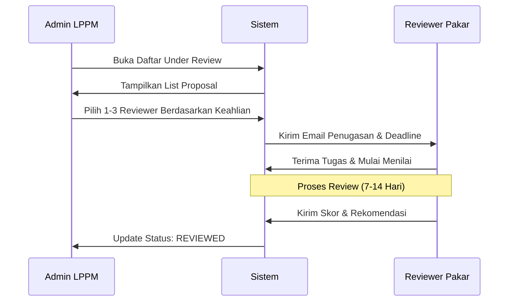

# 02. Workflow Lengkap
## SIM LPPM ITSNU – Alur Bisnis dan Siklus Hidup Proposal

Dokumen ini menjelaskan alur kerja (workflow) terintegrasi dalam SIM LPPM, mulai dari pembuatan draf hingga laporan akhir.

---

## 1. Ikhtisar Siklus Hidup Proposal
Proposal di SIM LPPM melewati rangkaian status yang ketat untuk memastikan standar kualitas akademik terpenuhi.

### Diagram Alur Utama (High-Level)

```mermaid
graph TD
    %% Nodes
    Start((Mulai))
    Draft[Dosen: DRAFT]
    TeamInvite{Undangan Tim}
    NeedAssign[NEED_ASSIGNMENT]
    Submit[Dosen: SUBMITTED]
    DekanReview{Review Dekan}
    Approved[APPROVED]
    InitialApprove{Persetujuan Awal LPPM}
    UnderReview[UNDER_REVIEW]
    AssignReviewer[Admin: Pilih Reviewer]
    Reviewed[REVIEWED]
    FinalDecision{Keputusan Akhir}
    Completed[🟢 COMPLETED]
    Revision[🟡 REVISION_NEEDED]
    Rejected[🔴 REJECTED]

    %% Connections
    Start --> Draft
    Draft --> TeamInvite
    TeamInvite -->|Anggota Terima| Submit
    TeamInvite -->|Anggota Tolak| NeedAssign
    NeedAssign --> Draft
    
    Submit --> DekanReview
    DekanReview -->|Setujui| Approved
    DekanReview -->|Minta Perbaikan Tim| NeedAssign
    DekanReview -->|Tolak| Rejected
    
    Approved --> InitialApprove
    InitialApprove -->|Lanjut Review| UnderReview
    InitialApprove -->|Tolak| Rejected
    
    UnderReview --> AssignReviewer
    AssignReviewer --> Reviewed
    
    Reviewed --> FinalDecision
    FinalDecision -->|Lulus| Completed
    FinalDecision -->|Perlu Revisi| Revision
    FinalDecision -->|Tidak Layak| Rejected
    
    Revision -->|Edit Proposal| Submit

    %% Styling
    style Completed fill:#d4edda,stroke:#28a745
    style Rejected fill:#f8d7da,stroke:#dc3545
    style Revision fill:#fff3cd,stroke:#ffc107
    style Draft fill:#e2e3e5,stroke:#6c757d
```

---

## 2. Alur Kerja Mendalam (Deep Dive)

### A. Alur Pengusulan (Dosen)
1. **Penyusunan:** Dosen mengisi formulir identitas, substansi, dan anggaran.
2. **Koordinasi Tim:** Menambahkan anggota dosen/mahasiswa. 
3. **Persetujuan Kolektif:** Sistem tidak akan mengizinkan tombol "Submit" muncul sebelum semua anggota yang diundang memberikan konfirmasi melalui dashboard mereka masing-masing.

### B. Alur Penugasan Reviewer (Admin LPPM)

### C. Alur Keputusan Final (Kepala LPPM)
Setelah semua reviewer yang ditugaskan selesai memberikan nilai, Kepala LPPM akan:
1. Meninjau tab **"Review Summary"**.
2. Membandingkan catatan antar reviewer.
3. Memilih keputusan akhir:
    *   **Setujui:** Proposal masuk tahap pelaksanaan.
    *   **Revisi:** Proposal dikembalikan ke dosen untuk diperbaiki sesuai catatan.
    *   **Tolak:** Proses berhenti, dosen dapat mencoba lagi di periode hibah berikutnya.

---

## 3. Matriks Transisi Status
| Dari | Ke | Aktor | Kondisi Utama |
| :--- | :--- | :--- | :--- |
| DRAFT | SUBMITTED | Dosen | Seluruh tim sudah menyetujui undangan. |
| SUBMITTED | APPROVED | Dekan | Substansi awal dinilai layak oleh fakultas. |
| APPROVED | UNDER_REVIEW | Kepala LPPM | Lulus seleksi administrasi awal LPPM. |
| UNDER_REVIEW | REVIEWED | Admin LPPM | Minimal 1 reviewer telah ditugaskan. |
| REVIEWED | COMPLETED | Kepala LPPM | Nilai reviewer memenuhi ambang batas kelulusan. |
| REVIEWED | REVISION_NEEDED | Kepala LPPM | Terdapat masukan krusial untuk perbaikan. |

---

## 4. Jalur Cepat (Short-circuit Rules)
*   **Penolakan Tim:** Kapan saja anggota tim menolak undangan, proposal yang belum diajukan akan tetap atau kembali ke status `NEED_ASSIGNMENT`.
*   **Resubmit:** Proposal yang diajukan kembali dari status `REVISION_NEEDED` akan langsung masuk ke status `SUBMITTED` dan harus melewati persetujuan Dekan kembali (untuk memastikan fakultas mengetahui perubahan substantif).

---
*Dokumentasi ini merupakan representasi teknis dari State Machine yang diimplementasikan pada `App\Enums\ProposalStatus`.*
