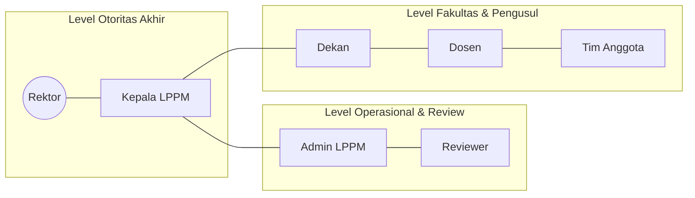

# 03. Peran dan Wewenang
## SIM LPPM ITSNU – Matriks Akses dan Tanggung Jawab

Sistem ini menggunakan *Role-Based Access Control* (RBAC) yang dikombinasikan dengan *Data Scoping* untuk memastikan keamanan dan kerahasiaan data.

---

## 1. Daftar Peran (Roles)

### 1.1 Dosen (Lecturer)
*   **Fungsi Utama:** Kreator konten dan pelaksana riset/PKM.
*   **Wewenang:**
    *   Membuat proposal baru (Penelitian atau PKM).
    *   Mengelola tim (mengundang anggota).
    *   Mengunggah laporan kemajuan dan bukti luaran.
*   **Batasan Data:** Hanya dapat melihat proposal di mana ia menjadi ketua atau anggota tim.

### 1.2 Dekan (Dean)
*   **Fungsi Utama:** Otoritas fakultas (Gatekeeper tingkat 1).
*   **Wewenang:**
    *   Menyetujui atau meminta perbaikan tim untuk proposal dari fakultasnya.
    *   Memantau statistik riset di lingkungan fakultasnya.
*   **Batasan Data:** Terkunci pada data fakultas masing-masing (Faculty-scoped access).

### 1.3 Admin LPPM (Operational Admin)
*   **Fungsi Utama:** Pengelola operasional harian sistem.
*   **Wewenang:**
    *   Menugaskan reviewer ke proposal yang sudah lolos seleksi awal.
    *   Mengelola data master (taksonomi, anggaran, prodi, dll).
    *   Mengelola akun pengguna dan penetapan peran.
*   **Batasan Data:** Akses institusi (seluruh fakultas), namun tidak bisa mengambil keputusan persetujuan akhir.

### 1.4 Kepala LPPM (Director)
*   **Fungsi Utama:** Pengambil keputusan strategis dan otoritas hibah.
*   **Wewenang:**
    *   Memberikan persetujuan awal (Initial Approval).
    *   Memberikan keputusan final (Final Decision) berdasarkan rekomendasi reviewer.
    *   Menandatangani/menyetujui laporan kemajuan akhir.
*   **Batasan Data:** Akses institusi penuh (Read & Decision Write).

### 1.5 Reviewer (Evaluator)
*   **Fungsi Utama:** Penilai independen substansi proposal.
*   **Wewenang:**
    *   Membuka detail proposal yang ditugaskan kepadanya.
    *   Mengisi formulir penilaian dan memberikan rekomendasi (Terima/Revisi/Tolak).
*   **Batasan Data:** Hanya dapat melihat proposal yang sedang aktif ditugaskan kepadanya. Identitas pengusul dapat disembunyikan (Blind Review) jika diaktifkan.

### 1.6 Rektor (University Rector)
*   **Fungsi Utama:** Pengawasan strategis institusi.
*   **Wewenang:**
    *   Melihat dashboard analitik universitas.
    *   Melihat profil riset dan pengabdian secara makro.
*   **Batasan Data:** Read-only access untuk seluruh data institusi.

### 1.7 Superadmin (IT System Admin)
*   **Fungsi Utama:** Pemelihara teknis sistem.
*   **Wewenang:**
    *   Akses teknis penuh (Konfigurasi server, log, pemulihan data).
    *   Override status proposal dalam kondisi darurat.
*   **Batasan Data:** Akses sistem tanpa batas (digunakan hanya untuk keperluan maintenance).

---

## 2. Hirarki dan Interaksi Antar Peran

## 3. Matriks Tanggung Jawab (RACI)

| Aktivitas | Dosen | Dekan | Admin LPPM | Kepala LPPM | Reviewer |
| :--- | :---: | :---: | :---: | :---: | :---: |
| Membuat Proposal | **Accountable** | - | - | - | - |
| Menyetujui Undangan Tim | **Responsible** | - | - | - | - |
| Persetujuan Fakultas | - | **Accountable** | - | - | - |
| Seleksi Administratif | - | - | **Consulted** | **Accountable** | - |
| Penugasan Reviewer | - | - | **Accountable** | **Consulted** | - |
| Penilaian Substansi | - | - | - | - | **Accountable** |
| Penetapan Pemenang/Hibah | - | - | **Consulted** | **Accountable** | - |
| Laporan Kemajuan | **Accountable** | - | **Consulted** | **Responsible** | - |

---

## 3. Sistem "Active Role"
SIM LPPM mendukung satu pengguna memiliki banyak peran (misal: seorang Dosen juga menjabat sebagai Dekan). 
*   Pengguna dapat berpindah peran melalui menu profil tanpa harus logout.
*   Izin akses dan dashboard akan menyesuaikan secara dinamis berdasarkan "Active Role" yang dipilih di session.

---
*Keamanan data dijamin melalui Spatie Permission Middleware dan Query Scopes di tingkat Eloquent Model.*
