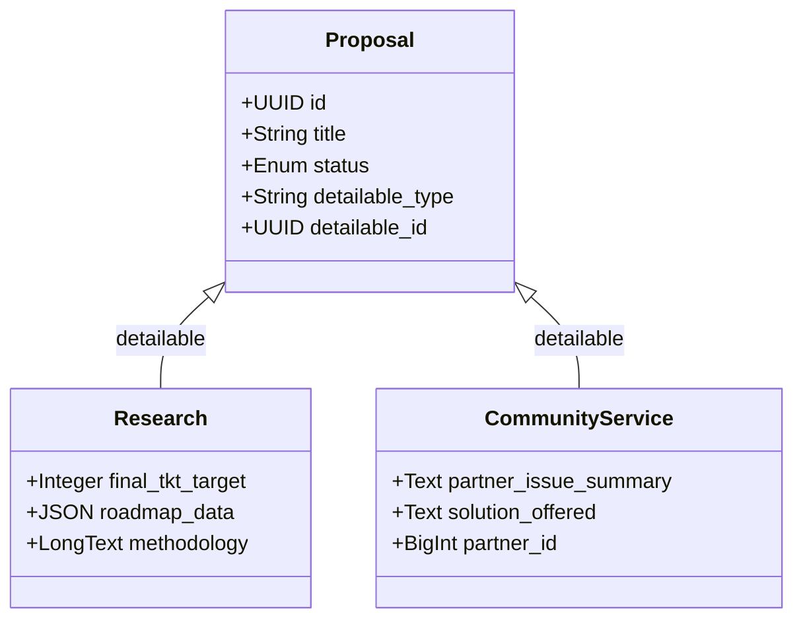

# 04. Struktur Data
## SIM LPPM ITSNU – Penelitian vs Pengabdian (PKM)

SIM LPPM menggunakan arsitektur polimorfik untuk menangani dua jenis kegiatan yang berbeda namun berbagi basis administratif yang sama.

---

## 1. Arsitektur Polimorfik
Tabel `proposals` bertindak sebagai induk (Parent) yang menyimpan metadata administratif, sementara detail spesifik disimpan dalam tabel terpisah.

*   **Parent:** `proposals`
*   **Child 1:** `research` (Penelitian)
*   **Child 2:** `community_services` (Pengabdian/PKM)

Relasi ini dihubungkan melalui kolom `detailable_type` dan `detailable_id` pada tabel `proposals`.

---

## 2. Hubungan Entitas (Polimorfik)

---

## 3. Perbedaan Konten Spesifik

### 2.1 Penelitian (Research)
Fokus pada pengembangan ilmu pengetahuan dan teknologi.
*   **TKT (Tingkat Kesiapan Terapan):** Menggunakan skala 1-9 untuk mengukur kesiapan hasil riset.
*   **SOTA (State of the Art):** Tinjauan pustaka mendalam untuk menunjukkan kebaruan riset.
*   **Roadmap:** Rencana penelitian multi-tahun yang disimpan dalam format JSON.
*   **Metodologi:** Penjelasan teknis mengenai tahapan eksperimen atau pengambilan data.

### 2.2 Pengabdian kepada Masyarakat (PKM)
Fokus pada penerapan ilmu untuk menyelesaikan masalah nyata di masyarakat.
*   **Isu Mitra:** Ringkasan permasalahan yang dihadapi oleh mitra (misal: UMKM, Desa, Sekolah).
*   **Solusi:** Deskripsi langkah praktis yang ditawarkan untuk menyelesaikan isu tersebut.
*   **Mitra:** Informasi organisasi atau kelompok masyarakat yang menjadi objek pengabdian.

---

## 3. Komponen Bersama (Shared Components)
Kedua jenis proposal berbagi komponen berikut:
1.  **Manajemen Tim:** Menggunakan tabel `proposal_user` untuk melacak ketua dan anggota.
2.  **Anggaran (RAB):** Sistem input item biaya yang terstruktur berdasarkan kelompok anggaran (Honor, Bahan, Perjalanan, dll).
3.  **Jadwal Kegiatan:** Timeline pelaksanaan kegiatan per bulan.
4.  **Luaran (Outputs):** Target hasil kegiatan seperti artikel jurnal, poster, berita massa, atau produk fisik.
5.  **Tahapan (Stages):** Breakdown langkah kerja dengan penanggung jawab masing-masing.

---

## 4. Taksonomi & Klasifikasi
Setiap proposal diklasifikasikan menggunakan standar yang seragam:
*   **Rumpun Ilmu:** Menggunakan struktur 3 level (Bidang → Subbidang → Detail).
*   **Taksonomi Fokus:** Menggunakan 3 level (Focus Area → Theme → Topic).
*   **Skema:** Jenis hibah (misal: Penelitian Dasar, Pengabdian Internal).
*   **PRN (Prioritas Riset Nasional):** Keselarasan dengan agenda riset nasional.

---

## 5. Validasi Anggaran (SBK)
Sistem menerapkan validasi **Satuan Biaya Keluaran (SBK)**:
*   Setiap skema memiliki pagu maksimal.
*   Sistem secara otomatis menghitung `Total = Volume x Harga Satuan`.
*   Peringatan akan muncul jika total anggaran melebihi batas SBK yang ditentukan untuk skema tersebut.

---
*Struktur data ini dirancang untuk kemudahan ekspor data ke sistem nasional seperti BIMA atau SINTA di masa depan.*
