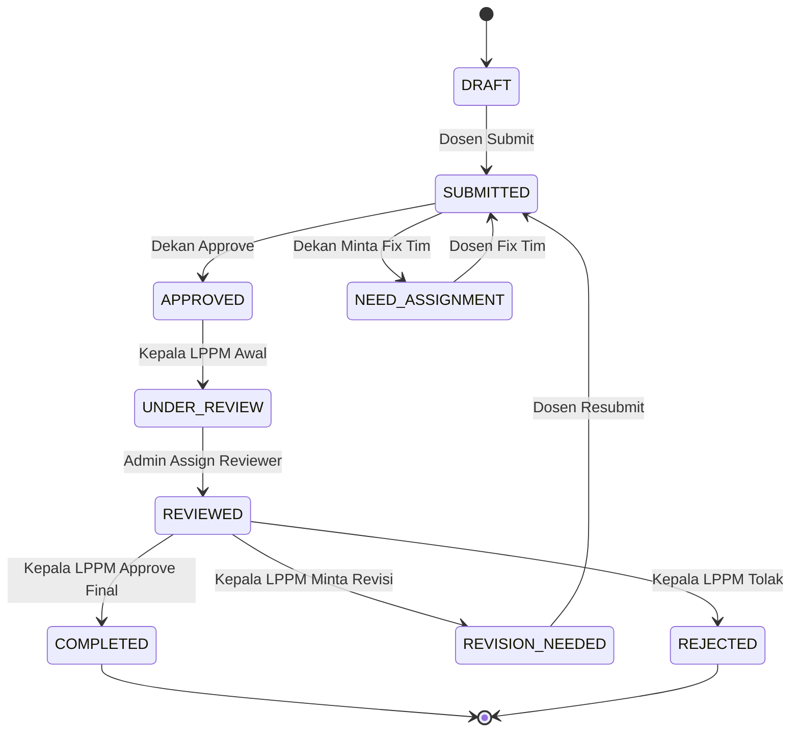

# 05. Transisi Status Proposal
## SIM LPPM ITSNU – Mesin Status (State Machine) & Validasi

Sistem ini memastikan integritas alur kerja melalui validasi transisi status yang ketat. Setiap perpindahan status memiliki syarat dan memicu aksi tertentu.

---

## 1. Definisi Status (`ProposalStatus`)
Terdapat 9 status utama yang didefinisikan dalam Enum `App\Enums\ProposalStatus`:

1.  **DRAFT:** Proposal baru dibuat, substansi sedang diisi oleh pengusul.
2.  **SUBMITTED:** Proposal telah diajukan dan sedang menunggu ulasan Dekan.
3.  **NEED_ASSIGNMENT:** Terjadi masalah pada tim (ada yang menolak) atau Dekan meminta revisi komposisi tim.
4.  **APPROVED:** Disetujui oleh Dekan, menunggu telaah awal Kepala LPPM.
5.  **UNDER_REVIEW:** Kepala LPPM menyetujui untuk diteruskan ke reviewer. Admin sedang menugaskan reviewer.
6.  **REVIEWED:** Reviewer telah ditugaskan dan proses penilaian substansi sedang berlangsung.
7.  **REVISION_NEEDED:** Kepala LPPM meminta perbaikan substansi berdasarkan masukan reviewer.
8.  **COMPLETED:** Proposal disetujui secara final untuk didanai/dilaksanakan.
9.  **REJECTED:** Proposal ditolak secara permanen.

---

## 2. Diagram Transisi (State Diagram)

## 3. Aturan Transisi (State Machine)

| Status Saat Ini | Status Tujuan | Aktor | Syarat / Pemicu |
| :--- | :--- | :--- | :--- |
| **DRAFT** | SUBMITTED | Dosen | Semua anggota tim telah mengonfirmasi kehadiran. |
| **SUBMITTED** | APPROVED | Dekan | Klik tombol "Approve" di dashboard Dekan. |
| **SUBMITTED** | NEED_ASSIGNMENT | Dekan | Klik "Request Team Fix" atau jika ada anggota tim yang tiba-tiba menolak. |
| **APPROVED** | UNDER_REVIEW | Kepala LPPM | Klik "Proceed to Review". |
| **UNDER_REVIEW** | REVIEWED | Admin LPPM | Berhasil menugaskan minimal 1 reviewer. |
| **REVIEWED** | COMPLETED | Kepala LPPM | Klik "Approve Final" setelah semua review masuk. |
| **REVIEWED** | REVISION_NEEDED | Kepala LPPM | Klik "Request Revision" dengan catatan feedback. |
| **REVISION_NEEDED** | SUBMITTED | Dosen | Dosen melakukan edit dan klik "Resubmit". |
| **ANY** | REJECTED | Kepala LPPM | Keputusan penolakan di tahap mana pun. |

---

## 3. Logika Bisnis Otomatis
Sistem melakukan beberapa aksi otomatis saat terjadi perubahan status:

*   **Penyucian Data:** Saat kembali ke `SUBMITTED` dari `REVISION_NEEDED`, status review lama akan diarsip agar reviewer mendapatkan versi proposal terbaru.
*   **Notifikasi:** Setiap transisi memicu event yang mengirimkan notifikasi aplikasi dan email kepada aktor terkait (Lihat [Dokumen 07. Notifikasi](07-notifikasi.md)).
*   **Kunci Dokumen:** Proposal dalam status selain `DRAFT`, `REVISION_NEEDED`, dan `NEED_ASSIGNMENT` akan dikunci (*read-only*) bagi dosen pengusul.

---

## 4. Validasi Pengajuan (canSubmit)
Proposal hanya bisa berpindah dari `DRAFT` ke `SUBMITTED` jika:
1.  Semua kolom wajib substansi telah diisi.
2.  Total anggaran tidak nol dan tidak melebihi SBK.
3.  Jadwal kegiatan minimal mencakup rentang waktu pelaksanaan.
4.  **Kritis:** Seluruh anggota tim (dosen/mahasiswa) telah login dan menekan tombol "Terima Undangan".

---
*Mesin status ini menjamin bahwa tidak ada proposal yang "lompat pagar" tanpa persetujuan pihak yang berwenang.*
