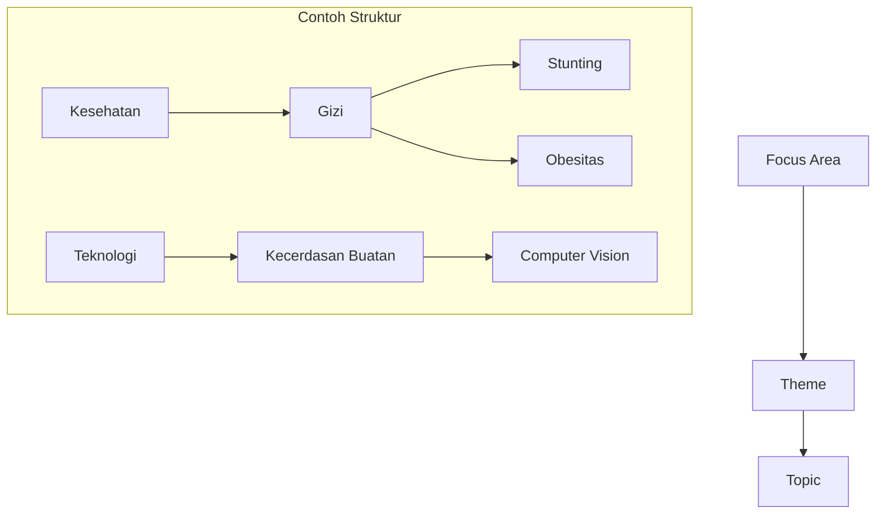

# 06. Data Master & Referensi
## SIM LPPM ITSNU – Taksonomi dan Kosakata Terkendali

Sistem ini bergantung pada data master yang konsisten untuk keperluan pelaporan dan analitik. Data ini dikelola secara terpusat oleh Admin LPPM.

---

## 1. Taksonomi Bidang Ilmu
Untuk memudahkan pengelompokan topik, sistem menggunakan struktur 3 level:

1.  **Focus Area (Bidang Fokus):** Kategori makro (misal: Kesehatan, Teknologi, Energi).
2.  **Theme (Tema):** Sub-kategori di bawah Bidang Fokus (misal: Gizi, IoT, Bio-fuel).
3.  **Topic (Topik):** Detail spesifik di bawah Tema.

---

## 2. Rumpun Ilmu (Science Clusters)
Sistem menggunakan klasifikasi rumpun ilmu sesuai standar nasional:
*   **Level 1 (Rumpun):** misal: Ilmu Teknik.
*   **Level 2 (Sub-Rumpun):** misal: Teknik Elektro dan Informatika.
*   **Level 3 (Bidang Ilmu):** misal: Kecerdasan Buatan.

---

## 3. Struktur Organisasi
*   **Institusi:** Identitas universitas/lembaga induk.
*   **Fakultas:** Unit pengelola (misal: SAINTEK, DEKABITA). Kode fakultas digunakan untuk *scoping* akses Dekan.
*   **Program Studi:** Unit akademik di bawah fakultas.

---

## 4. Klasifikasi Khusus Penelitian
*   **Skema Penelitian:** Jenis-jenis hibah yang tersedia (misal: Penelitian Dasar, Terapan).
*   **PRN (Prioritas Riset Nasional):** Bidang prioritas nasional (misal: Ketahanan Pangan, Pertahanan Keamanan).
*   **Kelompok Riset Makro:** Pengelompokan riset internal untuk strategi institusi.

---

## 5. Referensi Anggaran (Budget Masters)
Sistem RAB (Rencana Anggaran Biaya) menggunakan dua lapis klasifikasi:
1.  **Budget Group:** Kelompok besar pengeluaran (misal: Honorarium, Belanja Bahan, Perjalanan).
2.  **Budget Component:** Detail item di bawah grup (misal: Honor narasumber, ATK, Tiket Pesawat).
    *   Setiap komponen memiliki kolom `unit` (misal: OB, Sesi, Hari) untuk standarisasi input.

---

## 6. Manajemen Mitra (Partners)
Khusus untuk Pengabdian (PKM), sistem menyimpan database mitra:
*   **Tipe Mitra:** NGO, Sekolah, Kelompok Masyarakat, Pemerintah, UMKM, dll.
*   **Identitas:** Alamat, kontak person, dan profil singkat mitra.

---

## 7. Kata Kunci (Keywords)
Sistem mengelola koleksi kata kunci yang dapat digunakan kembali untuk meningkatkan pencarian dan keterhubungan antar proposal/laporan yang memiliki topik serupa.

---
*Pengelolaan data master yang disiplin adalah kunci dari kualitas dashboard analitik di tingkat Rektor dan Kepala LPPM.*
