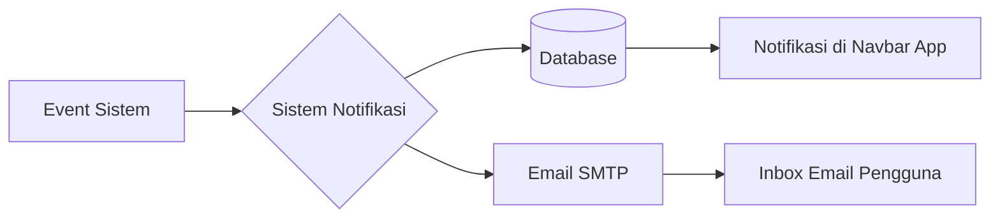

# 07. Sistem Notifikasi
## SIM LPPM ITSNU – Komunikasi Otomatis & Pengingat

SIM LPPM menggunakan sistem notifikasi multi-kanal (In-App dan Email) untuk memastikan setiap pemangku kepentingan segera mengetahui aksi yang diperlukan.

---

## 1. Kanal Notifikasi
Sistem menggunakan Laravel Notification dengan dua kanal utama:

*   **Database (In-App):** Notifikasi real-time yang muncul pada ikon lonceng di navbar aplikasi.
*   **Mail (Email):** Notifikasi yang dikirim ke alamat email resmi pengguna untuk aksi yang bersifat penting atau memiliki tenggat waktu.

---

## 2. Pemicu Notifikasi (Triggers)

### 2.1 Alur Pengajuan
1.  **Proposal Submitted:** Dikirim ke Dekan dan Admin LPPM saat dosen mengajukan proposal.
2.  **Team Invitation:** Dikirim ke calon anggota tim saat dosen menambahkan mereka ke proposal.
3.  **Team Response:** Dosen pengusul menerima notifikasi saat anggota tim menerima atau menolak undangan.

### 2.2 Alur Persetujuan
4.  **Dekan Decision:** Dosen menerima notifikasi hasil ulasan Dekan (Approved/Need Fix).
5.  **Initial Approval:** Admin LPPM menerima notifikasi saat Kepala LPPM menyetujui proposal untuk lanjut ke tahap review.
6.  **Final Decision:** Seluruh tim pengusul menerima notifikasi saat status akhir ditetapkan (Completed/Revision/Rejected).

### 2.3 Alur Review
7.  **Reviewer Assigned:** Reviewer menerima email penugasan beserta link ke detail proposal.
8.  **Review Reminder:** Sistem mengirimkan pengingat otomatis kepada reviewer 3 hari sebelum tenggat waktu penilaian berakhir.
9.  **Review Overdue:** Notifikasi dikirim ke Admin LPPM jika ada reviewer yang melewati batas waktu tanpa memberikan ulasan.

---

## 3. Struktur Pesan
Setiap notifikasi didesain untuk memberikan informasi yang cukup tanpa harus membuka aplikasi terlebih dahulu:
*   **Judul:** Jenis aksi (misal: "Penugasan Reviewer Baru").
*   **Pesan:** Detail singkat (misal: "Anda ditugaskan me-review proposal: [Judul Proposal]").
*   **Link Aksi:** Tombol langsung menuju halaman terkait di aplikasi.

---

## 4. Konfigurasi Pengguna
Pengguna dapat mengatur preferensi notifikasi melalui menu **Settings > Notifications**:
*   Dapat menonaktifkan kanal Email untuk aksi tertentu yang dianggap kurang mendesak.
*   Dapat mengatur frekuensi pengingat (khusus untuk peran Reviewer dan Admin).

---

## 5. Implementasi Teknis
Seluruh proses pengiriman notifikasi menggunakan **Laravel Queue (Database Driver)**. Hal ini dilakukan agar performa aplikasi tetap cepat karena proses pengiriman email dilakukan di latar belakang (*asynchronous*).

---
*Notifikasi yang tepat waktu adalah kunci kelancaran birokrasi digital di LPPM.*
