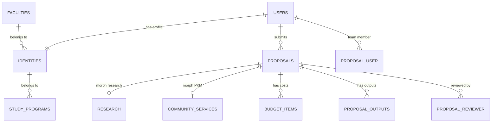

# 08. Entity Relationship Diagram (ERD)
## SIM LPPM ITSNU – Skema Basis Data

Dokumen ini menjelaskan struktur data dan hubungan antar entitas utama dalam sistem SIM LPPM.

---

## 1. Diagram ERD (Sederhana)

---

## 2. Deskripsi Tabel Utama

### 2.1 Inti Sistem (Core)
*   **users:** Menyimpan data otentikasi (nama, email, password). Menggunakan UUID sebagai Primary Key.
*   **identities:** Profil tambahan dosen/mahasiswa (NIDN/NIM, alamat, fakultas, prodi). Terhubung 1:1 dengan `users`.
*   **proposals:** Tabel induk untuk seluruh pengajuan. Menyimpan judul, status, dan metadata administratif.

### 2.2 Polimorfik (Substansi)
*   **research:** Menyimpan detail teknis penelitian (TKT, Roadmap JSON, SOTA, Metodologi).
*   **community_services:** Menyimpan detail teknis pengabdian (Isu Mitra, Solusi, Mitra Utama).

### 2.3 Relasi dan Transaksi
*   **proposal_user:** Tabel pivot untuk tim pengusul. Menyimpan peran (Ketua/Anggota) dan status penerimaan undangan.
*   **budget_items:** Detail Rencana Anggaran Biaya (RAB). Terhubung ke Master Anggaran.
*   **proposal_reviewer:** Menyimpan data penugasan reviewer, catatan penilaian, dan rekomendasi akhir.

### 2.4 Master Data & Taksonomi
*   **faculties / study_programs:** Hierarki organisasi kampus.
*   **focus_areas / themes / topics:** Hierarki bidang fokus riset.
*   **science_clusters:** Rumpun ilmu (3 level).
*   **budget_groups / budget_components:** Katalog item anggaran resmi.

---

## 3. Ketentuan Teknis Basis Data
1.  **UUID:** Semua tabel transaksi utama (Proposal, User, Budget) menggunakan UUID v4 untuk keamanan dan skalabilitas.
2.  **Soft Deletes:** Digunakan pada tabel-tabel krusial untuk mencegah kehilangan data yang tidak disengaja.
3.  **JSON Columns:** Digunakan pada kolom `roadmap_data` di tabel `research` untuk fleksibilitas struktur rencana multi-tahun.
4.  **Enums:** Status proposal dan peran tim dikunci menggunakan tipe data ENUM di database untuk integritas data.

---
*Skema ini dioptimalkan untuk performa query relasional dan kepatuhan terhadap standar normalisasi database.*
