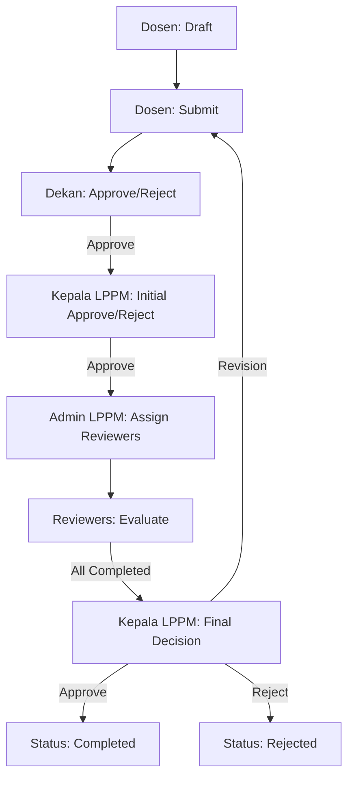

# Panduan Alur Kerja (User Manual Flow)

Dokumen ini berisi panduan alur kerja untuk setiap peran dalam Sistem Informasi Manajemen LPPM (SIM LPPM) ITSNU Pekalongan.

## Daftar Peran

1.  **[Dosen](./role-dosen.md)**: Pengusul penelitian dan pengabdian masyarakat.
2.  **[Dekan](./role-dekan.md)**: Validasi awal usulan di tingkat fakultas.
3.  **[Kepala LPPM](./role-kepala-lppm.md)**: Otoritas pemberi persetujuan awal dan keputusan final.
4.  **[Admin LPPM](./role-admin-lppm.md)**: Pengelola operasional review dan data master.
5.  **[Reviewer](./role-reviewer.md)**: Pakar penilai substansi usulan.
6.  **[Rektor](./role-rektor.md)**: Pengawasan strategis tingkat universitas.
7.  **[Superadmin](./role-superadmin.md)**: Manajemen teknis dan pengguna.

## Alur Utama Proposal

