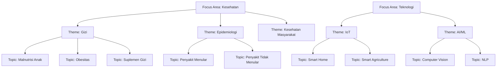
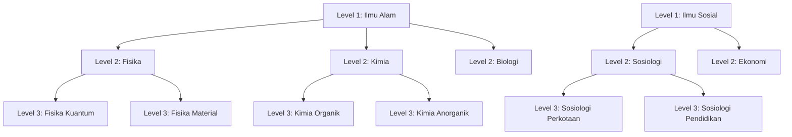
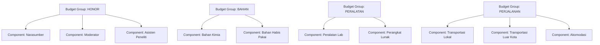

# Master Data & Reference Tables v2.0
## SIM LPPM ITSNU - Taxonomy & Controlled Vocabularies

**Document Version:** 2.0  
**Last Updated:** 2025-11-09  
**Managed By:** Admin LPPM, Kepala LPPM

---

## Table of Contents
1. [Taxonomy System (3-Level)](#taxonomy-system-3-level)
2. [Science Clusters (3-Level)](#science-clusters-3-level)
3. [Research Classification](#research-classification)
4. [Budget Hierarchy](#budget-hierarchy)
5. [Partners & Organizations](#partners--organizations)
6. [Keywords](#keywords)
7. [Organizational Structure](#organizational-structure)

---

## Taxonomy System (3-Level)

### Focus Areas → Themes → Topics



---

### 1. Focus Areas (Bidang Fokus)

**Table:** `focus_areas`

**Purpose:** Top-level research categorization

**Examples:**

| ID | Name | Description |
|----|------|-------------|
| 1 | Kesehatan | Research related to health, medicine, public health |
| 2 | Pendidikan | Education, learning methods, curriculum development |
| 3 | Teknologi | Technology, engineering, computer science |
| 4 | Sosial Humaniora | Social sciences, humanities, culture |
| 5 | Ekonomi dan Bisnis | Economics, business, management, entrepreneurship |
| 6 | Pertanian | Agriculture, food security, agribusiness |
| 7 | Lingkungan | Environmental science, sustainability, climate |
| 8 | Energi | Energy, renewable resources, power systems |

**Usage:**
- All proposals must select one focus area
- Determines high-level categorization
- Used for institutional reporting

**CRUD Access:** Admin LPPM, Kepala LPPM (view)

---

### 2. Themes (Tema)

**Table:** `themes`

**Purpose:** Second-level categorization (child of focus areas)

**Schema:**
```sql
themes (
    id, 
    focus_area_id FK, 
    name, 
    created_at, 
    updated_at
)
```

**Example: Focus Area "Kesehatan"**

| ID | Focus Area | Theme Name | Description |
|----|------------|------------|-------------|
| 1 | Kesehatan | Gizi | Nutrition, diet, supplements |
| 2 | Kesehatan | Epidemiologi | Disease patterns, public health |
| 3 | Kesehatan | Kesehatan Masyarakat | Community health, preventive care |
| 4 | Kesehatan | Biomedis | Biomedical research, lab studies |
| 5 | Kesehatan | Farmasi | Pharmacy, drug development |

**Example: Focus Area "Teknologi"**

| ID | Focus Area | Theme Name | Description |
|----|------------|------------|-------------|
| 6 | Teknologi | IoT | Internet of Things, connected devices |
| 7 | Teknologi | AI/Machine Learning | Artificial intelligence, ML algorithms |
| 8 | Teknologi | Cybersecurity | Security, cryptography, privacy |
| 9 | Teknologi | Software Engineering | Software development, architecture |

**Cascade Delete:** When focus area is deleted, all child themes are deleted

---

### 3. Topics (Topik)

**Table:** `topics`

**Purpose:** Third-level (most specific) categorization

**Schema:**
```sql
topics (
    id, 
    theme_id FK, 
    name, 
    created_at, 
    updated_at
)
```

**Example: Theme "Gizi" (Nutrition)**

| ID | Theme | Topic Name | Description |
|----|-------|------------|-------------|
| 1 | Gizi | Malnutrisi Anak | Child malnutrition, stunting |
| 2 | Gizi | Obesitas | Obesity, weight management |
| 3 | Gizi | Suplemen Gizi | Nutritional supplements, vitamins |
| 4 | Gizi | Gizi Olahraga | Sports nutrition, athlete diet |
| 5 | Gizi | Keamanan Pangan | Food safety, hygiene |

**Example: Theme "AI/Machine Learning"**

| ID | Theme | Topic Name | Description |
|----|-------|------------|-------------|
| 6 | AI/ML | Computer Vision | Image processing, object detection |
| 7 | AI/ML | Natural Language Processing | Text processing, chatbots |
| 8 | AI/ML | Deep Learning | Neural networks, deep models |
| 9 | AI/ML | Reinforcement Learning | RL algorithms, game AI |

**Cascade Delete:** When theme is deleted, all child topics are deleted

---

### Taxonomy Usage in Proposals

```php
$proposal = Proposal::create([
    'focus_area_id' => 3,  // Teknologi
    'theme_id' => 7,       // AI/Machine Learning
    'topic_id' => 6,       // Computer Vision
    // ...
]);
```

**Benefits:**
- Granular categorization for reporting
- Easy filtering by level (all in "Kesehatan", all in "Gizi", all in "Malnutrisi")
- Hierarchical navigation in UI

---

## Science Clusters (3-Level)

### Rumpun Ilmu (Science Classification)

**Table:** `science_clusters`

**Schema:**
```sql
science_clusters (
    id, 
    name, 
    level (1, 2, or 3), 
    parent_id FK (self-referencing), 
    created_at, 
    updated_at
)
```

### Hierarchy Structure



---

### Level 1: Rumpun Ilmu (Major Field) - Based on OECD FoS

**Complete List (12 Rumpun Ilmu):**

| ID | Code | Name | English |
|----|------|------|---------|
| 1 | 100 | Matematika dan Ilmu Pengetahuan Alam (MIPA) | Mathematics and Natural Sciences |
| 2 | 200 | Ilmu Tanaman | Plant Sciences |
| 3 | 300 | Ilmu Hewani | Animal Sciences |
| 4 | 400 | Ilmu Kedokteran | Medical Sciences |
| 5 | 500 | Ilmu Kesehatan | Health Sciences |
| 6 | 600 | Ilmu Teknik | Engineering and Technology |
| 7 | 700 | Ilmu Bahasa | Language and Literature |
| 8 | 800 | Ilmu Ekonomi | Economics |
| 9 | 900 | Ilmu Sosial Humaniora | Social Sciences and Humanities |
| 10 | 1000 | Agama dan Filsafat | Religion and Philosophy |
| 11 | 1100 | Seni, Desain, dan Media | Arts, Design, and Media |
| 12 | 1200 | Ilmu Pendidikan | Education |

---

### Level 2: Sub Rumpun (Subfield)

**Examples under "MIPA (100)":**

| Code | Sub Rumpun | Parent |
|------|------------|--------|
| 110 | Ilmu IPA | MIPA |
| 120 | Matematika | MIPA |
| 130 | Kebumian dan Angkasa | MIPA |

**Examples under "Ilmu Bahasa (700)":**

| Code | Sub Rumpun | Parent |
|------|------------|--------|
| 510 | Sastra & Bahasa Indonesia/Daerah | Ilmu Bahasa |
| 520 | Ilmu Bahasa | Ilmu Bahasa |
| 530 | Bahasa Asing | Ilmu Bahasa |

**Examples under "Ilmu Teknik (600)":**

| Code | Sub Rumpun | Parent |
|------|------------|--------|
| 610 | Teknik Sipil dan Perencanaan Tata Ruang | Ilmu Teknik |
| 620 | Teknik Mesin dan Dirgantara | Ilmu Teknik |
| 630 | Teknik Elektro dan Informatika | Ilmu Teknik |

---

### Level 3: Bidang Ilmu (Detailed Field)

**Examples under "Ilmu IPA (110)":**

| Code | Bidang Ilmu | Sub Rumpun | Description |
|------|-------------|------------|-------------|
| 111 | Fisika | Ilmu IPA | Physics (general, quantum, material, nuclear) |
| 112 | Kimia | Ilmu IPA | Chemistry (organic, inorganic, analytical) |
| 113 | Biologi (dan Bioteknologi Umum) | Ilmu IPA | Biology and General Biotechnology |
| 114 | IPA Lain | Ilmu IPA | Other Natural Sciences |

**Examples under "Matematika (120)":**

| Code | Bidang Ilmu | Sub Rumpun | Description |
|------|-------------|------------|-------------|
| 121 | Matematika | Matematika | Pure and Applied Mathematics |
| 122 | Statistik | Matematika | Statistics and Data Analysis |
| 123 | Ilmu Komputer | Matematika | Computer Science |
| 124 | Matematika Lain | Matematika | Other Mathematical Sciences |

**Examples under "Kebumian dan Angkasa (130)":**

| Code | Bidang Ilmu | Sub Rumpun | Description |
|------|-------------|------------|-------------|
| 131 | Astronomi | Kebumian dan Angkasa | Astronomy |
| 132 | Geografi | Kebumian dan Angkasa | Geography |
| 133 | Geologi | Kebumian dan Angkasa | Geology |
| 134 | Geofisika | Kebumian dan Angkasa | Geophysics |
| 135 | Meteorologi | Kebumian dan Angkasa | Meteorology |
| 136 | Geofisika Lain | Kebumian dan Angkasa | Other Geophysical Sciences |

**Examples under "Bahasa Asing (530)":**

| Code | Bidang Ilmu | Sub Rumpun | Description |
|------|-------------|------------|-------------|
| 531 | Sastra/Bahasa Inggris | Bahasa Asing | English Language and Literature |
| 532 | Sastra/Bahasa Jepang | Bahasa Asing | Japanese Language and Literature |
| 533 | Sastra/Bahasa China (Mandarin) | Bahasa Asing | Chinese Language and Literature |
| 534 | Sastra/Bahasa Arab | Bahasa Asing | Arabic Language and Literature |
| 535 | Sastra/Bahasa Korea | Bahasa Asing | Korean Language and Literature |
| 536 | Sastra/Bahasa Jerman | Bahasa Asing | German Language and Literature |
| 537 | Sastra/Bahasa Melayu | Bahasa Asing | Malay Language and Literature |
| 538 | Sastra/Bahasa Belanda | Bahasa Asing | Dutch Language and Literature |
| 539 | Sastra/Bahasa Perancis | Bahasa Asing | French Language and Literature |

**Reference:** Official classification from DIKTI/BAN-PT, aligned with OECD Field of Science (FoS) structure

---

### Proposal Usage (3 Separate FKs)

```php
$proposal = Proposal::create([
    'cluster_level1_id' => 2,  // Ilmu Teknik
    'cluster_level2_id' => 11, // Teknik Informatika
    'cluster_level3_id' => 17, // Kecerdasan Buatan
    // ...
]);
```

**Why 3 FKs?**
- Enables multi-dimensional classification
- Facilitates reporting at each level
- Allows filtering by any hierarchy level
- No constraint on parent-child consistency (flexibility)

---

## Research Classification

### 1. Research Schemes (Skema Penelitian)

**Table:** `research_schemes`

**Purpose:** Classify research by funding/approach type

**Examples:**

| ID | Name | Strata | Description |
|----|------|--------|-------------|
| 1 | Penelitian Dasar | Fundamental | Basic research, theory development |
| 2 | Penelitian Terapan | Applied | Applied research, practical applications |
| 3 | Penelitian Pengembangan | Development | Development research, prototypes |
| 4 | Penelitian Unggulan | Flagship | Institutional priority research |
| 5 | Penelitian Kolaborasi | Collaborative | Multi-institution collaboration |
| 6 | Penelitian Mahasiswa | Student | Student-led research projects |

**Usage:**
- Required for all proposals
- Determines evaluation criteria
- May affect budget limits

---

### 2. National Priorities (PRN - Prioritas Riset Nasional)

**Table:** `national_priorities`

**Purpose:** Align proposals with national research agenda

**Examples:**

| ID | Name | Description |
|----|------|-------------|
| 1 | Ketahanan Pangan | Food security and agricultural sustainability |
| 2 | Energi Baru dan Terbarukan | Renewable energy development |
| 3 | Kesehatan dan Obat | Health research and pharmaceutical development |
| 4 | Transportasi | Transportation technology and infrastructure |
| 5 | Teknologi Informasi dan Komunikasi | ICT advancement |
| 6 | Pertahanan dan Keamanan | Defense and security technology |
| 7 | Material Maju | Advanced materials research |
| 8 | Kebencanaan | Disaster mitigation and management |

**Usage:**
- Optional but encouraged
- Increases proposal priority
- May unlock additional funding

---

### 3. Macro Research Groups

**Table:** `macro_research_groups`

**Purpose:** Broad research categorization (for Research proposals only)

**Examples:**

| ID | Name | Description |
|----|------|-------------|
| 1 | Komputasi dan Sistem Cerdas | Computing and intelligent systems |
| 2 | Rekayasa Material dan Manufaktur | Material engineering and manufacturing |
| 3 | Biomedis dan Kesehatan | Biomedical and health research |
| 4 | Energi dan Lingkungan | Energy and environmental research |
| 5 | Sosial Ekonomi dan Budaya | Social-economic and cultural research |
| 6 | Pendidikan dan Pembelajaran | Education and learning research |

**Usage:** Required for Research proposals, not applicable to PKM

---

## Budget Hierarchy

### 2-Level Structure: Groups → Components



---

### 1. Budget Groups (Kelompok Anggaran)

**Table:** `budget_groups`

**Schema:**
```sql
budget_groups (
    id, 
    code (unique, e.g., "HONOR"), 
    name, 
    description, 
    created_at, 
    updated_at
)
```

**Standard Groups:**

| Code | Name | Description |
|------|------|-------------|
| HONOR | Honorarium | Payments to speakers, moderators, assistants |
| BAHAN | Bahan dan Supplies | Materials, consumables, chemicals |
| PERALATAN | Peralatan | Equipment, tools, software licenses |
| PERJALANAN | Perjalanan | Transportation, accommodation, meals |
| LAIN | Lain-lain | Other expenses, miscellaneous |

---

### 2. Budget Components (Komponen Anggaran)

**Table:** `budget_components`

**Schema:**
```sql
budget_components (
    id, 
    budget_group_id FK, 
    code, 
    name, 
    description, 
    unit (e.g., "per sesi", "per liter"), 
    created_at, 
    updated_at
)
```

**Example: Group "HONOR"**

| Code | Name | Description | Unit |
|------|------|-------------|------|
| HONOR.NS | Narasumber | Expert speaker honorarium | per sesi |
| HONOR.MOD | Moderator | Event moderator fee | per sesi |
| HONOR.AST | Asisten Peneliti | Research assistant salary | per bulan |
| HONOR.ENUM | Enumerator | Data collector fee | per hari |

**Example: Group "BAHAN"**

| Code | Name | Description | Unit |
|------|------|-------------|------|
| BAHAN.KIM | Bahan Kimia | Chemical materials | per liter |
| BAHAN.ATK | ATK | Office supplies | per paket |
| BAHAN.LAB | Bahan Lab | Laboratory consumables | per unit |

**Example: Group "PERALATAN"**

| Code | Name | Description | Unit |
|------|------|-------------|------|
| PRLTN.LAPTOP | Laptop | Laptop computer | per unit |
| PRLTN.SW | Perangkat Lunak | Software license | per lisensi |
| PRLTN.ALAT | Alat Lab | Laboratory equipment | per unit |

---

### Budget Item Creation

**Workflow:**
1. Dosen selects budget group
2. System loads components for that group
3. Dosen selects component
4. Enters: item description, volume, unit price
5. System calculates: total_price = volume × unit_price

**Example Entry:**

```php
BudgetItem::create([
    'proposal_id' => 'uuid',
    'budget_group_id' => 1,           // HONOR
    'budget_component_id' => 1,       // HONOR.NS (Narasumber)
    'item_description' => 'Narasumber workshop literasi digital',
    'volume' => 4,                     // 4 sessions
    'unit_price' => 1500000,          // Rp 1,500,000 per session
    'total_price' => 6000000          // 4 × 1,500,000 (auto-calculated)
]);
```

---

## Partners & Organizations

### Partners (Mitra)

**Table:** `partners`

**Purpose:** External organizations for PKM collaboration

**Schema:**
```sql
partners (
    id, 
    name, 
    type, 
    address, 
    contact_person, 
    phone, 
    email, 
    created_at, 
    updated_at
)
```

**Partner Types:**

| Type | Description | Example |
|------|-------------|---------|
| NGO | Non-Governmental Organization | LSM Lingkungan, Yayasan Pendidikan |
| Community | Kelompok Masyarakat | Kelompok Tani, Paguyuban RT |
| Government | Pemerintah/Dinas | Dinas Kesehatan, Kelurahan |
| School | Sekolah/Pendidikan | SD, SMP, SMA, Pondok Pesantren |
| SME | Small-Medium Enterprise | UMKM, Koperasi, Warung |
| Religious | Organisasi Keagamaan | Masjid, Musholla, Pesantren |

**Example Entries:**

```sql
INSERT INTO partners VALUES
(1, 'Kelompok Tani Makmur Jaya', 'Community', 'Desa Karanganyar, Pekalongan', 'Bapak Suparno', '081234567890', 'tanim akmur@email.com'),
(2, 'Dinas Kesehatan Kota Pekalongan', 'Government', 'Jl. Dr. Sutomo No. 1', 'Dr. Sri Wahyuni', '0285123456', 'dinkes@pekalongankota.go.id'),
(3, 'UMKM Batik Setono', 'SME', 'Jl. Setono No. 45', 'Ibu Siti', '082345678901', 'batiksetono@gmail.com');
```

**Usage:**
- PKM proposals link to partners (required)
- Research proposals can optionally add partners
- Many-to-many relationship via `proposal_partner` pivot

---

## Keywords

**Table:** `keywords`

**Purpose:** Tagging system for searchability

**Schema:**
```sql
keywords (
    id, 
    name, 
    created_at, 
    updated_at
)
```

**Examples:**

| ID | Name | Usage Count | Category |
|----|------|-------------|----------|
| 1 | machine learning | 45 | Technology |
| 2 | diabetes | 32 | Health |
| 3 | community empowerment | 28 | Social |
| 4 | renewable energy | 25 | Environment |
| 5 | digital literacy | 22 | Education |
| 6 | UMKM development | 20 | Economic |
| 7 | nanotechnology | 18 | Science |
| 8 | water quality | 15 | Environment |

**Usage:**
- Tagged to proposals via `proposal_keyword` (M:N)
- Tagged to progress reports via `progress_report_keyword` (M:N)
- Used for search and filtering
- Auto-suggest in forms (popular keywords first)

**Best Practices:**
- Lowercase, consistent naming
- Avoid duplicates (check before create)
- Max 3-5 words per keyword
- Use specific terms (not generic like "research")

---

## Organizational Structure

### 1. Institutions (Institusi)

**Table:** `institutions`

**Purpose:** Universities and organizations

**Examples:**

| ID | Name | Type | Address |
|----|------|------|---------|
| 1 | ITSNU Pekalongan | Universitas | Jl. Sriwijaya No. 1, Pekalongan |
| 2 | Universitas Indonesia | Universitas | Depok, Jawa Barat |
| 3 | Institut Teknologi Bandung | Universitas | Bandung, Jawa Barat |

**Usage:**
- Linked to `identities` (user affiliation)
- Linked to `study_programs`

---

### 2. Faculties (Fakultas)

**Table:** `faculties`

**Purpose:** Academic faculties at ITSNU

**Examples:**

| ID | Code | Name | Description |
|----|------|------|-------------|
| 1 | SAINTEK | Fakultas Sains dan Teknologi | Science and Technology faculty |
| 2 | DEKABITA | Fakultas Desain, Komunikasi, Bisnis, dan Bahasa | Design, Communication, Business, Language faculty |

**Usage:**
- Linked to `identities` (user faculty)
- Linked to `study_programs`
- Used for faculty-scoped permissions (Dekan)

---

### 3. Study Programs (Program Studi)

**Table:** `study_programs`

**Schema:**
```sql
study_programs (
    id, 
    institution_id FK, 
    faculty_id FK, 
    name, 
    created_at, 
    updated_at
)
```

**Examples:**

| ID | Institution | Faculty | Name |
|----|-------------|---------|------|
| 1 | ITSNU | SAINTEK | Teknik Informatika |
| 2 | ITSNU | SAINTEK | Sistem Informasi |
| 3 | ITSNU | DEKABITA | Desain Komunikasi Visual |
| 4 | ITSNU | DEKABITA | Manajemen Bisnis |

**Usage:**
- Linked to `identities` (user study program)
- Used for user profile information

---

## Master Data Management

### Access Control

| Action | superadmin | admin lppm | kepala lppm | Others |
|--------|:----------:|:----------:|:-----------:|:------:|
| **View All Master Data** | ✅ | ✅ | ✅ | ✔️ Limited |
| **Create/Edit/Delete** | ✅ | ✅ | ❌ | ❌ |
| **Manage Taxonomy** | ✅ | ✅ | ❌ | ❌ |
| **Manage Budget Hierarchy** | ✅ | ✅ | ❌ | ❌ |
| **Manage Partners** | ✅ | ✅ | ❌ | ✔️ View |
| **Manage Keywords** | ✅ | ✅ | ❌ | ❌ |
| **Manage Faculties/Programs** | ✅ | ✅ | ❌ | ❌ |

---

### Management UI

**Location:** Settings > Master Data

**Tabs:**
1. Focus Areas (with themes and topics nested)
2. Science Clusters (3-level tree view)
3. Research Schemes
4. National Priorities
5. Macro Research Groups
6. Budget Groups & Components
7. Partners
8. Keywords
9. Faculties & Study Programs
10. Institutions

**Features:**
- Inline editing
- Drag-and-drop reordering
- Hierarchical view for taxonomy
- Bulk import/export (CSV)
- Usage statistics (how many proposals use this)
- Delete protection (cannot delete if referenced)

---

### Validation Rules

**Taxonomy:**
- Theme must belong to a focus area
- Topic must belong to a theme
- Cascade delete on parent removal

**Science Clusters:**
- Level 2 must have Level 1 parent
- Level 3 must have Level 2 parent
- Cannot create Level 3 without Level 1 and 2

**Budget Components:**
- Must belong to a budget group
- Code must be unique within group
- Unit field is required

**Partners:**
- Email validation (if provided)
- Phone number format validation
- Cannot delete if used in proposals

**Keywords:**
- Unique name (case-insensitive)
- Minimum 2 characters
- No special characters except hyphen and space

---

**Document End**
