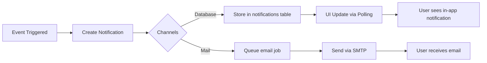

# Notification System v2.0
## SIM LPPM ITSNU - Concise Notification Documentation

**Document Version:** 2.0  
**Last Updated:** 2025-11-09  
**System:** Laravel Notifications (Database + Mail channels)

---

## Overview

All notifications implement `ShouldQueue` for async delivery. Two channels: `database` (in-app) and `mail` (email).

---

## Notification Types (13 Total)

### 1. ProposalSubmitted
**Trigger:** Proposal submitted by Dosen  
**Recipients:** Dekan, Admin LPPM, Team Members  
**Channels:** Database + Mail

### 2. ReviewerAssigned
**Trigger:** Admin LPPM assigns reviewer  
**Recipients:** Assigned Reviewer  
**Channels:** Database + Mail

### 3. TeamInvitationSent
**Trigger:** Team member invited to proposal  
**Recipients:** Invited Member  
**Channels:** Database + Mail

### 4. TeamInvitationAccepted
**Trigger:** Team member accepts invitation  
**Recipients:** Proposal Submitter  
**Channels:** Database only

### 5. TeamInvitationRejected
**Trigger:** Team member rejects invitation  
**Recipients:** Proposal Submitter  
**Channels:** Database only

### 6. ReviewCompleted
**Trigger:** Reviewer completes review  
**Recipients:** Admin LPPM, Kepala LPPM (when all done)  
**Channels:** Database + Mail

### 7. FinalDecisionMade
**Trigger:** Kepala LPPM final decision  
**Recipients:** Submitter, Team, Dekan, Admin LPPM  
**Channels:** Database + Mail

### 8. DekanApprovalDecision
**Trigger:** Dekan approves/rejects  
**Recipients:** Submitter, Kepala LPPM (if approved)  
**Channels:** Database + Mail

### 9. ReviewReminder
**Trigger:** Scheduled (3 days before deadline)  
**Recipients:** Reviewer with pending review  
**Channels:** Database + Mail

### 10. ReviewOverdue
**Trigger:** Scheduled (1 day after deadline)  
**Recipients:** Reviewer + Admin LPPM  
**Channels:** Database + Mail

### 11. ReviewerAssignment
**Trigger:** Kepala LPPM approves for review  
**Recipients:** Admin LPPM (to assign reviewers)  
**Channels:** Database + Mail

### 12. DailySummaryReport
**Trigger:** Scheduled (daily 8 AM)  
**Recipients:** Admin LPPM  
**Channels:** Mail only

### 13. WeeklySummaryReport
**Trigger:** Scheduled (weekly Monday 8 AM)  
**Recipients:** Kepala LPPM  
**Channels:** Mail only

---

## Data Payload Structure

**Database notifications (JSON):**

```json
{
  "type": "proposal_submitted",
  "title": "Proposal Baru Disubmit",
  "message": "Proposal '{title}' telah disubmit oleh {submitter_name}",
  "body": "Detailed description in Indonesian...",
  "proposal_id": "uuid",
  "submitter_id": "uuid",
  "submitter_name": "string",
  "proposal_type": "research|community_service",
  "link": "https://domain/proposals/uuid",
  "icon": "file-text",
  "created_at": "2025-11-09T08:00:00.000Z"
}
```

---

## UI Components

### Notification Dropdown
- **Location:** Top navbar (bell icon)
- **Shows:** Last 5 unread notifications
- **Polling:** Every 30 seconds (Livewire polling)
- **Actions:** Mark as read, View all

### Notification Center
- **Route:** `/notifications`
- **Pagination:** 20 per page
- **Filters:** All, Unread, Read
- **Actions:** Mark as read, Mark all as read, Delete

---

## Email Templates

**Structure:**
- **Subject:** `[SIM LPPM] {Action}`
- **Greeting:** `Halo, {name}!`
- **Body:** 2-3 concise lines
- **Action Button:** Link to proposal/review
- **Footer:** System signature

**Example:**
```
Subject: [SIM LPPM] Proposal Baru Diajukan

Halo, Admin LPPM!

Proposal baru dengan judul "Implementasi AI untuk Deteksi Penyakit" 
telah diajukan oleh Dr. John Doe.

[Lihat Detail Proposal]

Terima kasih,
SIM LPPM ITSNU
```

---

## Notification Flow



---

**Document End**
