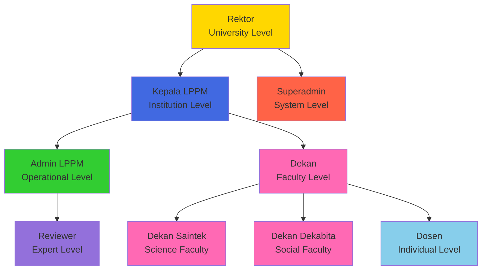

# Roles & Permissions Matrix v2.0
## SIM LPPM ITSNU - Role-Based Access Control (RBAC)

**Document Version:** 2.0  
**Last Updated:** 2025-11-09  
**Authorization System:** Spatie Laravel Permission

---

## Table of Contents
1. [Role Overview](#role-overview)
2. [Complete Permissions Matrix](#complete-permissions-matrix)
3. [Role Descriptions](#role-descriptions)
4. [Data Scope & Access Levels](#data-scope--access-levels)
5. [Permission Implementation](#permission-implementation)

---

## Role Overview

### System Roles (9 Total)

| #   | Role Name   | Code          | Level       | User Count    | Primary Function                              |
| --- | ----------- | ------------- | ----------- | ------------- | --------------------------------------------- |
| 1   | Super Admin | `superadmin`  | System      | 1-2           | IT administration, full system access         |
| 2   | Admin LPPM  | `admin lppm`  | Institution | 2-5           | Operational management, reviewer coordination |
| 3   | Kepala LPPM | `kepala lppm` | Institution | 1             | Strategic leadership, final approvals         |
| 4   | Dekan       | `dekan`       | Faculty     | 1 per faculty | First-level proposal approval                 |
| 7   | Dosen       | `dosen`       | Individual  | Many          | Proposal creation, submission                 |
| 8   | Reviewer    | `reviewer`    | Expert      | Many          | Proposal evaluation                           |
| 9   | Rektor      | `rektor`      | University  | 1             | Strategic oversight (rarely active)           |

### Role Hierarchy



---

## Complete Permissions Matrix

### Legend
- ✅ **Full Access** - Complete CRUD + all actions
- ✔️ **Limited Access** - Read + specific actions only
- 🔒 **Scoped Access** - Access limited by data ownership/scope
- ❌ **No Access** - Cannot access this resource

### Proposal Management

| Permission                  | superadmin | admin lppm | kepala lppm |  dekan*   |    dosen    |  reviewer  | rektor |
| --------------------------- | :--------: | :--------: | :---------: | :-------: | :---------: | :--------: | :----: |
| **Create Proposal**         |     ✅      |     ✅      |      ✅      |     ✅     |      ✅      |     ❌      |   ❌    |
| **View All Proposals**      |     ✅      |     ✅      |      ✅      | 🔒 Faculty |    🔒 Own    | 🔒 Assigned |   ✅    |
| **View Proposal Detail**    |     ✅      |     ✅      |      ✅      | 🔒 Faculty | 🔒 Own/Team  | 🔒 Assigned |   ✅    |
| **Edit Draft Proposal**     |     ✅      |     ✅      |      ✅      |     ✅     |    🔒 Own    |     ❌      |   ❌    |
| **Edit Submitted Proposal** |     ✅      |     ✅      | ✔️ Metadata  |     ❌     |      ❌      |     ❌      |   ❌    |
| **Delete Proposal**         |     ✅      |     ✅      |   ✔️ Draft   |     ❌     | 🔒 Own Draft |     ❌      |   ❌    |
| **Submit Proposal**         |     ✅      |     ✅      |      ✅      |     ✅     |    🔒 Own    |     ❌      |   ❌    |
| **Resubmit (Revision)**     |     ✅      |     ✅      |      ✅      |     ✅     |    🔒 Own    |     ❌      |   ❌    |

*dekan = includes dekan

---

### Approval Workflow

| Permission                       | superadmin | admin lppm | kepala lppm | dekan* | dosen | reviewer |   rektor    |
| -------------------------------- | :--------: | :--------: | :---------: | :----: | :---: | :------: | :---------: |
| **Dekan Approval**               |     ✅      |     ❌      |      ❌      |   ✅    |   ❌   |    ❌     |      ❌      |
| **Dekan Request Team Fix**       |     ✅      |     ❌      |      ❌      |   ✅    |   ❌   |    ❌     |      ❌      |
| **Kepala LPPM Initial Approval** |     ✅      |     ❌      |      ✅      |   ❌    |   ❌   |    ❌     | ✔️ Override  |
| **Kepala LPPM Final Decision**   |     ✅      |     ❌      |      ✅      |   ❌    |   ❌   |    ❌     | ✔️ Override  |
| **Reject Proposal**              |     ✅      |     ❌      |      ✅      |   ❌    |   ❌   |    ❌     | ✔️ Strategic |
| **Mark as Completed**            |     ✅      |     ❌      |      ✅      |   ❌    |   ❌   |    ❌     |      ❌      |
| **Request Revision**             |     ✅      |     ❌      |      ✅      |   ❌    |   ❌   |    ❌     |      ❌      |
| **Override Status**              |     ✅      |     ❌      |      ❌      |   ❌    |   ❌   |    ❌     | ✔️ Emergency |

---

### Team Management

| Permission                   | superadmin | admin lppm | kepala lppm |  dekan*   | dosen |  reviewer  | rektor |
| ---------------------------- | :--------: | :--------: | :---------: | :-------: | :---: | :--------: | :----: |
| **Invite Team Members**      |     ✅      |     ✅      |      ✅      |     ✅     | 🔒 Own |     ❌      |   ❌    |
| **Remove Team Member**       |     ✅      |     ✅      |   ✔️ Admin   |     ❌     | 🔒 Own |     ❌      |   ❌    |
| **Accept Team Invitation**   |     ✅      |     ✅      |      ✅      |     ✅     |   ✅   |     ❌      |   ❌    |
| **Reject Team Invitation**   |     ✅      |     ✅      |      ✅      |     ✅     |   ✅   |     ❌      |   ❌    |
| **View Team Members**        |     ✅      |     ✅      |      ✅      | 🔒 Faculty |   ✅   | 🔒 Assigned |   ✅    |
| **Assign Team Tasks**        |     ✅      |     ✅      |      ✅      |     ❌     | 🔒 Own |     ❌      |   ❌    |
| **View Pending Invitations** |     ✅      |     ✅      |      ✅      | 🔒 Faculty | 🔒 Own |     ❌      |   ❌    |

---

### Review Management

| Permission                    | superadmin | admin lppm | kepala lppm |  dekan*   | dosen |    reviewer     | rektor |
| ----------------------------- | :--------: | :--------: | :---------: | :-------: | :---: | :-------------: | :----: |
| **Assign Reviewers**          |     ✅      |     ✅      |   ✔️ View    |     ❌     |   ❌   |        ❌        |   ❌    |
| **Remove Reviewer**           |     ✅      |     ✅      |      ❌      |     ❌     |   ❌   |        ❌        |   ❌    |
| **View Reviewer Assignments** |     ✅      |     ✅      |      ✅      | 🔒 Faculty | 🔒 Own |      🔒 Own      |   ✅    |
| **Submit Review**             |     ✅      |     ❌      |      ❌      |     ❌     |   ❌   |        ✅        |   ❌    |
| **Edit Own Review**           |     ✅      |     ❌      |      ❌      |     ❌     |   ❌   | ✔️ Before Submit |   ❌    |
| **View All Reviews**          |     ✅      |     ✅      |      ✅      | 🔒 Faculty | 🔒 Own |      🔒 Own      |   ✅    |
| **View Review Notes**         |     ✅      |     ✅      |      ✅      |     ❌     | 🔒 Own |      🔒 Own      |   ✅    |
| **View Review Summary**       |     ✅      |     ✅      |      ✅      | 🔒 Faculty | 🔒 Own |        ❌        |   ✅    |

---

### Budget Management

| Permission                | superadmin | admin lppm | kepala lppm |  dekan*   |    dosen    |  reviewer  |   rektor    |
| ------------------------- | :--------: | :--------: | :---------: | :-------: | :---------: | :--------: | :---------: |
| **Add Budget Items**      |     ✅      |     ✅      |      ✅      |     ✅     | 🔒 Own Draft |     ❌      |      ❌      |
| **Edit Budget Items**     |     ✅      |     ✅      |   ✔️ Admin   |     ❌     | 🔒 Own Draft |     ❌      |      ❌      |
| **Delete Budget Items**   |     ✅      |     ✅      |   ✔️ Admin   |     ❌     | 🔒 Own Draft |     ❌      |      ❌      |
| **View Budget Details**   |     ✅      |     ✅      |      ✅      | 🔒 Faculty | 🔒 Own/Team  | 🔒 Assigned |      ✅      |
| **Export Budget Summary** |     ✅      |     ✅      |      ✅      | 🔒 Faculty |    🔒 Own    |     ❌      |      ✅      |
| **Approve Budget**        |     ✅      |     ❌      |      ✅      |     ✅     |      ❌      |     ❌      | ✔️ Strategic |

---

### Progress Reporting

| Permission                  | superadmin | admin lppm | kepala lppm |  dekan*   |   dosen    | reviewer | rektor |
| --------------------------- | :--------: | :--------: | :---------: | :-------: | :--------: | :------: | :----: |
| **Create Progress Report**  |     ✅      |     ✅      |      ✅      |     ✅     |   🔒 Own    |    ❌     |   ❌    |
| **Submit Progress Report**  |     ✅      |     ✅      |      ✅      |     ✅     |   🔒 Own    |    ❌     |   ❌    |
| **Edit Draft Report**       |     ✅      |     ✅      |      ✅      |     ❌     |   🔒 Own    |    ❌     |   ❌    |
| **Approve Progress Report** |     ✅      |     ✅      |      ✅      |     ❌     |     ❌      |    ❌     |   ❌    |
| **View All Reports**        |     ✅      |     ✅      |      ✅      | 🔒 Faculty |   🔒 Own    |    ❌     |   ✅    |
| **View Report Details**     |     ✅      |     ✅      |      ✅      | 🔒 Faculty | 🔒 Own/Team |    ❌     |   ✅    |
| **Add Mandatory Outputs**   |     ✅      |     ✅      |      ✅      |     ❌     |   🔒 Own    |    ❌     |   ❌    |
| **Add Additional Outputs**  |     ✅      |     ✅      |      ✅      |     ❌     |   🔒 Own    |    ❌     |   ❌    |

---

### Master Data Management

| Permission                       | superadmin | admin lppm | kepala lppm | dekan* | dosen  | reviewer | rektor |
| -------------------------------- | :--------: | :--------: | :---------: | :----: | :----: | :------: | :----: |
| **Manage Focus Areas**           |     ✅      |     ✅      |   ✔️ View    |   ❌    |   ❌    |    ❌     |   ❌    |
| **Manage Themes**                |     ✅      |     ✅      |   ✔️ View    |   ❌    |   ❌    |    ❌     |   ❌    |
| **Manage Topics**                |     ✅      |     ✅      |   ✔️ View    |   ❌    |   ❌    |    ❌     |   ❌    |
| **Manage Keywords**              |     ✅      |     ✅      |   ✔️ View    |   ❌    |   ❌    |    ❌     |   ❌    |
| **Manage Research Schemes**      |     ✅      |     ✅      |   ✔️ View    |   ❌    |   ❌    |    ❌     |   ❌    |
| **Manage National Priorities**   |     ✅      |     ✅      |   ✔️ View    |   ❌    |   ❌    |    ❌     |   ❌    |
| **Manage Science Clusters**      |     ✅      |     ✅      |   ✔️ View    |   ❌    |   ❌    |    ❌     |   ❌    |
| **Manage Budget Groups**         |     ✅      |     ✅      |   ✔️ View    |   ❌    |   ❌    |    ❌     |   ❌    |
| **Manage Budget Components**     |     ✅      |     ✅      |   ✔️ View    |   ❌    |   ❌    |    ❌     |   ❌    |
| **Manage Partners**              |     ✅      |     ✅      |   ✔️ View    |   ❌    | ✔️ View |    ❌     |   ❌    |
| **Manage Faculties**             |     ✅      |     ✅      |      ❌      |   ❌    |   ❌    |    ❌     |   ❌    |
| **Manage Study Programs**        |     ✅      |     ✅      |      ❌      |   ❌    |   ❌    |    ❌     |   ❌    |
| **Manage Institutions**          |     ✅      |     ✅      |      ❌      |   ❌    |   ❌    |    ❌     |   ❌    |
| **Manage Macro Research Groups** |     ✅      |     ✅      |   ✔️ View    |   ❌    |   ❌    |    ❌     |   ❌    |

---

### User Management

| Permission              | superadmin |    admin lppm    | kepala lppm | dekan* |     dosen     | reviewer | rektor |
| ----------------------- | :--------: | :--------------: | :---------: | :----: | :-----------: | :------: | :----: |
| **Create User**         |     ✅      |        ✅         |      ❌      |   ❌    |       ❌       |    ❌     |   ❌    |
| **Edit User**           |     ✅      |        ✅         |      ❌      |   ❌    | 🔒 Own Profile |    ❌     |   ❌    |
| **Delete User**         |     ✅      | ✔️ Dosen/Reviewer |      ❌      |   ❌    |       ❌       |    ❌     |   ❌    |
| **Assign Roles**        |     ✅      |        ✅         |      ❌      |   ❌    |       ❌       |    ❌     |   ❌    |
| **Remove Roles**        |     ✅      |        ✅         |      ❌      |   ❌    |       ❌       |    ❌     |   ❌    |
| **View All Users**      |     ✅      |        ✅         |   ✔️ View    |   ❌    |       ❌       |    ❌     |   ❌    |
| **View User Details**   |     ✅      |        ✅         |  ✔️ Limited  |   ❌    |     🔒 Own     |    ❌     |   ❌    |
| **Edit Own Profile**    |     ✅      |        ✅         |      ✅      |   ✅    |       ✅       |    ✅     |   ✅    |
| **Change Own Password** |     ✅      |        ✅         |      ✅      |   ✅    |       ✅       |    ✅     |   ✅    |
| **Enable 2FA**          |     ✅      |        ✅         |      ✅      |   ✅    |       ✅       |    ✅     |   ✅    |
| **Reset User Password** |     ✅      |        ✅         |      ❌      |   ❌    |       ❌       |    ❌     |   ❌    |

---

### Reports & Analytics

| Permission                   | superadmin | admin lppm | kepala lppm |  dekan*   | dosen | reviewer | rektor |
| ---------------------------- | :--------: | :--------: | :---------: | :-------: | :---: | :------: | :----: |
| **View Dashboard**           |     ✅      |     ✅      |      ✅      | 🔒 Faculty | 🔒 Own |  🔒 Own   |   ✅    |
| **View Proposal Statistics** |     ✅      |     ✅      |      ✅      | 🔒 Faculty | 🔒 Own |    ❌     |   ✅    |
| **Generate Reports**         |     ✅      |     ✅      |      ✅      | 🔒 Faculty | 🔒 Own |    ❌     |   ✅    |
| **Export Data (CSV/Excel)**  |     ✅      |     ✅      |      ✅      | 🔒 Faculty | 🔒 Own |    ❌     |   ✅    |
| **View System Analytics**    |     ✅      |     ✅      |      ✅      |     ❌     |   ❌   |    ❌     |   ✅    |
| **View Review Statistics**   |     ✅      |     ✅      |      ✅      | 🔒 Faculty |   ❌   |  🔒 Own   |   ✅    |
| **View Faculty Comparison**  |     ✅      |     ✅      |      ✅      |     ❌     |   ❌   |    ❌     |   ✅    |

---

### Notifications

| Permission                             | superadmin | admin lppm | kepala lppm | dekan* | dosen | reviewer | rektor |
| -------------------------------------- | :--------: | :--------: | :---------: | :----: | :---: | :------: | :----: |
| **View Own Notifications**             |     ✅      |     ✅      |      ✅      |   ✅    |   ✅   |    ✅     |   ✅    |
| **Mark as Read**                       |     ✅      |     ✅      |      ✅      |   ✅    |   ✅   |    ✅     |   ✅    |
| **Delete Notifications**               |     ✅      |     ✅      |      ✅      |   ✅    |   ✅   |    ✅     |   ✅    |
| **Send Manual Notifications**          |     ✅      |     ✅      |  ✔️ Limited  |   ❌    |   ❌   |    ❌     |   ❌    |
| **Configure Notification Preferences** |     ✅      |     ✅      |      ✅      |   ✅    |   ✅   |    ✅     |   ✅    |
| **View All Notifications Log**         |     ✅      |     ✅      |      ❌      |   ❌    |   ❌   |    ❌     |   ❌    |

---

### System Administration

| Permission                    | superadmin | admin lppm | kepala lppm | dekan* | dosen | reviewer | rektor |
| ----------------------------- | :--------: | :--------: | :---------: | :----: | :---: | :------: | :----: |
| **Access Telescope**          |     ✅      |     ❌      |      ❌      |   ❌    |   ❌   |    ❌     |   ❌    |
| **View System Logs**          |     ✅      | ✔️ Limited  |      ❌      |   ❌    |   ❌   |    ❌     |   ❌    |
| **Run Artisan Commands**      |     ✅      |     ❌      |      ❌      |   ❌    |   ❌   |    ❌     |   ❌    |
| **Manage Database**           |     ✅      |     ❌      |      ❌      |   ❌    |   ❌   |    ❌     |   ❌    |
| **Configure System Settings** |     ✅      | ✔️ Limited  |      ❌      |   ❌    |   ❌   |    ❌     |   ❌    |
| **View Queue Jobs**           |     ✅      |   ✔️ View   |      ❌      |   ❌    |   ❌   |    ❌     |   ❌    |
| **Clear Cache**               |     ✅      |     ❌      |      ❌      |   ❌    |   ❌   |    ❌     |   ❌    |

---

## Role Descriptions

### 1. Superadmin (System Administrator)

**Purpose:** IT administration and development support

**Access Level:** System-wide, unrestricted

**Key Responsibilities:**
- System maintenance and monitoring
- Database management
- Emergency data recovery
- Security incident response
- Development and deployment support

**Typical Users:** IT administrators, developers

**Critical Permissions:**
- ✅ Full database access
- ✅ Laravel Telescope access
- ✅ Artisan command execution
- ✅ Bypass all validation rules
- ✅ Override any status transition

**Restrictions:**
- Should NOT be used for daily operations
- Reserved for technical issues and development
- All actions logged for audit

---

### 2. Admin LPPM (LPPM Administrator)

**Purpose:** Operational management of LPPM activities

**Access Level:** Institution-wide (all faculties)

**Key Responsibilities:**
- Assign reviewers to proposals after Kepala LPPM approval
- Manage all master data (taxonomy, keywords, partners, budgets)
- User account management (create, edit, assign roles)
- Monitor review progress and send reminders
- Coordinate between stakeholders
- Generate operational reports

**Typical Users:** LPPM administrative staff (2-5 persons)

**Critical Permissions:**
- ✅ Assign/remove reviewers
- ✅ Full master data CRUD
- ✅ Create users and assign roles (except superadmin/rektor)
- ✅ View all proposals (all statuses, all faculties)
- ✅ View all reviews and summaries
- ❌ Cannot approve proposals (orchestrator, not decision-maker)
- ❌ Cannot submit reviews

**Data Scope:** All proposals, all faculties, all users (except sensitive system data)

---

### 3. Kepala LPPM (LPPM Director)

**Purpose:** Strategic leadership and final decision authority

**Access Level:** Institution-wide (all faculties)

**Key Responsibilities:**
- **Initial approval** after Dekan (APPROVED → UNDER_REVIEW)
- **Final decision** after all reviews completed (REVIEWED → COMPLETED/REVISION_NEEDED/REJECTED)
- Strategic oversight of all research/PKM activities
- Policy implementation
- Institutional research coordination
- High-level reporting

**Typical Users:** LPPM Director (1 person)

**Critical Permissions:**
- ✅ Initial approval (triggers reviewer assignment)
- ✅ Final decision (approve/revise/reject)
- ✅ View all proposals and reviews
- ✅ View all reports and analytics
- ✔️ View master data (cannot edit)
- ❌ Cannot assign reviewers directly (Admin LPPM's role)
- ❌ Cannot create users

**Two-Stage Approval:**
1. **Initial:** APPROVED → UNDER_REVIEW (approve for review)
2. **Final:** REVIEWED → COMPLETED/REVISION_NEEDED (final decision)

**Data Scope:** All proposals, all faculties, all reports (read-only for master data)

---

### 4. Dekan

**Purpose:** Faculty-level proposal approval and oversight

**Access Level:** Faculty-scoped (own faculty only)

**Key Responsibilities:**
- **First-level approval** of submitted proposals (SUBMITTED → APPROVED)
- Review proposal alignment with faculty goals
- Budget review for faculty proposals
- Faculty research coordination
- Request team member fixes if needed (SUBMITTED → NEED_ASSIGNMENT)

**Typical Users:** Faculty deans (1 per faculty, 3 total)

**Role Variants:**
- **Dekan:** General dean (can see all faculties, limited edit)

**Critical Permissions:**
- ✅ Approve proposals from own faculty
- ✅ Request team composition fixes
- ✅ View faculty-scoped proposals and reports
- ❌ Cannot reject proposals (only Kepala LPPM can reject)
- ❌ Cannot edit proposals after submission
- ❌ Cannot assign reviewers

**Data Scope:** Own faculty proposals only

**Approval Authority:**
- SUBMITTED → APPROVED (approve)
- SUBMITTED → NEED_ASSIGNMENT (request team fix)

---

### 5. Dosen (Lecturer/Researcher)

**Purpose:** Proposal creation, submission, and progress reporting

**Access Level:** Own proposals and team memberships

**Key Responsibilities:**
- Create research/PKM proposals
- Invite and manage team members
- Submit proposals for approval
- Respond to team invitations from others
- Submit progress reports (semester/annual)
- Revise proposals if marked for revision
- Track proposal status

**Typical Users:** Faculty lecturers and researchers (many)

**Critical Permissions:**
- ✅ Create proposals (research or PKM)
- ✅ Edit own draft proposals
- ✅ Invite team members (ketua/anggota)
- ✅ Submit proposals (when all team accepted)
- ✅ Submit progress reports
- ✅ Accept/reject team invitations from others
- ❌ Cannot edit submitted proposals
- ❌ Cannot view other Dosen's proposals (unless team member)
- ❌ Cannot assign reviewers or approve

**Data Scope:**
- Own submitted proposals (as submitter)
- Proposals where user is team member
- Own progress reports

**Workflow Participation:**
- Create → Invite Team → Submit (when all accept) → Revise (if needed) → Report Progress

---

### 6. Reviewer (Expert Evaluator)

**Purpose:** Expert evaluation and recommendation of proposals

**Access Level:** Assigned proposals only

**Key Responsibilities:**
- Review assigned proposals
- Evaluate methodology, budget, team qualifications
- Provide detailed feedback and notes
- Recommend approval, revision, or rejection
- Complete reviews within deadline (typically 7-14 days)

**Typical Users:** Subject matter experts, senior researchers (many)

**Critical Permissions:**
- ✅ View assigned proposals (full details)
- ✅ Submit reviews (notes + recommendation)
- ✅ View own review history
- ❌ Cannot view unassigned proposals
- ❌ Cannot approve or reject proposals (only recommends)
- ❌ Cannot assign reviews to others
- ❌ Cannot edit reviews after submission (immutable)

**Data Scope:** Only proposals assigned via `proposal_reviewer` table

**Review Options:**
- **Approved:** Proposal is acceptable as-is
- **Revision Needed:** Requires improvements before approval
- **Rejected:** Proposal should not be approved

**Notifications:**
- Receives assignment notification
- Receives 3-day reminder before deadline
- Receives overdue notice if late

---

### 7. Rektor (University Rector)

**Purpose:** Strategic oversight and high-priority approvals

**Access Level:** University-wide (read-mostly)

**Key Responsibilities:**
- Strategic approval for high-priority proposals
- University-wide research oversight
- View institutional analytics
- Emergency overrides (rarely used)

**Typical Users:** University Rector (1 person)

**Critical Permissions:**
- ✅ View all proposals (all statuses, all faculties)
- ✅ View all reports and analytics
- ✅ Strategic approval for priority proposals
- ✔️ Override Kepala LPPM decisions (emergency only)
- ❌ Not involved in day-to-day operations
- ❌ Cannot create proposals
- ❌ Cannot assign reviewers

**Data Scope:** All proposals, all faculties (read-mostly)

**Usage Pattern:** Mostly passive monitoring; active only for strategic/high-impact proposals

---

## Data Scope & Access Levels

### Access Scope Definitions

| Scope                 | Description                      | Applies To                      |
| --------------------- | -------------------------------- | ------------------------------- |
| **System-wide**       | Unrestricted access to all data  | superadmin                      |
| **Institution-wide**  | All faculties, all proposals     | admin lppm, kepala lppm, rektor |
| **Faculty-scoped**    | Own faculty proposals only       | dekan                           |
| **Team-scoped**       | Own proposals + team memberships | dosen                           |
| **Assignment-scoped** | Only assigned proposals          | reviewer                        |
| **Own-only**          | Personal data and activities     | All roles (for own profile)     |

---

### Query Filtering by Role

```php
// Example: Proposal list filtering

if ($user->hasRole('superadmin')) {
    $proposals = Proposal::all(); // No filter
}

elseif ($user->hasRole(['admin lppm', 'kepala lppm', 'rektor'])) {
    $proposals = Proposal::all(); // Institution-wide
}

elseif ($user->hasRole(['dekan'])) {
    $facultyId = $user->identity->faculty_id;
    $proposals = Proposal::whereHas('submitter.identity', function($q) use ($facultyId) {
        $q->where('faculty_id', $facultyId);
    })->get();
}

elseif ($user->hasRole('dosen')) {
    $proposals = Proposal::where('submitter_id', $user->id)
        ->orWhereHas('teamMembers', function($q) use ($user) {
            $q->where('user_id', $user->id);
        })->get();
}

elseif ($user->hasRole('reviewer')) {
    $proposals = Proposal::whereHas('reviewers', function($q) use ($user) {
        $q->where('user_id', $user->id);
    })->get();
}
```

---

### Action Authorization Example

```php
// Example: Can user approve proposal?

public function canApprove(User $user, Proposal $proposal): bool
{
    // Dekan approval
    if ($user->hasRole(['dekan'])) {
        return $proposal->status === ProposalStatus::SUBMITTED
            && $user->identity->faculty_id === $proposal->submitter->identity->faculty_id;
    }
    
    // Kepala LPPM initial approval
    if ($user->hasRole('kepala lppm')) {
        return $proposal->status === ProposalStatus::APPROVED;
    }
    
    // Kepala LPPM final decision
    if ($user->hasRole('kepala lppm')) {
        return $proposal->status === ProposalStatus::REVIEWED
            && $proposal->allReviewsCompleted();
    }
    
    return false;
}
```

---

## Permission Implementation

### Spatie Laravel Permission

The system uses **Spatie Laravel Permission** package for RBAC.

**Key Concepts:**
- **Roles:** Named user groups (e.g., "dosen", "reviewer")
- **Permissions:** Granular actions (e.g., "create-proposal", "assign-reviewer")
- **Model-level authorization:** Policies and Gates
- **Direct role assignment:** `$user->assignRole('dosen')`
- **Permission checking:** `$user->hasRole('dosen')` or `$user->can('create-proposal')`

### Database Tables (Spatie)

```
roles (id, name, guard_name)
permissions (id, name, guard_name)
model_has_roles (role_id, model_type, model_id)
model_has_permissions (permission_id, model_type, model_id)
role_has_permissions (permission_id, role_id)
```

### Middleware Usage

**Route Protection:**
```php
// Single role
Route::middleware(['auth', 'role:admin lppm'])->group(function() {
    Route::get('/reviewers/assign', [ReviewerController::class, 'assign']);
});

// Multiple roles (OR logic)
Route::middleware(['auth', 'role:admin lppm|kepala lppm'])->group(function() {
    Route::get('/proposals', [ProposalController::class, 'index']);
});

// Permission-based
Route::middleware(['auth', 'permission:assign-reviewers'])->group(function() {
    Route::post('/reviewers', [ReviewerController::class, 'store']);
});
```

**Livewire Component Authorization:**
```php
class AssignReviewers extends Component
{
    public function mount()
    {
        $this->authorize('assign-reviewers'); // Gate/Policy
    }
    
    public function assignReviewer($reviewerId)
    {
        if (!auth()->user()->hasRole('admin lppm')) {
            abort(403);
        }
        // ...
    }
}
```

---

### Active Role System

**Note:** This application implements a custom **active role** system on top of Spatie.

```php
// User model override
public function hasRole($role, $guard = null): bool
{
    $activeRole = session('active_role');
    return $activeRole === $role;
}

// Usage in dashboard redirector
if ($user->activeRole() === 'dosen') {
    return redirect()->route('research.proposal.index');
} elseif ($user->activeRole() === 'admin lppm') {
    return redirect()->route('dashboard.admin');
}
```

**Purpose:** Users with multiple roles can switch active role in session (future enhancement)

---

## Summary Table: Who Can Do What?

| Action                 | Executor    | Prerequisites         | Notification Sent To                      |
| ---------------------- | ----------- | --------------------- | ----------------------------------------- |
| Create Proposal        | Dosen       | None                  | None (draft)                              |
| Submit Proposal        | Dosen       | All team accepted     | Dekan, Admin LPPM, Team                   |
| Dekan Approve          | Dekan       | Status = SUBMITTED    | Kepala LPPM, Submitter, Team              |
| Kepala Initial Approve | Kepala LPPM | Status = APPROVED     | Admin LPPM                                |
| Assign Reviewers       | Admin LPPM  | Status = UNDER_REVIEW | Reviewer(s)                               |
| Submit Review          | Reviewer    | Assigned              | Admin LPPM (each), Kepala LPPM (all done) |
| Kepala Final Decision  | Kepala LPPM | Status = REVIEWED     | Submitter, Team, Dekan, Admin             |

---

**Document End**
