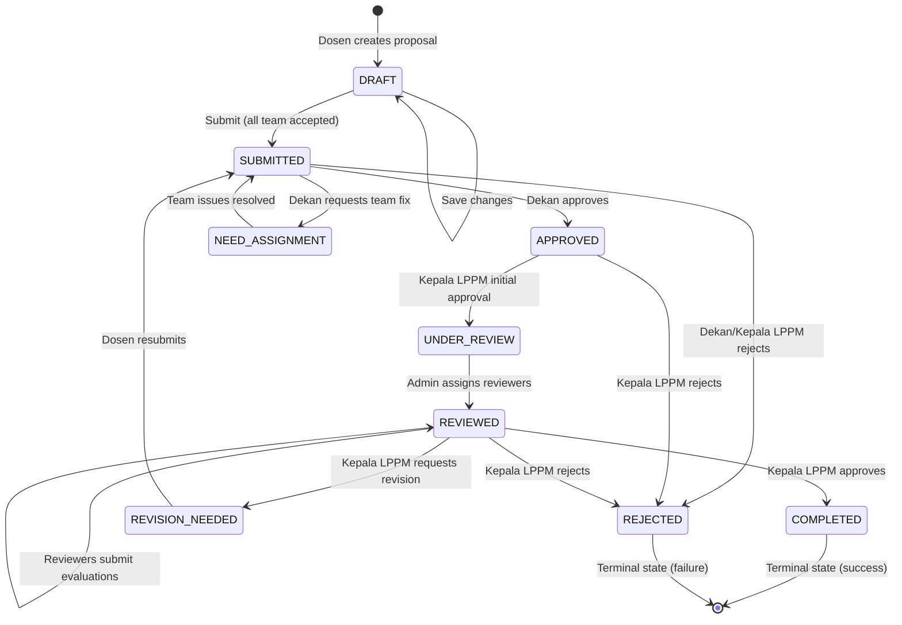
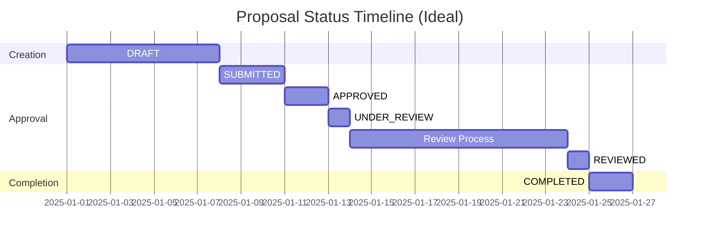
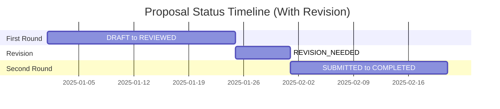

# Proposal Status Transitions v2.0
## SIM LPPM ITSNU - Status Lifecycle & State Machine

**Document Version:** 2.0  
**Last Updated:** 2025-11-09  
**Enum:** `App\Enums\ProposalStatus`

---

## ProposalStatus Enum (9 States)

```php
enum ProposalStatus: string
{
    case DRAFT = 'draft';
    case SUBMITTED = 'submitted';
    case NEED_ASSIGNMENT = 'need_assignment';
    case APPROVED = 'approved';
    case UNDER_REVIEW = 'under_review';
    case REVIEWED = 'reviewed';
    case REVISION_NEEDED = 'revision_needed';
    case COMPLETED = 'completed';
    case REJECTED = 'rejected';
}
```

---

## State Transition Diagram



---

## Valid Transitions Matrix

| From | To | Triggered By | Business Rule | Notification |
|------|-----|--------------|---------------|--------------|
| **DRAFT** | SUBMITTED | Dosen | All team members accepted | Dekan, Admin, Team |
| **SUBMITTED** | APPROVED | Dekan | Dekan reviews and approves | Kepala LPPM, Submitter, Team |
| **SUBMITTED** | NEED_ASSIGNMENT | Dekan | Team acceptance issues | Submitter, Pending Members |
| **SUBMITTED** | REJECTED | Kepala LPPM | Early rejection (rare) | Submitter, Team |
| **NEED_ASSIGNMENT** | SUBMITTED | Dosen | Team issues resolved | Dekan, Admin, Team |
| **APPROVED** | UNDER_REVIEW | Kepala LPPM | Initial approval granted | Admin LPPM |
| **APPROVED** | REJECTED | Kepala LPPM | Not acceptable | Submitter, Team |
| **UNDER_REVIEW** | REVIEWED | Admin LPPM | Reviewers assigned | Assigned Reviewers |
| **REVIEWED** | COMPLETED | Kepala LPPM | Final approval | Submitter, Team, Dekan, Admin |
| **REVIEWED** | REVISION_NEEDED | Kepala LPPM | Needs improvement | Submitter, Team |
| **REVIEWED** | REJECTED | Kepala LPPM | Not acceptable | Submitter, Team |
| **REVISION_NEEDED** | SUBMITTED | Dosen | Revised and resubmitted | Dekan, Admin, Team |
| **COMPLETED** | - | - | Terminal state | - |
| **REJECTED** | - | - | Terminal state | - |

---

## Status Descriptions

### DRAFT
**Label:** "Draft"  
**Color:** `secondary` (gray)  
**Description:** Proposal sedang dalam tahap penyusunan  

**Editable:** ✅ Yes (owner only)  
**Deletable:** ✅ Yes (owner only)  
**Team Status:** Can invite members  
**Next Steps:** Complete proposal, ensure all team members accept, then submit  

---

### SUBMITTED
**Label:** "Diajukan"  
**Color:** `info` (blue)  
**Description:** Proposal telah diajukan dan menunggu persetujuan Dekan  

**Editable:** ❌ No  
**Deletable:** ❌ No  
**Awaiting:** Dekan approval  
**Duration:** 3-5 days  

**Valid Transitions:**
- → APPROVED (Dekan approves)
- → NEED_ASSIGNMENT (Dekan requests team fix)
- → REJECTED (Rejected by Dekan/Kepala LPPM)

---

### NEED_ASSIGNMENT
**Label:** "Perlu Persetujuan Anggota"  
**Color:** `warning` (yellow)  
**Description:** Proposal memerlukan persetujuan anggota tim  

**Editable:** ✔️ Team members can accept/reject  
**Deletable:** ❌ No  
**Awaiting:** Team member action  
**Trigger:** Team member rejection OR Dekan request  

**Resolution:**
- Remove rejected members
- Invite new members
- Wait for all acceptances
- Resubmit when ready

**Valid Transitions:**
- → SUBMITTED (Team issues resolved)

---

### APPROVED
**Label:** "Disetujui Dekan"  
**Color:** `primary` (green)  
**Description:** Proposal telah disetujui Dekan dan menunggu persetujuan Kepala LPPM  

**Editable:** ❌ No  
**Deletable:** ❌ No  
**Awaiting:** Kepala LPPM initial approval  
**Duration:** 2-3 days  

**Valid Transitions:**
- → UNDER_REVIEW (Kepala LPPM initial approval)
- → REJECTED (Kepala LPPM rejects)

---

### UNDER_REVIEW
**Label:** "Menunggu Penugasan Reviewer"  
**Color:** `cyan` (light blue)  
**Description:** Proposal telah disetujui Kepala LPPM untuk direview, menunggu Admin LPPM menugaskan reviewer  

**Editable:** ❌ No  
**Deletable:** ❌ No  
**Awaiting:** Admin LPPM to assign reviewers  
**Duration:** 1-2 days (assignment phase)  

**Phase:**
Admin LPPM reviews proposal and assigns appropriate reviewers based on expertise. Once reviewers are assigned, proposal automatically transitions to REVIEWED status.

**Valid Transitions:**
- → REVIEWED (Reviewers assigned and begin review)

---

### REVIEWED
**Label:** "Sedang Direview"  
**Color:** `orange`  
**Description:** Proposal sedang dalam proses review oleh reviewer yang telah ditugaskan  

**Editable:** ❌ No  
**Deletable:** ❌ No  
**Awaiting:** All reviewers to complete their evaluations  
**Duration:** 7-14 days (review period)  

**Phase:**
Reviewers evaluate proposal content, methodology/solution, budget, and team qualifications. Each reviewer submits notes and recommendation (approved/revision_needed/rejected). When all reviewers complete, Admin LPPM and Kepala LPPM are notified.

**System Behavior:**
Proposal remains in REVIEWED status throughout the entire review process. Once all reviewers have submitted their evaluations (`proposal_reviewer.status = 'completed'`), Kepala LPPM is notified to make final decision.

**Valid Transitions:**
- → COMPLETED (Kepala LPPM approves after all reviews done)
- → REVISION_NEEDED (Kepala LPPM requests revision after all reviews done)
- → REJECTED (Kepala LPPM rejects after all reviews done)

---

### REVISION_NEEDED
**Label:** "Perlu Revisi"  
**Color:** `yellow`  
**Description:** Proposal memerlukan perbaikan sebelum disetujui  

**Editable:** ✅ Yes (owner can revise)  
**Deletable:** ❌ No  
**Awaiting:** Dosen revision  
**Action Required:** Review feedback, make improvements, resubmit  

**Revision Process:**
1. Dosen views reviewer feedback
2. Updates proposal content
3. Resubmits (status → SUBMITTED)
4. Restarts approval workflow

**Valid Transitions:**
- → SUBMITTED (Dosen resubmits)

---

### COMPLETED
**Label:** "Selesai"  
**Color:** `success` (green)  
**Description:** Proposal telah disetujui dan selesai  

**Editable:** ❌ No  
**Deletable:** ❌ No  
**Terminal:** ✅ Yes (no further transitions)  
**Next Steps:** Begin research/PKM activities, submit progress reports  

---

### REJECTED
**Label:** "Ditolak"  
**Color:** `danger` (red)  
**Description:** Proposal ditolak  

**Editable:** ❌ No  
**Deletable:** ❌ No  
**Terminal:** ✅ Yes (no further transitions)  
**Can Reject:** Dekan, Kepala LPPM  

**Rejection Stages:**
- Early rejection (SUBMITTED → REJECTED): Rare, usually sends to NEED_ASSIGNMENT instead
- Post-Dekan approval (APPROVED → REJECTED): Kepala LPPM strategic rejection
- Post-review (REVIEWED → REJECTED): Kepala LPPM rejects based on reviews

---

## Business Rules

### Rule 1: Team Acceptance Required
**Status Affected:** DRAFT → SUBMITTED

```php
public function canSubmit(Proposal $proposal): bool
{
    return $proposal->allTeamMembersAccepted();
}
```

**Validation:**
- All `proposal_user.status` must be `'accepted'`
- Cannot submit if any member has status `'pending'` or `'rejected'`
- Auto-transition to NEED_ASSIGNMENT if team member rejects

---

### Rule 2: Sequential Approval
**Statuses:** SUBMITTED → APPROVED → UNDER_REVIEW → REVIEWED → COMPLETED

**Cannot Skip Stages:**
- Must go through Dekan approval first (SUBMITTED → APPROVED)
- Then Kepala LPPM initial approval (APPROVED → UNDER_REVIEW)
- Then reviewer assignment and evaluation
- Finally Kepala LPPM final decision

---

### Rule 3: Reviewer Assignment Trigger
**Transition:** UNDER_REVIEW → REVIEWED

```php
// Auto-transition when first reviewer is assigned
if ($proposal->reviewers()->count() > 0) {
    $proposal->update(['status' => ProposalStatus::REVIEWED]);
}
```

**Validation:**
- At least one reviewer must be assigned
- System automatically updates status when Admin LPPM assigns reviewers
- Triggers notification to assigned reviewers

### Rule 3a: Review Completion Notification
**Status:** REVIEWED (remains in this status)

```php
// Notify Kepala LPPM when all reviewers complete
if ($proposal->allReviewersCompleted()) {
    // Notification sent, but status remains REVIEWED
    notify($kepalaLppm, 'All reviews completed');
}
```

**Validation:**
- All `proposal_reviewer.status` must be `'completed'`
- Status does NOT change automatically
- Triggers notification to Kepala LPPM for final decision

---

### Rule 4: Kepala LPPM Dual Approval
**Stages:**
1. **Initial Approval:** APPROVED → UNDER_REVIEW (approve for review)
2. **Final Decision:** REVIEWED → COMPLETED/REVISION_NEEDED/REJECTED

**Validation:**
- Cannot make final decision until status = REVIEWED
- Cannot approve for review unless status = APPROVED

---

### Rule 5: Revision Loop
**Path:** REVISION_NEEDED → SUBMITTED → ... → REVIEWED → (decision)

**Validation:**
- Revised proposals return to SUBMITTED status
- Must restart full approval workflow
- No limit on revision attempts (can be configured)

---

### Rule 6: Terminal States
**States:** COMPLETED, REJECTED

**Rules:**
- No transitions allowed from terminal states
- Immutable after reaching these states
- Require database-level intervention to change (superadmin only)

---

### Rule 7: Team Rejection Trigger
**Any Status → NEED_ASSIGNMENT (when team member rejects)**

```php
// Automatic transition on team rejection
if ($teamMember->rejects()) {
    $proposal->update(['status' => ProposalStatus::NEED_ASSIGNMENT]);
}
```

**Applies To:** Any non-terminal status

---

## Validation Implementation

```php
public function canTransitionTo(ProposalStatus $newStatus): bool
{
    return match ($this) {
        self::DRAFT => in_array($newStatus, [self::SUBMITTED]),
        
        self::SUBMITTED => in_array($newStatus, [
            self::APPROVED,
            self::NEED_ASSIGNMENT,
            self::REJECTED
        ]),
        
        self::NEED_ASSIGNMENT => in_array($newStatus, [self::SUBMITTED]),
        
        self::APPROVED => in_array($newStatus, [
            self::UNDER_REVIEW,
            self::REJECTED
        ]),
        
        self::UNDER_REVIEW => in_array($newStatus, [self::REVIEWED]),
        
        self::REVIEWED => in_array($newStatus, [
            self::COMPLETED,
            self::REVISION_NEEDED,
            self::REJECTED
        ]),
        
        self::REVISION_NEEDED => in_array($newStatus, [self::SUBMITTED]),
        
        self::COMPLETED => false, // Terminal
        self::REJECTED => false,  // Terminal
    };
}
```

---

## Status Change Notifications

| Status Change | Notification Sent To | Subject |
|---------------|---------------------|---------|
| → SUBMITTED | Dekan, Admin LPPM, Team | "Proposal Baru Diajukan" |
| → NEED_ASSIGNMENT | Submitter, Pending Members | "Perbaikan Tim Diperlukan" |
| → APPROVED | Kepala LPPM, Submitter, Team | "Proposal Disetujui Dekan" |
| → UNDER_REVIEW | Admin LPPM | "Tugaskan Reviewer" |
| → REVIEWED | Assigned Reviewers | "Anda Ditugaskan Review Proposal" |
| All Reviews Complete (in REVIEWED) | Kepala LPPM | "Semua Review Selesai" |
| → COMPLETED | Submitter, Team, Dekan, Admin | "Proposal Disetujui" |
| → REVISION_NEEDED | Submitter, Team | "Revisi Diperlukan" |
| → REJECTED | Submitter, Team | "Proposal Ditolak" |

---

## Transition Timeline

**Average Duration (without revisions):**



**Total:** ~26 days (3-4 weeks)

**With One Revision:**



**Total:** ~51 days (7-8 weeks)

---

## Status Distribution Monitoring

**Dashboard Metrics:**
- Proposals by status (pie chart)
- Average time in each status (bar chart)
- Bottleneck identification (status with longest duration)
- Completion rate (COMPLETED / Total × 100%)
- Rejection rate (REJECTED / Total × 100%)
- Revision rate (went through REVISION_NEEDED × 100%)

---

**Document End**
