# Workflow Documentation v2.0
## SIM LPPM ITSNU - Complete Process Flows

**Document Version:** 2.0  
**Last Updated:** 2025-11-09

---

## Table of Contents
1. [Complete Proposal Lifecycle](#complete-proposal-lifecycle)
2. [Dosen Workflows](#dosen-workflows)
3. [Dekan Workflows](#dekan-workflows)
4. [Kepala LPPM Workflows](#kepala-lppm-workflows)
5. [Admin LPPM Workflows](#admin-lppm-workflows)
6. [Reviewer Workflows](#reviewer-workflows)
7. [Executive Summary](#executive-summary)

---

## Complete Proposal Lifecycle

### Overview Diagram

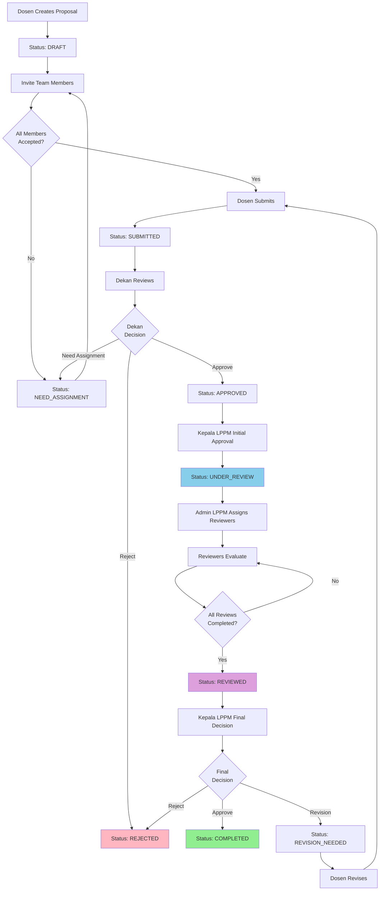

### Status Progression Table

| Stage | Status                                 | Actor       | Duration  | Next Step                    |
| ----- | -------------------------------------- | ----------- | --------- | ---------------------------- |
| 1     | DRAFT                                  | Dosen       | Variable  | Team invitations             |
| 2     | NEED_ASSIGNMENT                        | Dosen/Team  | 1-2 weeks | Team acceptance              |
| 3     | SUBMITTED                              | Dekan       | 3-5 days  | Dekan review                 |
| 4     | APPROVED                               | Kepala LPPM | 2-3 days  | Kepala LPPM initial approval |
| 5     | UNDER_REVIEW                           | Admin LPPM  | 1-2 days  | Reviewer assignment          |
| 6     | UNDER_REVIEW                           | Reviewers   | 7-14 days | Reviews completion           |
| 7     | REVIEWED                               | Kepala LPPM | 2-3 days  | Final decision               |
| 8     | COMPLETED / REVISION_NEEDED / REJECTED | -           | -         | Terminal or revision loop    |

**Total Average Duration:** 2-3 weeks (without revisions)

---

## Dosen Workflows

### Workflow 1: Create & Submit Proposal

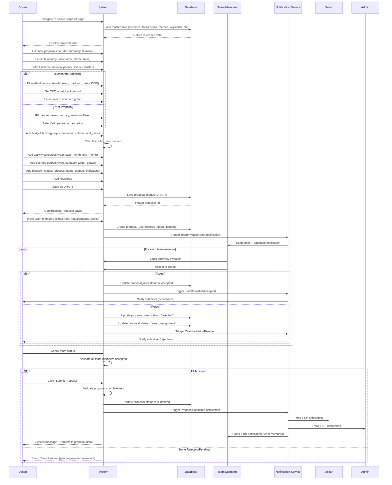

**Key Points:**
- Proposal can be saved as DRAFT multiple times before submission
- Team member acceptance is REQUIRED before submission
- Status transitions to NEED_ASSIGNMENT if any team member rejects
- Submission triggers notifications to Dekan, Admin LPPM, and Team

---

### Workflow 2: Handle Team Rejection & Resubmit

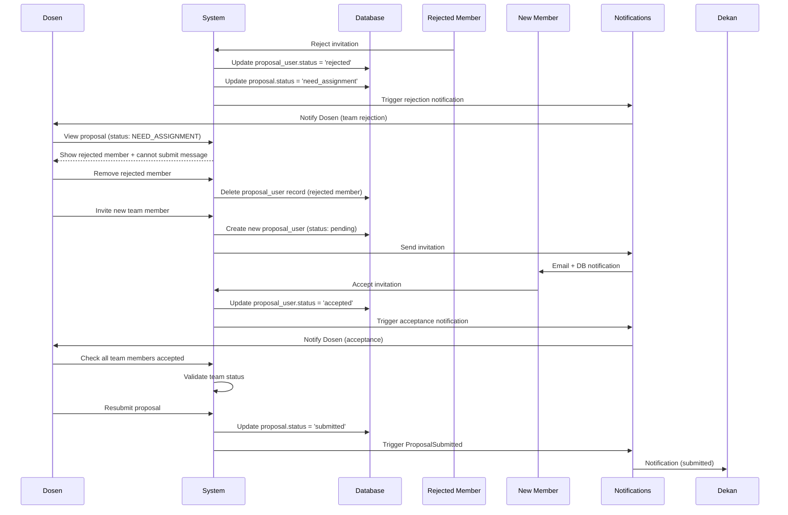

**Key Points:**
- Rejected team members must be replaced before resubmission
- Status automatically changes to NEED_ASSIGNMENT on rejection
- Dosen can remove and invite new members
- Resubmission follows normal submission workflow

---

### Workflow 3: Revision & Resubmission

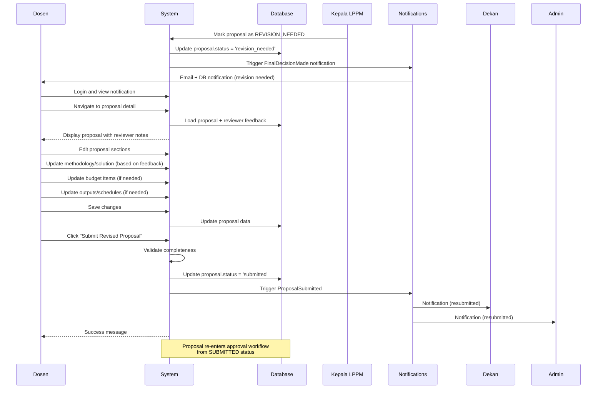

**Key Points:**
- Revised proposals return to SUBMITTED status
- Must go through full approval workflow again (Dekan → Kepala LPPM → Reviewers)
- Dosen can view all reviewer feedback before revising
- No limit on revision attempts (business rule can be added)

---

### Workflow 4: Submit Progress Report

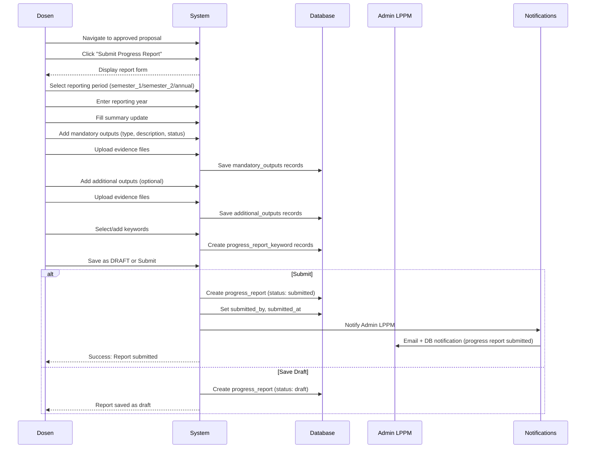

**Key Points:**
- Progress reports can be semester 1, semester 2, or annual
- Mandatory outputs are required (based on planned outputs)
- Additional outputs showcase extra achievements
- Reports can be saved as draft and submitted later
- Admin LPPM receives notification for review and approval

---

## Dekan Workflows

### Workflow 5: Review & Approve Proposal

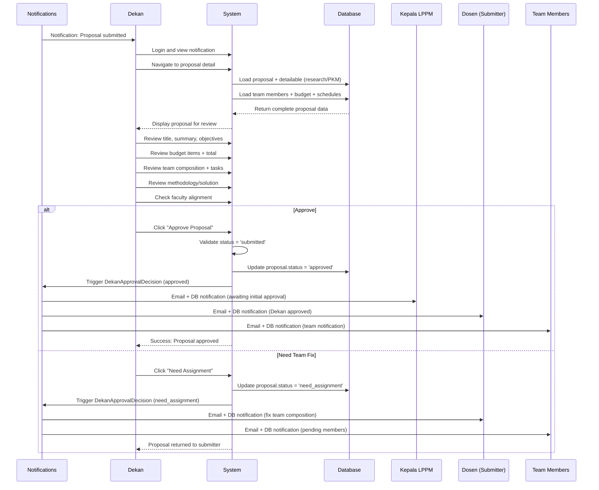

**Key Points:**
- Dekan is the FIRST approver (after submission)
- Can approve or request team member fixes
- Cannot directly reject (business rule: rejection only by Kepala LPPM)
- Status transitions: SUBMITTED → APPROVED or NEED_ASSIGNMENT
- Notifications sent to Kepala LPPM, Submitter, and Team

---

### Workflow 6: Faculty-Level Filtering

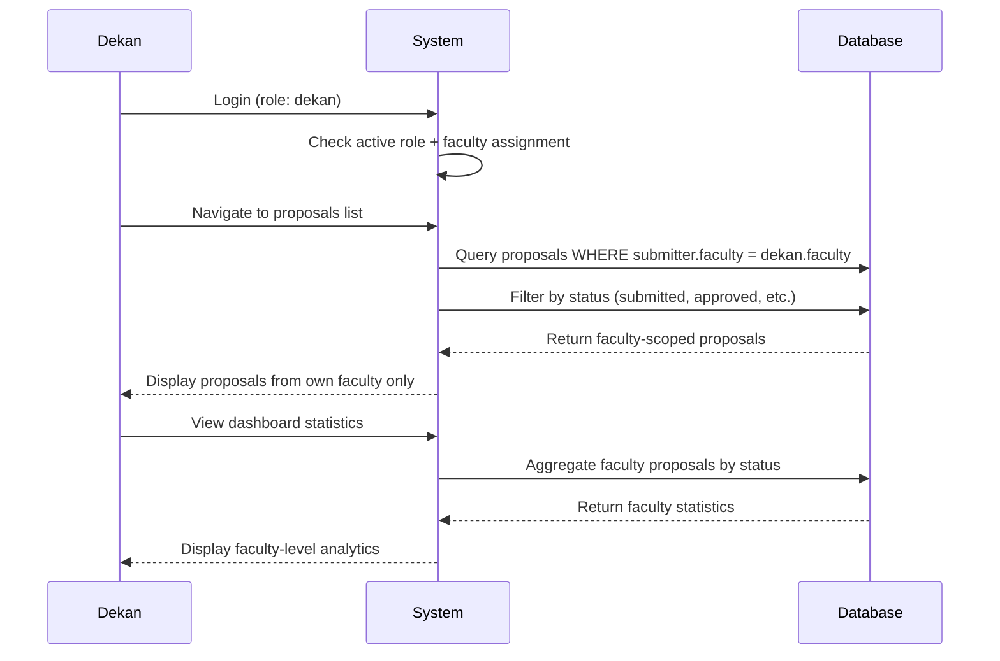

**Key Points:**
- Dekan can only see proposals from their own faculty
- System automatically filters by faculty affiliation
- Dashboard shows faculty-scoped statistics

---

## Kepala LPPM Workflows

### Workflow 7: Initial Approval (APPROVED → UNDER_REVIEW)

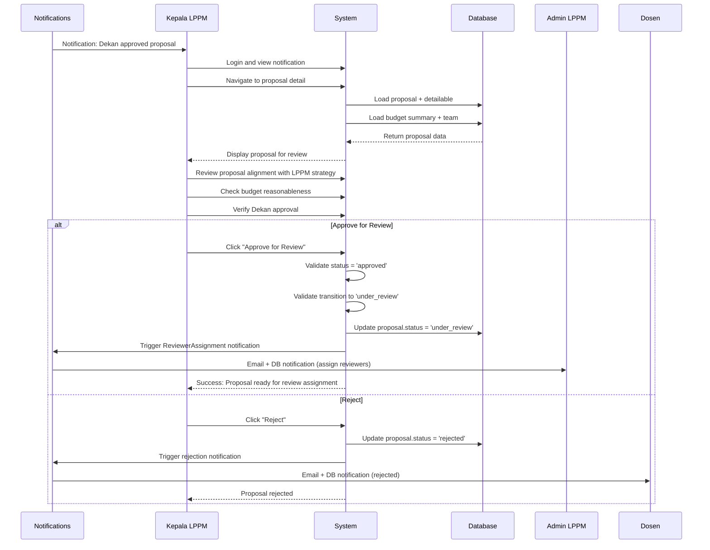

**Key Points:**
- Kepala LPPM provides INITIAL approval AFTER Dekan
- Status transition: APPROVED → UNDER_REVIEW
- This approval triggers Admin LPPM to assign reviewers
- Kepala LPPM can reject at this stage (rare)
- Does NOT assign reviewers directly (Admin LPPM's responsibility)

---

### Workflow 8: Final Decision (REVIEWED → COMPLETED/REVISION_NEEDED)

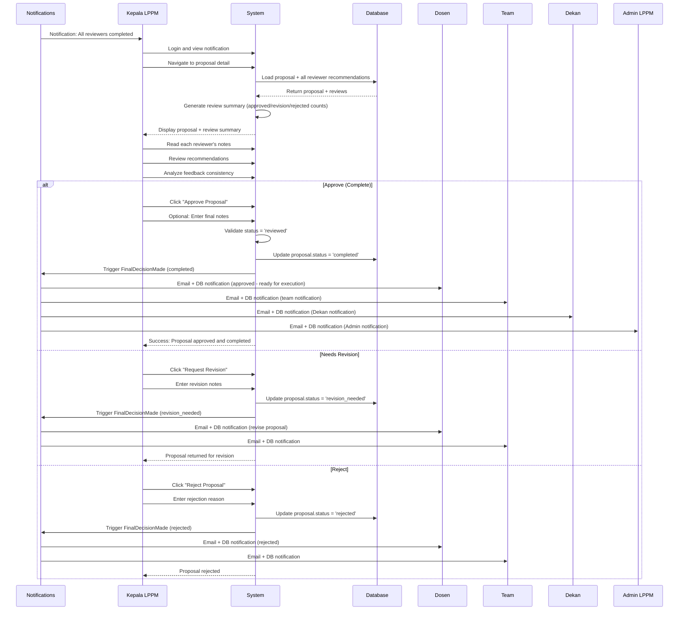

**Key Points:**
- Kepala LPPM makes FINAL decision AFTER all reviews completed
- Can only proceed when proposal.status = 'reviewed'
- Reviews all reviewer recommendations before deciding
- Three options: Approve (COMPLETED), Request Revision, or Reject
- Approved proposals are ready for execution (research/PKM activities)
- Revisions return to Dosen for updates, then restart workflow

---

## Admin LPPM Workflows

### Workflow 9: Assign Reviewers

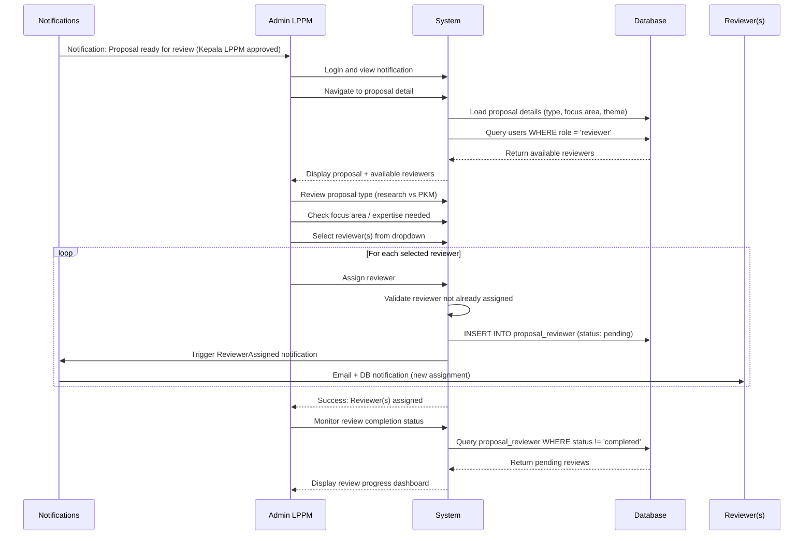

**Key Points:**
- Admin LPPM assigns reviewers AFTER Kepala LPPM initial approval
- Can assign multiple reviewers to one proposal
- Reviewers selected based on expertise (focus area, research type)
- System prevents duplicate assignments (unique constraint)
- Admin can track review progress in dashboard
- Can remove/reassign reviewers if needed (before review completion)

---

### Workflow 10: Manage Master Data

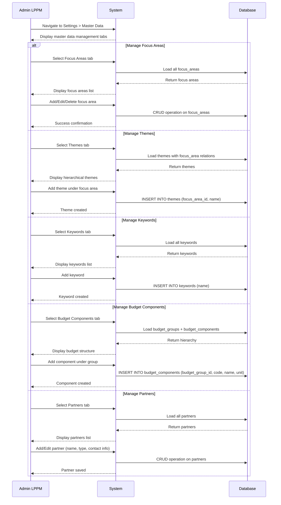

**Key Points:**
- Admin LPPM manages all reference/master data
- Changes immediately available to all users
- Hierarchical data (focus areas → themes → topics) maintained through FKs
- Budget hierarchy (groups → components) ensures structured budgeting
- Partner management for PKM proposals
- Deletion restricted if data is referenced by proposals

---

## Reviewer Workflows

### Workflow 11: Review Proposal

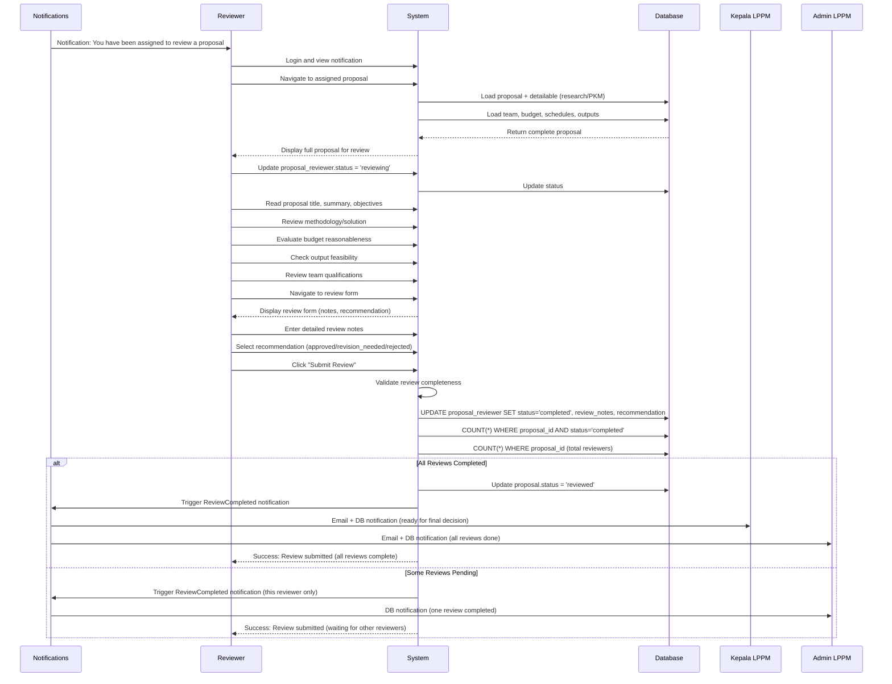

**Key Points:**
- Reviewers can only view proposals assigned to them
- Status updates from 'pending' → 'reviewing' → 'completed'
- Review notes are detailed feedback for Dosen and Kepala LPPM
- Recommendation is required (approved/revision_needed/rejected)
- Proposal status changes to REVIEWED only when ALL reviewers complete
- Kepala LPPM notified when all reviews done (ready for final decision)

---

### Workflow 12: Review Reminder System

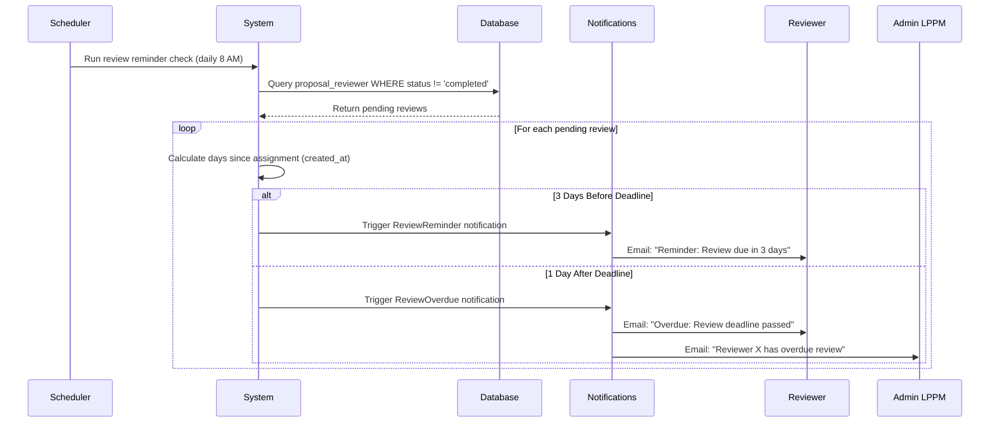

**Key Points:**
- Automated reminder system (scheduled job)
- Sends reminder 3 days before deadline
- Sends overdue notice 1 day after deadline
- Admin LPPM notified of overdue reviews for follow-up
- Reviewers can request deadline extension through Admin

---

## Executive Summary

### Complete Approval Chain

**Correct Workflow Sequence:**

```
1. DRAFT → Dosen creates proposal
2. Team invitations → All must ACCEPT before submission
3. SUBMITTED → Dosen submits (if all team accepted)
4. APPROVED → Dekan approves (first approval)
5. UNDER_REVIEW → Kepala LPPM initial approval (second approval)
6. Reviewer Assignment → Admin LPPM assigns reviewers
7. Reviews → Reviewers evaluate and recommend
8. REVIEWED → All reviewers completed (automatic)
9. COMPLETED/REVISION_NEEDED → Kepala LPPM final decision (third approval)
```

### Key Actors & Responsibilities

| Actor            | Primary Responsibility         | Critical Actions                                                                                   |
| ---------------- | ------------------------------ | -------------------------------------------------------------------------------------------------- |
| **Dosen**        | Proposal creation & submission | Create, invite team, submit, revise, progress reports                                              |
| **Team Members** | Collaboration acceptance       | Accept/reject invitations                                                                          |
| **Dekan**        | First-level approval           | Approve proposals from faculty (SUBMITTED → APPROVED)                                              |
| **Kepala LPPM**  | Strategic oversight            | Initial approval (APPROVED → UNDER_REVIEW) + Final decision (REVIEWED → COMPLETED/REVISION_NEEDED) |
| **Admin LPPM**   | Operational coordination       | Assign reviewers, manage master data, user management                                              |
| **Reviewers**    | Expert evaluation              | Review proposals, provide recommendations                                                          |

### Notification Triggers

| Event                        | Recipients                    | Channels   |
| ---------------------------- | ----------------------------- | ---------- |
| Proposal Submitted           | Dekan, Admin LPPM, Team       | Email + DB |
| Team Invitation              | Invited Member                | Email + DB |
| Team Acceptance              | Submitter                     | DB         |
| Team Rejection               | Submitter                     | DB         |
| Dekan Approval               | Kepala LPPM, Submitter, Team  | Email + DB |
| Kepala LPPM Initial Approval | Admin LPPM                    | Email + DB |
| Reviewer Assigned            | Reviewer                      | Email + DB |
| Review Completed (one)       | Admin LPPM                    | DB         |
| All Reviews Completed        | Kepala LPPM, Admin LPPM       | Email + DB |
| Final Decision               | Submitter, Team, Dekan, Admin | Email + DB |
| Review Reminder              | Reviewer                      | Email      |
| Review Overdue               | Reviewer, Admin LPPM          | Email      |

### Alternative Pathways

**Rejection Path:**
```
SUBMITTED → (Dekan rejects) → REJECTED (terminal)
APPROVED → (Kepala LPPM rejects) → REJECTED (terminal)
REVIEWED → (Kepala LPPM rejects) → REJECTED (terminal)
```

**Revision Path:**
```
REVIEWED → (Kepala LPPM requests revision) → REVISION_NEEDED
REVISION_NEEDED → (Dosen revises) → SUBMITTED (restart workflow)
```

**Team Fix Path:**
```
SUBMITTED → (Dekan requests team fix) → NEED_ASSIGNMENT
NEED_ASSIGNMENT → (Dosen fixes team) → SUBMITTED (continue workflow)
Any status → (Team member rejects) → NEED_ASSIGNMENT
```

### Average Processing Times

| Stage                         | Duration      | Bottleneck Risk                  |
| ----------------------------- | ------------- | -------------------------------- |
| Proposal Creation             | 3-7 days      | Dosen workload                   |
| Team Acceptance               | 1-2 weeks     | Team member responsiveness       |
| Dekan Review                  | 3-5 days      | Faculty workload                 |
| Kepala LPPM Initial           | 2-3 days      | Strategic review time            |
| Reviewer Assignment           | 1-2 days      | Admin coordination               |
| Reviewer Evaluation           | 7-14 days     | **HIGH** - Reviewer availability |
| Kepala LPPM Final             | 2-3 days      | Review analysis                  |
| **TOTAL (without revisions)** | **2-3 weeks** | -                                |
| **With one revision cycle**   | **4-6 weeks** | -                                |

### System Automation

**Automated Actions:**
1. Status transition to NEED_ASSIGNMENT on team rejection
2. Status transition to REVIEWED when all reviewers complete
3. Notification sending at each workflow stage
4. Budget total calculation (volume × unit_price)
5. Review deadline reminders (3 days before)
6. Review overdue alerts (1 day after)
7. Daily/weekly summary reports to Admin/Kepala

**Manual Actions:**
1. Proposal creation and content entry
2. Team member acceptance decisions
3. Dekan approval decision
4. Kepala LPPM initial approval
5. Reviewer assignment by Admin
6. Reviewer evaluation and recommendation
7. Kepala LPPM final decision
8. Progress report submission

---

**Document End**
