# Entity-Relationship Diagram (ERD) v2.0
## SIM LPPM ITSNU - Database Schema

**Version:** 2.0 | **Database:** MySQL | **Tables:** 45+

---

## Minimalist ERD Diagram

```mermaid
erDiagram
    users ||--|| identities : hasOne
    users ||--o{ proposals : submits
    users ||--o{ proposal_user : teamMember
    users ||--o{ proposal_reviewer : reviews
    users ||--o{ research_stages : manages
    
    identities }o--|| institutions : belongsTo
    identities }o--|| study_programs : enrolledIn
    identities }o--|| faculties : belongsTo
    
    proposals ||--o| research : morphOne
    proposals ||--o| community_services : morphOne
    proposals }o--|| users : belongsTo
    proposals }o--|| research_schemes : belongsTo
    proposals }o--|| focus_areas : belongsTo
    proposals }o--|| themes : belongsTo
    proposals }o--|| topics : belongsTo
    proposals }o--|| national_priorities : belongsTo
    proposals }o--|| science_clusters : level1
    proposals }o--|| science_clusters : level2
    proposals }o--|| science_clusters : level3
    
    proposals ||--o{ proposal_user : pivot
    proposals ||--o{ proposal_reviewer : pivot
    proposals ||--o{ proposal_outputs : hasMany
    proposals ||--o{ budget_items : hasMany
    proposals ||--o{ activity_schedules : hasMany
    proposals ||--o{ research_stages : hasMany
    proposals ||--o{ progress_reports : hasMany
    proposals ||--o{ proposal_keyword : hasMany
    proposals ||--o{ proposal_partner : hasMany
    
    research }o--|| macro_research_groups : belongsTo
    community_services }o--|| partners : belongsTo
    
    budget_groups ||--o{ budget_components : hasMany
    budget_items }o--|| budget_groups : belongsTo
    budget_items }o--|| budget_components : belongsTo
    
    focus_areas ||--o{ themes : hasMany
    themes }o--|| focus_areas : belongsTo
    themes ||--o{ topics : hasMany
    topics }o--|| themes : belongsTo
    
    science_clusters ||--o{ science_clusters : parent
    
    progress_reports }o--|| proposals : belongsTo
    progress_reports }o--|| users : submittedBy
    progress_reports ||--o{ mandatory_outputs : hasMany
    progress_reports ||--o{ additional_outputs : hasMany
    progress_reports ||--o{ progress_report_keyword : hasMany
    
    keywords ||--o{ proposal_keyword : hasMany
    keywords ||--o{ progress_report_keyword : hasMany
    
    partners ||--o{ proposal_partner : hasMany
    
    institutions ||--o{ study_programs : hasMany
    faculties ||--o{ study_programs : hasMany
    
    users {
        uuid id
        string name
        string email UK
        string password
        timestamp email_verified_at
        timestamp created_at
        timestamp updated_at
    }
    
    identities {
        uuid id
        uuid user_id FK
        string identity_id
        string sinta_id
        string type
        text address
        string birthplace
        date birthdate
        bigint institution_id FK
        bigint study_program_id FK
        bigint faculty_id FK
        string profile_picture
        timestamp created_at
        timestamp updated_at
    }
    
    proposals {
        uuid id
        string title
        uuid submitter_id FK
        string detailable_type
        uuid detailable_id
        bigint research_scheme_id FK
        bigint focus_area_id FK
        bigint theme_id FK
        bigint topic_id FK
        bigint national_priority_id FK
        bigint cluster_level1_id FK
        bigint cluster_level2_id FK
        bigint cluster_level3_id FK
        decimal sbk_value
        integer duration_in_years
        text summary
        enum status
        timestamp created_at
        timestamp updated_at
    }
    
    research {
        uuid id
        bigint macro_research_group_id FK
        integer final_tkt_target
        longText background
        longText state_of_the_art
        longText methodology
        json roadmap_data
        string substance_file
        timestamp created_at
        timestamp updated_at
    }
    
    community_services {
        uuid id
        bigint partner_id FK
        text partner_issue_summary
        text solution_offered
        timestamp created_at
        timestamp updated_at
    }
    
    proposal_user {
        bigint id
        uuid proposal_id FK
        uuid user_id FK
        enum role
        text tasks
        enum status
        timestamp created_at
        timestamp updated_at
    }
    
    proposal_reviewer {
        bigint id
        uuid proposal_id FK
        uuid user_id FK
        enum status
        text review_notes
        enum recommendation
        timestamp created_at
        timestamp updated_at
    }
    
    budget_groups {
        bigint id
        string code UK
        string name
        text description
        timestamp created_at
        timestamp updated_at
    }
    
    budget_components {
        bigint id
        bigint budget_group_id FK
        string code
        string name
        text description
        string unit
        timestamp created_at
        timestamp updated_at
    }
    
    budget_items {
        uuid id
        uuid proposal_id FK
        bigint budget_group_id FK
        bigint budget_component_id FK
        text item_description
        integer volume
        decimal unit_price
        decimal total_price
        timestamp created_at
        timestamp updated_at
    }
    
    focus_areas {
        bigint id
        string name
        timestamp created_at
        timestamp updated_at
    }
    
    themes {
        bigint id
        bigint focus_area_id FK
        string name
        timestamp created_at
        timestamp updated_at
    }
    
    topics {
        bigint id
        bigint theme_id FK
        string name
        timestamp created_at
        timestamp updated_at
    }
    
    science_clusters {
        bigint id
        string name
        integer level
        bigint parent_id FK
        timestamp created_at
        timestamp updated_at
    }
    
    research_schemes {
        bigint id
        string name
        string strata
        text description
        timestamp created_at
        timestamp updated_at
    }
    
    national_priorities {
        bigint id
        string name
        text description
        timestamp created_at
        timestamp updated_at
    }
    
    macro_research_groups {
        bigint id
        string name
        text description
        timestamp created_at
        timestamp updated_at
    }
    
    proposal_outputs {
        uuid id
        uuid proposal_id FK
        integer output_year
        enum category
        string type
        string target_status
        text output_description
        string journal_name
        date estimated_date
        timestamp created_at
        timestamp updated_at
    }
    
    activity_schedules {
        uuid id
        uuid proposal_id FK
        string activity_name
        integer year
        integer start_month
        integer end_month
        timestamp created_at
        timestamp updated_at
    }
    
    research_stages {
        uuid id
        uuid proposal_id FK
        integer stage_number
        string process_name
        text outputs
        text indicator
        uuid person_in_charge_id FK
        timestamp created_at
        timestamp updated_at
    }
    
    progress_reports {
        uuid id
        uuid proposal_id FK
        text summary_update
        integer reporting_year
        enum reporting_period
        enum status
        uuid submitted_by FK
        timestamp submitted_at
        timestamp created_at
        timestamp updated_at
    }
    
    mandatory_outputs {
        uuid id
        uuid progress_report_id FK
        string output_type
        text description
        string status
        string evidence_file
        timestamp created_at
        timestamp updated_at
    }
    
    additional_outputs {
        uuid id
        uuid progress_report_id FK
        string output_type
        text description
        string status
        string evidence_file
        timestamp created_at
        timestamp updated_at
    }
    
    partners {
        bigint id
        string name
        string type
        text address
        string contact_person
        string phone
        string email
        timestamp created_at
        timestamp updated_at
    }
    
    proposal_partner {
        uuid proposal_id FK
        bigint partner_id FK
        timestamp created_at
        timestamp updated_at
    }
    
    keywords {
        bigint id
        string name
        timestamp created_at
        timestamp updated_at
    }
    
    proposal_keyword {
        bigint id
        uuid proposal_id FK
        bigint keyword_id FK
        timestamp created_at
        timestamp updated_at
    }
    
    progress_report_keyword {
        bigint id
        uuid progress_report_id FK
        bigint keyword_id FK
        timestamp created_at
        timestamp updated_at
    }
    
    institutions {
        bigint id
        string name
        string type
        text address
        timestamp created_at
        timestamp updated_at
    }
    
    faculties {
        bigint id
        string code
        string name
        text description
        timestamp created_at
        timestamp updated_at
    }
    
    study_programs {
        bigint id
        bigint institution_id FK
        bigint faculty_id FK
        string name
        timestamp created_at
        timestamp updated_at
    }
    
    notifications {
        uuid id
        string type
        string notifiable_type
        uuid notifiable_id
        json data
        timestamp read_at
        timestamp created_at
        timestamp updated_at
    }
```



---

## Class Diagram (Laravel Models)

```mermaid
classDiagram
    class User {
        +uuid id
        +string name
        +string email
        +string password
        +timestamp email_verified_at
        +timestamp created_at
        +timestamp updated_at
        +hasOne() identity
        +hasMany() submittedProposals
        +belongsToMany() proposals
        +hasMany() researchStages
    }
    
    class Identity {
        +uuid id
        +uuid user_id
        +string identity_id
        +string sinta_id
        +string type
        +text address
        +string birthplace
        +date birthdate
        +bigint institution_id
        +bigint study_program_id
        +bigint faculty_id
        +string profile_picture
        +belongsTo() user
        +belongsTo() institution
        +belongsTo() studyProgram
        +belongsTo() faculty
    }
    
    class Proposal {
        +uuid id
        +string title
        +uuid submitter_id
        +string detailable_type
        +uuid detailable_id
        +bigint research_scheme_id
        +bigint focus_area_id
        +bigint theme_id
        +bigint topic_id
        +bigint national_priority_id
        +bigint cluster_level1_id
        +bigint cluster_level2_id
        +bigint cluster_level3_id
        +decimal sbk_value
        +integer duration_in_years
        +text summary
        +enum status
        +belongsTo() submitter
        +morphTo() detailable
        +belongsToMany() teamMembers
        +hasMany() proposalReviewers
        +hasMany() proposalOutputs
        +hasMany() budgetItems
        +hasMany() activitySchedules
        +hasMany() researchStages
        +hasMany() progressReports
        +belongsTo() researchScheme
        +belongsTo() focusArea
        +belongsTo() theme
        +belongsTo() topic
        +belongsTo() nationalPriority
        +belongsTo() clusterLevel1
        +belongsTo() clusterLevel2
        +belongsTo() clusterLevel3
    }
    
    class Research {
        +uuid id
        +bigint macro_research_group_id
        +integer final_tkt_target
        +longText background
        +longText state_of_the_art
        +longText methodology
        +json roadmap_data
        +string substance_file
        +morphOne() proposal
        +belongsTo() macroResearchGroup
    }
    
    class CommunityService {
        +uuid id
        +bigint partner_id
        +text partner_issue_summary
        +text solution_offered
        +morphOne() proposal
        +belongsTo() partner
    }
    
    class ProposalUser {
        +bigint id
        +uuid proposal_id
        +uuid user_id
        +enum role
        +text tasks
        +enum status
    }
    
    class ProposalReviewer {
        +bigint id
        +uuid proposal_id
        +uuid user_id
        +enum status
        +text review_notes
        +enum recommendation
    }
    
    class BudgetGroup {
        +bigint id
        +string code
        +string name
        +text description
        +hasMany() budgetComponents
        +hasMany() budgetItems
    }
    
    class BudgetComponent {
        +bigint id
        +bigint budget_group_id
        +string code
        +string name
        +text description
        +string unit
        +belongsTo() budgetGroup
        +hasMany() budgetItems
    }
    
    class BudgetItem {
        +uuid id
        +uuid proposal_id
        +bigint budget_group_id
        +bigint budget_component_id
        +text item_description
        +integer volume
        +decimal unit_price
        +decimal total_price
        +belongsTo() proposal
        +belongsTo() budgetGroup
        +belongsTo() budgetComponent
    }
    
    class FocusArea {
        +bigint id
        +string name
        +hasMany() themes
        +hasMany() proposals
    }
    
    class Theme {
        +bigint id
        +bigint focus_area_id
        +string name
        +belongsTo() focusArea
        +hasMany() topics
        +hasMany() proposals
    }
    
    class Topic {
        +bigint id
        +bigint theme_id
        +string name
        +belongsTo() theme
        +hasMany() proposals
    }
    
    class ScienceCluster {
        +bigint id
        +string name
        +integer level
        +bigint parent_id
    }
    
    class ResearchScheme {
        +bigint id
        +string name
        +string strata
        +text description
        +hasMany() proposals
    }
    
    class NationalPriority {
        +bigint id
        +string name
        +text description
        +hasMany() proposals
    }
    
    class MacroResearchGroup {
        +bigint id
        +string name
        +text description
        +hasMany() research
    }
    
    class ProposalOutput {
        +uuid id
        +uuid proposal_id
        +integer output_year
        +enum category
        +string type
        +string target_status
        +text output_description
        +string journal_name
        +date estimated_date
        +belongsTo() proposal
    }
    
    class ActivitySchedule {
        +uuid id
        +uuid proposal_id
        +string activity_name
        +integer year
        +integer start_month
        +integer end_month
        +belongsTo() proposal
    }
    
    class ResearchStage {
        +uuid id
        +uuid proposal_id
        +integer stage_number
        +string process_name
        +text outputs
        +text indicator
        +uuid person_in_charge_id
        +belongsTo() proposal
        +belongsTo() personInCharge: User
    }
    
    class ProgressReport {
        +uuid id
        +uuid proposal_id
        +text summary_update
        +integer reporting_year
        +enum reporting_period
        +enum status
        +uuid submitted_by
        +timestamp submitted_at
        +belongsTo() proposal
        +belongsTo() submitter: User
        +hasMany() mandatoryOutputs
        +hasMany() additionalOutputs
    }
    
    class MandatoryOutput {
        +uuid id
        +uuid progress_report_id
        +string output_type
        +text description
        +string status
        +string evidence_file
        +belongsTo() progressReport
    }
    
    class AdditionalOutput {
        +uuid id
        +uuid progress_report_id
        +string output_type
        +text description
        +string status
        +string evidence_file
        +belongsTo() progressReport
    }
    
    class Partner {
        +bigint id
        +string name
        +string type
        +text address
        +string contact_person
        +string phone
        +string email
        +hasMany() communityServices
        +belongsToMany() proposals
    }
    
    class Keyword {
        +bigint id
        +string name
        +belongsToMany() proposals
        +belongsToMany() progressReports
    }
    
    class Institution {
        +bigint id
        +string name
        +string type
        +text address
        +hasMany() studyPrograms
        +hasMany() identities
    }
    
    class Faculty {
        +bigint id
        +string code
        +string name
        +text description
        +hasMany() studyPrograms
        +hasMany() identities
    }
    
    class StudyProgram {
        +bigint id
        +bigint institution_id
        +bigint faculty_id
        +string name
        +belongsTo() institution
        +belongsTo() faculty
        +hasMany() identities
    }
    
    User "1" --> "1" Identity : hasOne
    User "1" --> "*" Proposal : submits
    User "1" --> "*" ProposalUser : ""
    User "1" --> "*" ProposalReviewer : ""
    User "1" --> "*" ResearchStage : manages
    
    Identity "*" --> "1" Institution : ""
    Identity "*" --> "1" StudyProgram : ""
    Identity "*" --> "1" Faculty : ""
    
    Proposal "1" --> "0..1" Research : morphOne
    Proposal "1" --> "0..1" CommunityService : morphOne
    Proposal "*" --> "1" User : submitter
    Proposal "*" --> "1" ResearchScheme : ""
    Proposal "*" --> "1" FocusArea : ""
    Proposal "*" --> "1" Theme : ""
    Proposal "*" --> "1" Topic : ""
    Proposal "*" --> "1" NationalPriority : ""
    Proposal "*" --> "1" ScienceCluster : level1
    Proposal "*" --> "1" ScienceCluster : level2
    Proposal "*" --> "1" ScienceCluster : level3
    
    Proposal "1" --> "*" ProposalUser : pivot
    Proposal "1" --> "*" ProposalReviewer : pivot
    Proposal "1" --> "*" ProposalOutput : ""
    Proposal "1" --> "*" BudgetItem : ""
    Proposal "1" --> "*" ActivitySchedule : ""
    Proposal "1" --> "*" ResearchStage : ""
    Proposal "1" --> "*" ProgressReport : ""
    
    Research "*" --> "1" MacroResearchGroup : ""
    
    CommunityService "*" --> "1" Partner : ""
    
    BudgetGroup "1" --> "*" BudgetComponent : ""
    BudgetGroup "1" --> "*" BudgetItem : ""
    
    BudgetComponent "*" --> "*" BudgetItem : ""
    
    FocusArea "1" --> "*" Theme : ""
    Theme "1" --> "*" Topic : ""
    
    ProgressReport "1" --> "*" MandatoryOutput : ""
    ProgressReport "1" --> "*" AdditionalOutput : ""
    
    Partner "1" --> "*" CommunityService : ""
    Partner "*" <--> "*" Proposal : ""
    
    Keyword "*" <--> "*" Proposal : ""
    Keyword "*" <--> "*" ProgressReport : ""
    
    Institution "1" --> "*" StudyProgram : ""
    Faculty "1" --> "*" StudyProgram : ""
```



---

## Relationship Legend

| Term                   | Meaning                     | Example                              |
| ---------------------- | --------------------------- | ------------------------------------ |
| `hasOne`               | One-to-One relation         | User → Identity                      |
| `hasMany`              | One-to-Many relation        | Proposal → BudgetItems               |
| `belongsTo`            | Reverse One-to-Many         | BudgetItem ← Proposal                |
| `belongsToMany`        | Many-to-Many (pivot)        | User ↔ Proposal                      |
| `morphOne`             | Polymorphic One-to-One      | Proposal → Research/CommunityService |
| `morphTo`              | Polymorphic Reverse         | Proposal ← Detailable                |
| `level1/level2/level3` | Multiple ForeignKey         | Proposal → ScienceCluster (3x)       |
| `pivot`                | Intermediate Junction Table | ProposalUser, ProposalReviewer       |
| `submits`              | Custom relation name        | User submits Proposal                |
| `manages`              | Custom relation name        | User manages ResearchStage           |

---

## Entity Descriptions

### Core Tables

#### `users`
**Primary authentication and user management table**

| Column                    | Type      | Description                     |
| ------------------------- | --------- | ------------------------------- |
| id                        | uuid      | Primary key (UUID)              |
| name                      | string    | User full name                  |
| email                     | string    | Unique email (login credential) |
| password                  | string    | Hashed password                 |
| email_verified_at         | timestamp | Email verification timestamp    |
| two_factor_secret         | string    | 2FA secret (encrypted)          |
| two_factor_recovery_codes | text      | 2FA recovery codes (encrypted)  |
| two_factor_confirmed_at   | timestamp | 2FA activation timestamp        |
| remember_token            | string    | Session token                   |
| created_at                | timestamp | Record creation                 |
| updated_at                | timestamp | Last update                     |

**Relationships:**
- 1:1 with `identities` (extended profile)
- 1:N with `proposals` (submitter)
- M:N with `proposals` via `proposal_user` (team member)
- 1:N with `proposal_reviewer` (reviewer assignments)
- 1:N with `research_stages` (person in charge)
- M:N with `roles` and `permissions` (Spatie Permission, excluded from ERD)

---

#### `identities`
**Extended user profile with academic/institutional information**

| Column           | Type      | Description                          |
| ---------------- | --------- | ------------------------------------ |
| id               | uuid      | Primary key (UUID)                   |
| user_id          | uuid      | FK to users                          |
| identity_id      | string    | NIDN (10 digits) or NIM (16 digits)  |
| sinta_id         | string    | Sinta ID (optional, for researchers) |
| type             | string    | "dosen" or "mahasiswa"               |
| address          | text      | Full address                         |
| birthplace       | string    | Place of birth                       |
| birthdate        | date      | Date of birth                        |
| institution_id   | bigint    | FK to institutions                   |
| study_program_id | bigint    | FK to study_programs                 |
| faculty_id       | bigint    | FK to faculties                      |
| profile_picture  | string    | File path to profile image           |
| created_at       | timestamp | Record creation                      |
| updated_at       | timestamp | Last update                          |

**Relationships:**
- N:1 with `users`
- N:1 with `institutions`
- N:1 with `study_programs`
- N:1 with `faculties`

---

#### `proposals`
**Central entity for both Research and PKM proposals (polymorphic parent)**

| Column               | Type          | Description                                                                                                               |
| -------------------- | ------------- | ------------------------------------------------------------------------------------------------------------------------- |
| id                   | uuid          | Primary key (UUID)                                                                                                        |
| title                | string        | Proposal title                                                                                                            |
| submitter_id         | uuid          | FK to users (proposal owner)                                                                                              |
| detailable_type      | string        | Polymorphic type: "App\Models\Research" or "App\Models\CommunityService"                                                  |
| detailable_id        | uuid          | Polymorphic ID (FK to research/community_services)                                                                        |
| research_scheme_id   | bigint        | FK to research_schemes                                                                                                    |
| focus_area_id        | bigint        | FK to focus_areas                                                                                                         |
| theme_id             | bigint        | FK to themes                                                                                                              |
| topic_id             | bigint        | FK to topics                                                                                                              |
| national_priority_id | bigint        | FK to national_priorities                                                                                                 |
| cluster_level1_id    | bigint        | FK to science_clusters (level 1)                                                                                          |
| cluster_level2_id    | bigint        | FK to science_clusters (level 2)                                                                                          |
| cluster_level3_id    | bigint        | FK to science_clusters (level 3)                                                                                          |
| sbk_value            | decimal(15,2) | SBK (Satuan Biaya Keluaran) value                                                                                         |
| duration_in_years    | integer       | Project duration (default: 1)                                                                                             |
| summary              | text          | Proposal summary/abstract                                                                                                 |
| status               | enum          | ProposalStatus: draft, submitted, need_assignment, approved, under_review, reviewed, revision_needed, completed, rejected |
| created_at           | timestamp     | Record creation                                                                                                           |
| updated_at           | timestamp     | Last update                                                                                                               |

**Relationships:**
- N:1 with `users` (submitter)
- 1:1 polymorphic with `research` OR `community_services`
- 1:N with `proposal_outputs`, `budget_items`, `activity_schedules`, `research_stages`, `progress_reports`, `proposal_reviewer`
- M:N with `users` via `proposal_user` (team members)
- M:N with `keywords` via `proposal_keyword`
- M:N with `partners` via `proposal_partner`
- N:1 with taxonomy tables (research_schemes, focus_areas, themes, topics, national_priorities, science_clusters)

---

#### `research`
**Research-specific proposal data (polymorphic child)**

| Column                  | Type      | Description                  |
| ----------------------- | --------- | ---------------------------- |
| id                      | uuid      | Primary key (UUID)           |
| macro_research_group_id | bigint    | FK to macro_research_groups  |
| final_tkt_target        | integer   | Target TKT level (0-9)       |
| background              | longText  | Research background          |
| state_of_the_art        | longText  | Literature review            |
| methodology             | longText  | Research methods             |
| roadmap_data            | json      | Multi-year roadmap structure |
| substance_file          | string    | Uploaded document path       |
| created_at              | timestamp | Record creation              |
| updated_at              | timestamp | Last update                  |

**Roadmap JSON Structure:**
```json
{
  "year_1": {
    "activities": ["Activity 1", "Activity 2"],
    "targets": ["Target 1", "Target 2"],
    "tkt_level": 3
  },
  "year_2": {
    "activities": ["Activity 3", "Activity 4"],
    "targets": ["Target 3", "Target 4"],
    "tkt_level": 5
  }
}
```

**Relationships:**
- 1:1 morphOne with `proposals` (detailable)
- N:1 with `macro_research_groups`

---

#### `community_services`
**PKM-specific proposal data (polymorphic child)**

| Column                | Type      | Description                             |
| --------------------- | --------- | --------------------------------------- |
| id                    | uuid      | Primary key (UUID)                      |
| partner_id            | bigint    | FK to partners (main partner, optional) |
| partner_issue_summary | text      | Community problem description           |
| solution_offered      | text      | Proposed solution approach              |
| created_at            | timestamp | Record creation                         |
| updated_at            | timestamp | Last update                             |

**Relationships:**
- 1:1 morphOne with `proposals` (detailable)
- N:1 with `partners` (main partner)

---

### Taxonomy Tables

#### `focus_areas` (Bidang Fokus)
**Top-level research categorization**

| Column     | Type      | Description                                      |
| ---------- | --------- | ------------------------------------------------ |
| id         | bigint    | Primary key (auto-increment)                     |
| name       | string    | Focus area name (e.g., "Kesehatan", "Teknologi") |
| created_at | timestamp | Record creation                                  |
| updated_at | timestamp | Last update                                      |

**Relationships:**
- 1:N with `themes`
- 1:N with `proposals`

---

#### `themes` (Tema)
**Second-level categorization (child of focus_areas)**

| Column        | Type      | Description                               |
| ------------- | --------- | ----------------------------------------- |
| id            | bigint    | Primary key (auto-increment)              |
| focus_area_id | bigint    | FK to focus_areas (cascade delete)        |
| name          | string    | Theme name (e.g., "Gizi", "Epidemiologi") |
| created_at    | timestamp | Record creation                           |
| updated_at    | timestamp | Last update                               |

**Relationships:**
- N:1 with `focus_areas`
- 1:N with `topics`
- 1:N with `proposals`

---

#### `topics` (Topik)
**Third-level categorization (child of themes)**

| Column     | Type      | Description                                      |
| ---------- | --------- | ------------------------------------------------ |
| id         | bigint    | Primary key (auto-increment)                     |
| theme_id   | bigint    | FK to themes (cascade delete)                    |
| name       | string    | Topic name (e.g., "Malnutrisi Anak", "Obesitas") |
| created_at | timestamp | Record creation                                  |
| updated_at | timestamp | Last update                                      |

**Relationships:**
- N:1 with `themes`
- 1:N with `proposals`

---

#### `science_clusters` (Rumpun Ilmu)
**3-level hierarchical science classification**

| Column     | Type      | Description                                         |
| ---------- | --------- | --------------------------------------------------- |
| id         | bigint    | Primary key (auto-increment)                        |
| name       | string    | Cluster name                                        |
| level      | integer   | Hierarchy level (1, 2, or 3)                        |
| parent_id  | bigint    | FK to science_clusters (self-referencing, nullable) |
| created_at | timestamp | Record creation                                     |
| updated_at | timestamp | Last update                                         |

**Hierarchy:**
- **Level 1:** Bidang (e.g., "Ilmu Alam")
- **Level 2:** Subbidang (e.g., "Fisika", "Kimia")
- **Level 3:** Detail (e.g., "Fisika Kuantum", "Kimia Organik")

**Relationships:**
- Self-referencing 1:N (parent-child)
- 1:N with `proposals` (via 3 separate FKs: cluster_level1_id, cluster_level2_id, cluster_level3_id)

---

#### `research_schemes` (Skema Penelitian)
**Research classification schemes**

| Column      | Type      | Description                                                  |
| ----------- | --------- | ------------------------------------------------------------ |
| id          | bigint    | Primary key (auto-increment)                                 |
| name        | string    | Scheme name (e.g., "Penelitian Dasar", "Penelitian Terapan") |
| strata      | string    | Strata level (optional)                                      |
| description | text      | Scheme description                                           |
| created_at  | timestamp | Record creation                                              |
| updated_at  | timestamp | Last update                                                  |

**Relationships:**
- 1:N with `proposals`

---

#### `national_priorities` (Prioritas Riset Nasional)
**National research priority alignment**

| Column      | Type      | Description                  |
| ----------- | --------- | ---------------------------- |
| id          | bigint    | Primary key (auto-increment) |
| name        | string    | Priority name                |
| description | text      | Priority description         |
| created_at  | timestamp | Record creation              |
| updated_at  | timestamp | Last update                  |

**Relationships:**
- 1:N with `proposals`

---

### Budget Tables

#### `budget_groups` (Kelompok Anggaran)
**Top-level budget categorization**

| Column      | Type       | Description                                          |
| ----------- | ---------- | ---------------------------------------------------- |
| id          | bigint     | Primary key (auto-increment)                         |
| code        | string(10) | Unique group code (e.g., "HONOR", "BAHAN")           |
| name        | string     | Group name (e.g., "Honorarium", "Bahan Habis Pakai") |
| description | text       | Group description                                    |
| created_at  | timestamp  | Record creation                                      |
| updated_at  | timestamp  | Last update                                          |

**Relationships:**
- 1:N with `budget_components`
- 1:N with `budget_items`

---

#### `budget_components` (Komponen Anggaran)
**Second-level budget categorization (child of budget_groups)**

| Column          | Type       | Description                                        |
| --------------- | ---------- | -------------------------------------------------- |
| id              | bigint     | Primary key (auto-increment)                       |
| budget_group_id | bigint     | FK to budget_groups (cascade delete)               |
| code            | string(10) | Component code (unique within group)               |
| name            | string     | Component name (e.g., "Narasumber", "Bahan Kimia") |
| description     | text       | Component description                              |
| unit            | string     | Measurement unit (e.g., "per sesi", "per liter")   |
| created_at      | timestamp  | Record creation                                    |
| updated_at      | timestamp  | Last update                                        |

**Unique Constraint:** (budget_group_id, code)

**Relationships:**
- N:1 with `budget_groups`
- 1:N with `budget_items`

---

#### `budget_items` (Item Anggaran)
**Specific budget line items in proposals**

| Column              | Type          | Description                            |
| ------------------- | ------------- | -------------------------------------- |
| id                  | uuid          | Primary key (UUID)                     |
| proposal_id         | uuid          | FK to proposals (cascade delete)       |
| budget_group_id     | bigint        | FK to budget_groups                    |
| budget_component_id | bigint        | FK to budget_components                |
| item_description    | text          | Detailed item description              |
| volume              | integer       | Quantity                               |
| unit_price          | decimal(15,2) | Price per unit                         |
| total_price         | decimal(15,2) | Calculated total (volume × unit_price) |
| created_at          | timestamp     | Record creation                        |
| updated_at          | timestamp     | Last update                            |

**Relationships:**
- N:1 with `proposals`
- N:1 with `budget_groups`
- N:1 with `budget_components`

---

### Collaboration Tables

#### `partners` (Mitra)
**External partner organizations (for PKM)**

| Column         | Type      | Description                                                |
| -------------- | --------- | ---------------------------------------------------------- |
| id             | bigint    | Primary key (auto-increment)                               |
| name           | string    | Organization name                                          |
| type           | string    | Organization type (e.g., "NGO", "Community", "Government") |
| address        | text      | Full address                                               |
| contact_person | string    | Contact person name                                        |
| phone          | string    | Phone number                                               |
| email          | string    | Email address                                              |
| created_at     | timestamp | Record creation                                            |
| updated_at     | timestamp | Last update                                                |

**Relationships:**
- 1:N with `community_services` (main partner)
- M:N with `proposals` via `proposal_partner`

---

#### `proposal_partner` (Pivot Table)
**Many-to-many relationship between proposals and partners**

| Column      | Type      | Description                      |
| ----------- | --------- | -------------------------------- |
| proposal_id | uuid      | FK to proposals (cascade delete) |
| partner_id  | bigint    | FK to partners (cascade delete)  |
| created_at  | timestamp | Record creation                  |
| updated_at  | timestamp | Last update                      |

**Primary Key:** Composite (proposal_id, partner_id)

---

#### `proposal_user` (Pivot Table)
**Team member assignments with roles**

| Column      | Type      | Description                                          |
| ----------- | --------- | ---------------------------------------------------- |
| id          | bigint    | Primary key (auto-increment)                         |
| proposal_id | uuid      | FK to proposals (cascade delete)                     |
| user_id     | uuid      | FK to users (cascade delete)                         |
| role        | enum      | Team role: "ketua" or "anggota"                      |
| tasks       | text      | Assigned tasks                                       |
| status      | enum      | Acceptance status: "pending", "accepted", "rejected" |
| created_at  | timestamp | Record creation                                      |
| updated_at  | timestamp | Last update                                          |

**Relationships:**
- N:1 with `proposals`
- N:1 with `users`

---

#### `proposal_reviewer` (Reviewer Assignments)
**Reviewer assignment and review tracking**

| Column         | Type      | Description                                                          |
| -------------- | --------- | -------------------------------------------------------------------- |
| id             | bigint    | Primary key (auto-increment)                                         |
| proposal_id    | uuid      | FK to proposals (cascade delete)                                     |
| user_id        | uuid      | FK to users (cascade delete, reviewer)                               |
| status         | enum      | Review status: "pending", "reviewing", "completed"                   |
| review_notes   | text      | Reviewer's detailed notes                                            |
| recommendation | enum      | Reviewer's recommendation: "approved", "rejected", "revision_needed" |
| created_at     | timestamp | Record creation (assignment date)                                    |
| updated_at     | timestamp | Last update (review completion)                                      |

**Unique Constraint:** (proposal_id, user_id)

**Relationships:**
- N:1 with `proposals`
- N:1 with `users` (reviewer)

---

### Supporting Tables

#### `keywords` (Kata Kunci)
**Keyword tags for proposals and progress reports**

| Column     | Type      | Description                  |
| ---------- | --------- | ---------------------------- |
| id         | bigint    | Primary key (auto-increment) |
| name       | string    | Keyword text                 |
| created_at | timestamp | Record creation              |
| updated_at | timestamp | Last update                  |

**Relationships:**
- M:N with `proposals` via `proposal_keyword`
- M:N with `progress_reports` via `progress_report_keyword`

---

#### `proposal_keyword` (Pivot Table)
**Many-to-many between proposals and keywords**

| Column      | Type      | Description                      |
| ----------- | --------- | -------------------------------- |
| id          | bigint    | Primary key (auto-increment)     |
| proposal_id | uuid      | FK to proposals (cascade delete) |
| keyword_id  | bigint    | FK to keywords (cascade delete)  |
| created_at  | timestamp | Record creation                  |
| updated_at  | timestamp | Last update                      |

---

#### `activity_schedules` (Jadwal Kegiatan)
**Project timeline/activity schedule**

| Column        | Type      | Description                      |
| ------------- | --------- | -------------------------------- |
| id            | uuid      | Primary key (UUID)               |
| proposal_id   | uuid      | FK to proposals (cascade delete) |
| activity_name | string    | Activity description             |
| year          | integer   | Year of activity                 |
| start_month   | integer   | Start month (1-12)               |
| end_month     | integer   | End month (1-12)                 |
| created_at    | timestamp | Record creation                  |
| updated_at    | timestamp | Last update                      |

**Relationships:**
- N:1 with `proposals`

---

#### `research_stages` (Tahapan Penelitian)
**Phased project development with responsible persons**

| Column              | Type      | Description                      |
| ------------------- | --------- | -------------------------------- |
| id                  | uuid      | Primary key (UUID)               |
| proposal_id         | uuid      | FK to proposals (cascade delete) |
| stage_number        | integer   | Sequential stage number          |
| process_name        | string    | Stage/process name               |
| outputs             | text      | Expected stage outputs           |
| indicator           | text      | Success indicators               |
| person_in_charge_id | uuid      | FK to users (set null)           |
| created_at          | timestamp | Record creation                  |
| updated_at          | timestamp | Last update                      |

**Relationships:**
- N:1 with `proposals`
- N:1 with `users` (person in charge)

---

#### `proposal_outputs` (Luaran yang Direncanakan)
**Planned outputs (publications, patents, etc.)**

| Column             | Type      | Description                                      |
| ------------------ | --------- | ------------------------------------------------ |
| id                 | uuid      | Primary key (UUID)                               |
| proposal_id        | uuid      | FK to proposals (cascade delete)                 |
| output_year        | integer   | Target year                                      |
| category           | enum      | "required" or "additional"                       |
| type               | string    | Output type (e.g., "journal", "patent", "book")  |
| target_status      | string    | Target achievement (e.g., "Q1", "Q2", "Granted") |
| output_description | text      | Output description                               |
| journal_name       | string    | Journal/venue name                               |
| estimated_date     | date      | Estimated completion date                        |
| created_at         | timestamp | Record creation                                  |
| updated_at         | timestamp | Last update                                      |

**Relationships:**
- N:1 with `proposals`

---

### Progress Tracking Tables

#### `progress_reports` (Laporan Kemajuan)
**Semester/annual progress reports**

| Column           | Type      | Description                                     |
| ---------------- | --------- | ----------------------------------------------- |
| id               | uuid      | Primary key (UUID)                              |
| proposal_id      | uuid      | FK to proposals (cascade delete)                |
| summary_update   | text      | Updated project summary                         |
| reporting_year   | integer   | Year of report                                  |
| reporting_period | enum      | Period: "semester_1", "semester_2", "annual"    |
| status           | enum      | Report status: "draft", "submitted", "approved" |
| submitted_by     | uuid      | FK to users (submitter)                         |
| submitted_at     | timestamp | Submission timestamp                            |
| created_at       | timestamp | Record creation                                 |
| updated_at       | timestamp | Last update                                     |

**Index:** (proposal_id, reporting_year)

**Relationships:**
- N:1 with `proposals`
- N:1 with `users` (submitter)
- 1:N with `mandatory_outputs`
- 1:N with `additional_outputs`
- M:N with `keywords` via `progress_report_keyword`

---

#### `mandatory_outputs` (Luaran Wajib)
**Required outputs reported in progress reports**

| Column             | Type      | Description                             |
| ------------------ | --------- | --------------------------------------- |
| id                 | uuid      | Primary key (UUID)                      |
| progress_report_id | uuid      | FK to progress_reports (cascade delete) |
| output_type        | string    | Type of output                          |
| description        | text      | Output description                      |
| status             | string    | Completion status                       |
| evidence_file      | string    | Supporting document path                |
| created_at         | timestamp | Record creation                         |
| updated_at         | timestamp | Last update                             |

**Relationships:**
- N:1 with `progress_reports`

---

#### `additional_outputs` (Luaran Tambahan)
**Extra outputs beyond requirements**

| Column             | Type      | Description                             |
| ------------------ | --------- | --------------------------------------- |
| id                 | uuid      | Primary key (UUID)                      |
| progress_report_id | uuid      | FK to progress_reports (cascade delete) |
| output_type        | string    | Type of output                          |
| description        | text      | Output description                      |
| status             | string    | Completion status                       |
| evidence_file      | string    | Supporting document path                |
| created_at         | timestamp | Record creation                         |
| updated_at         | timestamp | Last update                             |

**Relationships:**
- N:1 with `progress_reports`

---

#### `progress_report_keyword` (Pivot Table)
**Keywords for progress reports**

| Column             | Type      | Description                             |
| ------------------ | --------- | --------------------------------------- |
| id                 | bigint    | Primary key (auto-increment)            |
| progress_report_id | uuid      | FK to progress_reports (cascade delete) |
| keyword_id         | bigint    | FK to keywords (cascade delete)         |
| created_at         | timestamp | Record creation                         |
| updated_at         | timestamp | Last update                             |

---

### Organizational Tables

#### `institutions` (Institusi)
**Universities and organizations**

| Column     | Type      | Description                  |
| ---------- | --------- | ---------------------------- |
| id         | bigint    | Primary key (auto-increment) |
| name       | string    | Institution name             |
| type       | string    | Institution type             |
| address    | text      | Full address                 |
| created_at | timestamp | Record creation              |
| updated_at | timestamp | Last update                  |

**Relationships:**
- 1:N with `study_programs`
- 1:N with `identities`

---

#### `faculties` (Fakultas)
**University faculties**

| Column      | Type      | Description                                |
| ----------- | --------- | ------------------------------------------ |
| id          | bigint    | Primary key (auto-increment)               |
| code        | string    | Faculty code (e.g., "SAINTEK", "DEKABITA") |
| name        | string    | Faculty name                               |
| description | text      | Faculty description                        |
| created_at  | timestamp | Record creation                            |
| updated_at  | timestamp | Last update                                |

**Relationships:**
- 1:N with `study_programs`
- 1:N with `identities`

---

#### `study_programs` (Program Studi)
**Academic programs**

| Column         | Type      | Description                         |
| -------------- | --------- | ----------------------------------- |
| id             | bigint    | Primary key (auto-increment)        |
| institution_id | bigint    | FK to institutions (cascade delete) |
| faculty_id     | bigint    | FK to faculties                     |
| name           | string    | Program name                        |
| created_at     | timestamp | Record creation                     |
| updated_at     | timestamp | Last update                         |

**Relationships:**
- N:1 with `institutions`
- N:1 with `faculties`
- 1:N with `identities`

---

#### `macro_research_groups` (Kelompok Riset Makro)
**Broad research categorization**

| Column      | Type      | Description                  |
| ----------- | --------- | ---------------------------- |
| id          | bigint    | Primary key (auto-increment) |
| name        | string    | Group name                   |
| description | text      | Group description            |
| created_at  | timestamp | Record creation              |
| updated_at  | timestamp | Last update                  |

**Relationships:**
- 1:N with `research`

---

### System Tables

#### `notifications`
**Laravel notification storage**

| Column          | Type      | Description                        |
| --------------- | --------- | ---------------------------------- |
| id              | uuid      | Primary key (UUID)                 |
| type            | string    | Notification class name            |
| notifiable_type | string    | Polymorphic: notifiable model type |
| notifiable_id   | uuid      | Polymorphic: notifiable model ID   |
| data            | json      | Notification payload               |
| read_at         | timestamp | Read timestamp (nullable)          |
| created_at      | timestamp | Notification creation              |
| updated_at      | timestamp | Last update                        |

**Indexes:**
- (notifiable_type, notifiable_id)
- read_at
- created_at

---

## Relationship Summary

### One-to-One (1:1)
- `users` ↔ `identities`
- `proposals` → `research` (polymorphic morphOne)
- `proposals` → `community_services` (polymorphic morphOne)

### One-to-Many (1:N)
- `users` → `proposals` (submitter)
- `users` → `proposal_reviewer` (reviewer)
- `users` → `research_stages` (person in charge)
- `proposals` → `proposal_outputs`, `budget_items`, `activity_schedules`, `research_stages`, `progress_reports`, `proposal_reviewer`
- `focus_areas` → `themes`, `proposals`
- `themes` → `topics`, `proposals`
- `topics` → `proposals`
- `research_schemes` → `proposals`
- `national_priorities` → `proposals`
- `science_clusters` → `science_clusters` (self-referencing)
- `science_clusters` → `proposals` (3 separate FKs)
- `budget_groups` → `budget_components`, `budget_items`
- `budget_components` → `budget_items`
- `partners` → `community_services` (main partner)
- `progress_reports` → `mandatory_outputs`, `additional_outputs`
- `institutions` → `study_programs`, `identities`
- `faculties` → `study_programs`, `identities`
- `study_programs` → `identities`
- `macro_research_groups` → `research`

### Many-to-Many (M:N)
- `proposals` ↔ `users` via `proposal_user` (team members)
- `proposals` ↔ `keywords` via `proposal_keyword`
- `proposals` ↔ `partners` via `proposal_partner`
- `progress_reports` ↔ `keywords` via `progress_report_keyword`

### Polymorphic
- `proposals.detailable` → `research` OR `community_services` (type: detailable_type, id: detailable_id)
- `notifications.notifiable` → `users` (type: notifiable_type, id: notifiable_id)

---

## Plain-English Summary

The SIM LPPM database is designed around a central **proposals** table that supports two distinct proposal types: **Research** (Penelitian) and **Community Service** (PKM/Pengabdian) through a polymorphic relationship. 

**Research proposals** require scientific methodology, TKT (Technology Readiness Level) tracking, state-of-the-art literature review, and multi-year roadmap planning stored as JSON. They are categorized by macro research groups and focus on academic outputs like publications and patents.

**PKM proposals** focus on community problem-solving, requiring partner organization information, problem summaries, and solution descriptions. They emphasize social impact over academic contributions.

Both proposal types share common infrastructure:
- **Team management** through `proposal_user` pivot table with role assignments (ketua/anggota) and acceptance tracking
- **Budget planning** using a 2-level hierarchy (Groups → Components) with line items tracking volume, unit price, and calculated totals
- **Activity scheduling** with year, start month, and end month tracking
- **Proposal outputs** planning with categories (required/additional), types, and target status
- **Research stages** with responsible persons and success indicators

The system implements a **3-level taxonomy** (Focus Areas → Themes → Topics) and a **3-level science cluster** classification for detailed categorization. Proposals are further classified by research schemes, national priorities (PRN alignment), and linked to master data like keywords, partners, and institutions.

**Progress tracking** is comprehensive with `progress_reports` supporting semester and annual reporting, linked to mandatory and additional outputs with evidence files. Keywords can be associated with both proposals and progress reports for searchability.

**Organizational structure** links users to institutions, faculties, and study programs through the `identities` table, enabling faculty-scoped permissions for deans and institutional reporting.

**Review workflow** is managed through `proposal_reviewer` table tracking assignment, review status, notes, and recommendations. The status field on proposals uses an enum with 9 states tracking the complete lifecycle from draft to completion or rejection.

All core entities use **UUID primary keys** for security and distributed system compatibility, while reference/master data tables use auto-increment integers for performance. Foreign key constraints ensure referential integrity with appropriate cascade rules (cascade delete for dependent data, set null for optional references).

The design separates concerns effectively: core proposal data in `proposals`, type-specific data in `research`/`community_services`, collaboration data in pivot tables, master/reference data in dedicated tables, and progress tracking in report tables. This enables flexible querying, maintains data integrity, and supports the complex multi-stage approval workflow central to the system.

---

**Document End**
