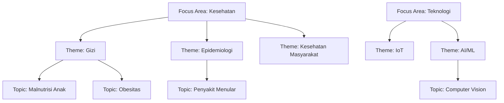

# Data Master & Referensi v2.0 (Bahasa Indonesia)
## SIM LPPM ITSNU – Taksonomi & Kosakata Terkendali

Versi Dokumen: 2.0  
Terakhir Diperbarui: 2025-11-09  
Dikelola Oleh: Admin LPPM, Kepala LPPM

---

## Daftar Isi
1. Taksonomi 3 Level (Focus Area → Theme → Topic)
2. Rumpun Ilmu 3 Level
3. Klasifikasi Penelitian (Skema, PRN, Kelompok Riset Makro)
4. Hierarki Anggaran (Grup → Komponen)
5. Mitra & Organisasi
6. Keywords (Kata Kunci)
7. Struktur Organisasi (Institusi, Fakultas, Prodi)
8. Pengelolaan & Validasi

---

## 1) Taksonomi 3 Level

Focus Area → Theme → Topic

Catatan:
- Semua proposal memilih 1 focus area, 1 theme, 1 topic.  
- Memudahkan penyaringan & pelaporan.

---

## 2) Rumpun Ilmu 3 Level

Tabel `science_clusters` dengan level 1 (Rumpun), 2 (Subrumpun), 3 (Bidang).  
Contoh: Level 1 = Ilmu Teknik → Level 2 = Teknik Elektro & Informatika → Level 3 = Kecerdasan Buatan.  
Referensi mengikuti OECD Field of Science (FoS) dan klasifikasi DIKTI/BAN-PT.

Penggunaan: Proposal menyimpan 3 FK terpisah untuk tiap level agar pelaporan fleksibel.

---

## 3) Klasifikasi Penelitian

### Skema Penelitian (`research_schemes`)
Contoh: Penelitian Dasar, Terapan, Pengembangan, serta skema internal.  
Digunakan untuk menentukan kriteria evaluasi & batasan anggaran.

### Prioritas Riset Nasional (PRN) (`national_priorities`)
9 fokus PRN (Perpres No. 38/2018) seperti Pangan, Energi, Kesehatan, TIK, dll.  
Meningkatkan prioritas usulan bila selaras.

### Kelompok Riset Makro (`macro_research_groups`)
Klasifikasi tingkat tinggi (contoh: Komputasi & Sistem Cerdas, Energi & Lingkungan). Hanya untuk proposal Penelitian.

---

## 4) Hierarki Anggaran (Grup → Komponen)

Grup Anggaran (`budget_groups`) → Komponen Anggaran (`budget_components`).  
Contoh Grup: HONOR, TEKNOLOGI, PELATIHAN, PERJALANAN, LAINNYA.  
Komponen berada di bawah grup tertentu dan memiliki satuan (per sesi, per liter, dsb.).

Validasi umum: total item = volume × harga satuan, ringkas per grup untuk ringkasan RAB.

---

## 5) Mitra & Organisasi

`partners` menyimpan data organisasi mitra (PKM).  
Tipe mitra umum: NGO, Community, Government, School, SME, Religious.  
Relasi banyak-ke-banyak dengan proposal lewat `proposal_partner`.

Opsional: pelacakan MOU (dokumen, tanggal, status) sesuai kebutuhan kebijakan.

---

## 6) Keywords (Kata Kunci)

Kata kunci membantu pencarian & pengelompokan topik.  
Relasi M:N dengan proposal (`proposal_keyword`) dan laporan progres.  
Praktik baik: huruf kecil, tidak duplikat, spesifik (maks 3–5 kata).

---

## 7) Struktur Organisasi

- `institutions` (Institusi/Universitas).  
- `faculties` (Fakultas; contoh: SAINTEK, DEKABITA).  
- `study_programs` (Program Studi).  
- `identities` mengaitkan pengguna ke fakultas & prodi untuk pembatasan akses Dekan.

---

## 8) Pengelolaan & Validasi

Hak kelola: Admin LPPM (CRUD), Kepala LPPM (lihat), peran lain (lihat terbatas).  
Aturan validasi umum:
- Theme harus memiliki Focus Area induk; Topic harus memiliki Theme induk.  
- Science Cluster Level 2 wajib punya parent Level 1; Level 3 wajib punya parent Level 2.  
- Komponen Anggaran wajib punya Grup; kode unik per grup; field `unit` wajib.  
- Partner tidak boleh dihapus bila dipakai proposal; validasi format email/telepon.  
- Keywords unik (case-insensitive), minimal 2 karakter, karakter khusus dibatasi.

---

Catatan: Detail lengkap (contoh daftar, kode, dan diagram) mengikuti versi Inggris. Dokumen ini menerjemahkan konsep & aturan utama ke Bahasa Indonesia yang mudah dipahami.
