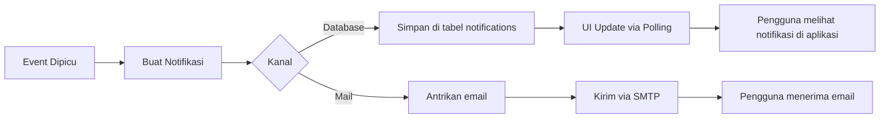

# Sistem Notifikasi v2.0 (Bahasa Indonesia)
## SIM LPPM ITSNU – Dokumentasi Notifikasi Ringkas

**Versi Dokumen:** 2.0  
**Terakhir Diperbarui:** 2025-11-09  
**Sistem:** Laravel Notifications (Database + Mail)

---

## Ikhtisar

Semua notifikasi mengimplementasikan `ShouldQueue` (pengiriman asinkron). Dua kanal: `database` (in-app) dan `mail` (email).

---

## Tipe Notifikasi (Total 13)

1) ProposalSubmitted  
• Pemicu: Proposal disubmit Dosen  
• Penerima: Dekan, Admin LPPM, Anggota Tim  
• Kanal: Database + Email

2) ReviewerAssigned  
• Pemicu: Admin LPPM menugaskan reviewer  
• Penerima: Reviewer yang ditugaskan  
• Kanal: Database + Email

3) TeamInvitationSent  
• Pemicu: Anggota tim diundang  
• Penerima: Anggota yang diundang  
• Kanal: Database + Email

4) TeamInvitationAccepted  
• Pemicu: Anggota menerima undangan  
• Penerima: Pengusul proposal  
• Kanal: Database saja

5) TeamInvitationRejected  
• Pemicu: Anggota menolak undangan  
• Penerima: Pengusul proposal  
• Kanal: Database saja

6) ReviewCompleted  
• Pemicu: Reviewer menyelesaikan review  
• Penerima: Admin LPPM, Kepala LPPM (saat semua selesai)  
• Kanal: Database + Email

7) FinalDecisionMade  
• Pemicu: Keputusan akhir Kepala LPPM  
• Penerima: Pengusul, Tim, Dekan, Admin LPPM  
• Kanal: Database + Email

8) DekanApprovalDecision  
• Pemicu: Keputusan Dekan (approve/need assignment)  
• Penerima: Pengusul, Kepala LPPM (jika approve)  
• Kanal: Database + Email

9) ReviewReminder  
• Pemicu: Terjadwal (3 hari sebelum tenggat)  
• Penerima: Reviewer yang belum selesai  
• Kanal: Database + Email

10) ReviewOverdue  
• Pemicu: Terjadwal (1 hari setelah tenggat)  
• Penerima: Reviewer + Admin LPPM  
• Kanal: Database + Email

11) ReviewerAssignment  
• Pemicu: Persetujuan awal Kepala LPPM (siap penugasan)  
• Penerima: Admin LPPM  
• Kanal: Database + Email

12) DailySummaryReport  
• Pemicu: Terjadwal (harian 08.00)  
• Penerima: Admin LPPM  
• Kanal: Email saja

13) WeeklySummaryReport  
• Pemicu: Terjadwal (Senin 08.00)  
• Penerima: Kepala LPPM  
• Kanal: Email saja

---

## Struktur Payload Data (Database)

```json
{
  "type": "proposal_submitted",
  "title": "Proposal Baru Disubmit",
  "message": "Proposal '{title}' telah disubmit oleh {submitter_name}",
  "body": "Deskripsi detail dalam Bahasa Indonesia...",
  "proposal_id": "uuid",
  "submitter_id": "uuid",
  "submitter_name": "string",
  "proposal_type": "research|community_service",
  "link": "https://domain/proposals/uuid",
  "icon": "file-text",
  "created_at": "2025-11-09T08:00:00.000Z"
}
```

---

## Komponen UI

### Dropdown Notifikasi
- Lokasi: Navbar atas (ikon lonceng)
- Menampilkan: 5 notifikasi belum dibaca terakhir
- Polling: Tiap 30 detik (Livewire polling)
- Aksi: Tandai dibaca, Lihat semua

### Pusat Notifikasi
- Route: `/notifications`
- Pagination: 20 per halaman
- Filter: All, Unread, Read
- Aksi: Tandai dibaca, Tandai semua dibaca, Hapus

---

## Template Email

Struktur:
- Subjek: `[SIM LPPM] {Aksi}`
- Salam: `Halo, {name}!`
- Isi: 2-3 baris ringkas
- Tombol Aksi: Link ke proposal/review
- Footer: Signature sistem

Contoh:
```
Subjek: [SIM LPPM] Proposal Baru Diajukan

Halo, Admin LPPM!

Proposal baru dengan judul "Implementasi AI untuk Deteksi Penyakit" 
telah diajukan oleh Dr. John Doe.

[Lihat Detail Proposal]

Terima kasih,
SIM LPPM ITSNU
```

---

## Alur Notifikasi



---

**Akhir Dokumen**
