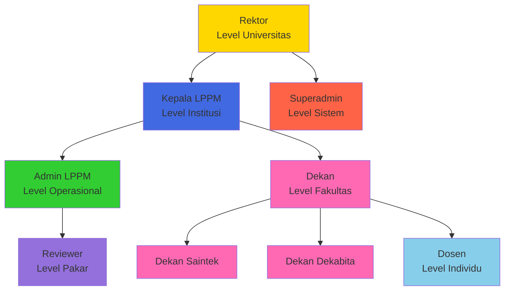

# Matriks Peran & Izin v2.0 (Bahasa Indonesia)
## SIM LPPM ITSNU – Role-Based Access Control (RBAC)

**Versi Dokumen:** 2.0  
**Terakhir Diperbarui:** 2025-11-09  
**Sistem Otorisasi:** Spatie Laravel Permission

---

## Daftar Isi
1. [Ikhtisar Peran](#ikhtisar-peran)
2. [Matriks Izin Lengkap](#matriks-izin-lengkap)
3. [Deskripsi Peran](#deskripsi-peran)
4. [Cakupan Data & Level Akses](#cakupan-data--level-akses)
5. [Implementasi Izin](#implementasi-izin)

---

## Ikhtisar Peran

### Peran Sistem (Total 9)

| #   | Nama Peran  | Kode          | Level       | Perkiraan Jumlah Pengguna | Fungsi Utama                               |
| --- | ----------- | ------------- | ----------- | ------------------------- | ------------------------------------------ |
| 1   | Super Admin | `superadmin`  | Sistem      | 1-2                       | Administrasi TI, akses penuh               |
| 2   | Admin LPPM  | `admin lppm`  | Institusi   | 2-5                       | Manajemen operasional, koordinasi reviewer |
| 3   | Kepala LPPM | `kepala lppm` | Institusi   | 1                         | Kepemimpinan strategis, persetujuan akhir  |
| 4   | Dekan       | `dekan`       | Fakultas    | 1 per fakultas            | Persetujuan tingkat pertama                |
| 7   | Dosen       | `dosen`       | Individu    | Banyak                    | Pembuatan & pengajuan proposal             |
| 8   | Reviewer    | `reviewer`    | Pakar       | Banyak                    | Evaluasi proposal                          |
| 9   | Rektor      | `rektor`      | Universitas | 1                         | Pengawasan strategis (jarang aktif)        |

### Hirarki Peran



---

## Matriks Izin Lengkap

### Legenda
- ✅ Akses Penuh (CRUD + semua aksi)
- ✔️ Akses Terbatas (baca + aksi tertentu)
- 🔒 Akses Terskopa (dibatasi kepemilikan/lingkup)
- ❌ Tidak Ada Akses

### Manajemen Proposal

| Izin                   | superadmin | admin lppm | kepala lppm |   dekan*   |      dosen      | reviewer | rektor |
| ---------------------- | :--------: | :--------: | :---------: | :--------: | :-------------: | :------: | :----: |
| Buat Proposal          |     ✅      |     ✅      |      ✅      |     ✅      |        ✅        |    ❌     |   ❌    |
| Lihat Semua Proposal   |     ✅      |     ✅      |      ✅      | 🔒 Fakultas | 🔒 Milik sendiri | 🔒 Tugas  |   ✅    |
| Lihat Detail Proposal  |     ✅      |     ✅      |      ✅      | 🔒 Fakultas |   🔒 Milik/Tim   | 🔒 Tugas  |   ✅    |
| Edit Draft Proposal    |     ✅      |     ✅      |      ✅      |     ✅      | 🔒 Milik sendiri |    ❌     |   ❌    |
| Edit Proposal Disubmit |     ✅      |     ✅      | ✔️ Metadata  |     ❌      |        ❌        |    ❌     |   ❌    |
| Hapus Proposal         |     ✅      |     ✅      |   ✔️ Draft   |     ❌      | 🔒 Draft sendiri |    ❌     |   ❌    |
| Submit Proposal        |     ✅      |     ✅      |      ✅      |     ✅      | 🔒 Milik sendiri |    ❌     |   ❌    |
| Resubmit (Revisi)      |     ✅      |     ✅      |      ✅      |     ✅      | 🔒 Milik sendiri |    ❌     |   ❌    |

*dekan mencakup dekan

---

### Alur Persetujuan

| Izin                             | superadmin | admin lppm | kepala lppm | dekan* | dosen | reviewer |   rektor    |
| -------------------------------- | :--------: | :--------: | :---------: | :----: | :---: | :------: | :---------: |
| Persetujuan Dekan                |     ✅      |     ❌      |      ❌      |   ✅    |   ❌   |    ❌     |      ❌      |
| Permintaan Perbaikan Tim (Dekan) |     ✅      |     ❌      |      ❌      |   ✅    |   ❌   |    ❌     |      ❌      |
| Persetujuan Awal Kepala LPPM     |     ✅      |     ❌      |      ✅      |   ❌    |   ❌   |    ❌     | ✔️ Override  |
| Keputusan Akhir Kepala LPPM      |     ✅      |     ❌      |      ✅      |   ❌    |   ❌   |    ❌     | ✔️ Override  |
| Tolak Proposal                   |     ✅      |     ❌      |      ✅      |   ❌    |   ❌   |    ❌     | ✔️ Strategis |
| Tandai Selesai                   |     ✅      |     ❌      |      ✅      |   ❌    |   ❌   |    ❌     |      ❌      |
| Minta Revisi                     |     ✅      |     ❌      |      ✅      |   ❌    |   ❌   |    ❌     |      ❌      |
| Override Status                  |     ✅      |     ❌      |      ❌      |   ❌    |   ❌   |    ❌     |  ✔️ Darurat  |

---

### Manajemen Tim

| Izin                   | superadmin | admin lppm | kepala lppm |   dekan*   |      dosen      | reviewer | rektor |
| ---------------------- | :--------: | :--------: | :---------: | :--------: | :-------------: | :------: | :----: |
| Undang Anggota Tim     |     ✅      |     ✅      |      ✅      |     ✅      | 🔒 Milik sendiri |    ❌     |   ❌    |
| Hapus Anggota Tim      |     ✅      |     ✅      |   ✔️ Admin   |     ❌      | 🔒 Milik sendiri |    ❌     |   ❌    |
| Terima Undangan Tim    |     ✅      |     ✅      |      ✅      |     ✅      |        ✅        |    ❌     |   ❌    |
| Tolak Undangan Tim     |     ✅      |     ✅      |      ✅      |     ✅      |        ✅        |    ❌     |   ❌    |
| Lihat Anggota Tim      |     ✅      |     ✅      |      ✅      | 🔒 Fakultas |        ✅        | 🔒 Tugas  |   ✅    |
| Tetapkan Tugas Tim     |     ✅      |     ✅      |      ✅      |     ❌      | 🔒 Milik sendiri |    ❌     |   ❌    |
| Lihat Undangan Pending |     ✅      |     ✅      |      ✅      | 🔒 Fakultas | 🔒 Milik sendiri |    ❌     |   ❌    |

---

### Manajemen Review

| Izin                     | superadmin | admin lppm | kepala lppm |   dekan*   |      dosen      |     reviewer     | rektor |
| ------------------------ | :--------: | :--------: | :---------: | :--------: | :-------------: | :--------------: | :----: |
| Tugaskan Reviewer        |     ✅      |     ✅      |   ✔️ Lihat   |     ❌      |        ❌        |        ❌         |   ❌    |
| Hapus Reviewer           |     ✅      |     ✅      |      ❌      |     ❌      |        ❌        |        ❌         |   ❌    |
| Lihat Penugasan Reviewer |     ✅      |     ✅      |      ✅      | 🔒 Fakultas | 🔒 Milik sendiri | 🔒 Milik sendiri  |   ✅    |
| Submit Review            |     ✅      |     ❌      |      ❌      |     ❌      |        ❌        |        ✅         |   ❌    |
| Edit Review Sendiri      |     ✅      |     ❌      |      ❌      |     ❌      |        ❌        | ✔️ Sebelum Submit |   ❌    |
| Lihat Semua Review       |     ✅      |     ✅      |      ✅      | 🔒 Fakultas | 🔒 Milik sendiri | 🔒 Milik sendiri  |   ✅    |
| Lihat Catatan Review     |     ✅      |     ✅      |      ✅      |     ❌      | 🔒 Milik sendiri | 🔒 Milik sendiri  |   ✅    |
| Lihat Ringkasan Review   |     ✅      |     ✅      |      ✅      | 🔒 Fakultas | 🔒 Milik sendiri |        ❌         |   ✅    |

---

### Manajemen Anggaran

| Izin                      | superadmin | admin lppm | kepala lppm |   dekan*   |      dosen      | reviewer |   rektor    |
| ------------------------- | :--------: | :--------: | :---------: | :--------: | :-------------: | :------: | :---------: |
| Tambah Item Anggaran      |     ✅      |     ✅      |      ✅      |     ✅      | 🔒 Draft sendiri |    ❌     |      ❌      |
| Edit Item Anggaran        |     ✅      |     ✅      |   ✔️ Admin   |     ❌      | 🔒 Draft sendiri |    ❌     |      ❌      |
| Hapus Item Anggaran       |     ✅      |     ✅      |   ✔️ Admin   |     ❌      | 🔒 Draft sendiri |    ❌     |      ❌      |
| Lihat Detail Anggaran     |     ✅      |     ✅      |      ✅      | 🔒 Fakultas |   🔒 Milik/Tim   | 🔒 Tugas  |      ✅      |
| Ekspor Ringkasan Anggaran |     ✅      |     ✅      |      ✅      | 🔒 Fakultas | 🔒 Milik sendiri |    ❌     |      ✅      |
| Setujui Anggaran          |     ✅      |     ❌      |      ✅      |     ✅      |        ❌        |    ❌     | ✔️ Strategis |

---

### Pelaporan Progres

| Izin                     | superadmin | admin lppm | kepala lppm |   dekan*   |      dosen      | reviewer | rektor |
| ------------------------ | :--------: | :--------: | :---------: | :--------: | :-------------: | :------: | :----: |
| Buat Laporan Kemajuan    |     ✅      |     ✅      |      ✅      |     ✅      | 🔒 Milik sendiri |    ❌     |   ❌    |
| Submit Laporan Kemajuan  |     ✅      |     ✅      |      ✅      |     ✅      | 🔒 Milik sendiri |    ❌     |   ❌    |
| Edit Draft Laporan       |     ✅      |     ✅      |      ✅      |     ❌      | 🔒 Milik sendiri |    ❌     |   ❌    |
| Setujui Laporan Kemajuan |     ✅      |     ✅      |      ✅      |     ❌      |        ❌        |    ❌     |   ❌    |
| Lihat Semua Laporan      |     ✅      |     ✅      |      ✅      | 🔒 Fakultas | 🔒 Milik sendiri |    ❌     |   ✅    |
| Lihat Detail Laporan     |     ✅      |     ✅      |      ✅      | 🔒 Fakultas |   🔒 Milik/Tim   |    ❌     |   ✅    |
| Tambah Luaran Wajib      |     ✅      |     ✅      |      ✅      |     ❌      | 🔒 Milik sendiri |    ❌     |   ❌    |
| Tambah Luaran Tambahan   |     ✅      |     ✅      |      ✅      |     ❌      | 🔒 Milik sendiri |    ❌     |   ❌    |

---

### Manajemen Data Master

| Izin                         | superadmin | admin lppm | kepala lppm | dekan* |  dosen  | reviewer | rektor |
| ---------------------------- | :--------: | :--------: | :---------: | :----: | :-----: | :------: | :----: |
| Kelola Focus Areas           |     ✅      |     ✅      |   ✔️ Lihat   |   ❌    |    ❌    |    ❌     |   ❌    |
| Kelola Themes                |     ✅      |     ✅      |   ✔️ Lihat   |   ❌    |    ❌    |    ❌     |   ❌    |
| Kelola Topics                |     ✅      |     ✅      |   ✔️ Lihat   |   ❌    |    ❌    |    ❌     |   ❌    |
| Kelola Keywords              |     ✅      |     ✅      |   ✔️ Lihat   |   ❌    |    ❌    |    ❌     |   ❌    |
| Kelola Research Schemes      |     ✅      |     ✅      |   ✔️ Lihat   |   ❌    |    ❌    |    ❌     |   ❌    |
| Kelola National Priorities   |     ✅      |     ✅      |   ✔️ Lihat   |   ❌    |    ❌    |    ❌     |   ❌    |
| Kelola Science Clusters      |     ✅      |     ✅      |   ✔️ Lihat   |   ❌    |    ❌    |    ❌     |   ❌    |
| Kelola Budget Groups         |     ✅      |     ✅      |   ✔️ Lihat   |   ❌    |    ❌    |    ❌     |   ❌    |
| Kelola Budget Components     |     ✅      |     ✅      |   ✔️ Lihat   |   ❌    |    ❌    |    ❌     |   ❌    |
| Kelola Partners              |     ✅      |     ✅      |   ✔️ Lihat   |   ❌    | ✔️ Lihat |    ❌     |   ❌    |
| Kelola Faculties             |     ✅      |     ✅      |      ❌      |   ❌    |    ❌    |    ❌     |   ❌    |
| Kelola Study Programs        |     ✅      |     ✅      |      ❌      |   ❌    |    ❌    |    ❌     |   ❌    |
| Kelola Institutions          |     ✅      |     ✅      |      ❌      |   ❌    |    ❌    |    ❌     |   ❌    |
| Kelola Macro Research Groups |     ✅      |     ✅      |   ✔️ Lihat   |   ❌    |    ❌    |    ❌     |   ❌    |

---

### Manajemen Pengguna

| Izin                    | superadmin |    admin lppm    | kepala lppm | dekan* |      dosen       | reviewer | rektor |
| ----------------------- | :--------: | :--------------: | :---------: | :----: | :--------------: | :------: | :----: |
| Buat Pengguna           |     ✅      |        ✅         |      ❌      |   ❌    |        ❌         |    ❌     |   ❌    |
| Edit Pengguna           |     ✅      |        ✅         |      ❌      |   ❌    | 🔒 Profil sendiri |    ❌     |   ❌    |
| Hapus Pengguna          |     ✅      | ✔️ Dosen/Reviewer |      ❌      |   ❌    |        ❌         |    ❌     |   ❌    |
| Tetapkan Peran          |     ✅      |        ✅         |      ❌      |   ❌    |        ❌         |    ❌     |   ❌    |
| Cabut Peran             |     ✅      |        ✅         |      ❌      |   ❌    |        ❌         |    ❌     |   ❌    |
| Lihat Semua Pengguna    |     ✅      |        ✅         |   ✔️ Lihat   |   ❌    |        ❌         |    ❌     |   ❌    |
| Lihat Detail Pengguna   |     ✅      |        ✅         | ✔️ Terbatas  |   ❌    | 🔒 Milik sendiri  |    ❌     |   ❌    |
| Edit Profil Sendiri     |     ✅      |        ✅         |      ✅      |   ✅    |        ✅         |    ✅     |   ✅    |
| Ganti Password Sendiri  |     ✅      |        ✅         |      ✅      |   ✅    |        ✅         |    ✅     |   ✅    |
| Aktifkan 2FA            |     ✅      |        ✅         |      ✅      |   ✅    |        ✅         |    ✅     |   ✅    |
| Reset Password Pengguna |     ✅      |        ✅         |      ❌      |   ❌    |        ❌         |    ❌     |   ❌    |

---

### Laporan & Analitik

| Izin                        | superadmin | admin lppm | kepala lppm |   dekan*   |      dosen      |    reviewer     | rektor |
| --------------------------- | :--------: | :--------: | :---------: | :--------: | :-------------: | :-------------: | :----: |
| Lihat Dashboard             |     ✅      |     ✅      |      ✅      | 🔒 Fakultas | 🔒 Milik sendiri | 🔒 Milik sendiri |   ✅    |
| Lihat Statistik Proposal    |     ✅      |     ✅      |      ✅      | 🔒 Fakultas | 🔒 Milik sendiri |        ❌        |   ✅    |
| Hasilkan Laporan            |     ✅      |     ✅      |      ✅      | 🔒 Fakultas | 🔒 Milik sendiri |        ❌        |   ✅    |
| Ekspor Data (CSV/Excel)     |     ✅      |     ✅      |      ✅      | 🔒 Fakultas | 🔒 Milik sendiri |        ❌        |   ✅    |
| Lihat Analitik Sistem       |     ✅      |     ✅      |      ✅      |     ❌      |        ❌        |        ❌        |   ✅    |
| Lihat Statistik Review      |     ✅      |     ✅      |      ✅      | 🔒 Fakultas |        ❌        | 🔒 Milik sendiri |   ✅    |
| Lihat Perbandingan Fakultas |     ✅      |     ✅      |      ✅      |     ❌      |        ❌        |        ❌        |   ✅    |

---

### Notifikasi

| Izin                       | superadmin | admin lppm | kepala lppm | dekan* | dosen | reviewer | rektor |
| -------------------------- | :--------: | :--------: | :---------: | :----: | :---: | :------: | :----: |
| Lihat Notifikasi Sendiri   |     ✅      |     ✅      |      ✅      |   ✅    |   ✅   |    ✅     |   ✅    |
| Tandai Dibaca              |     ✅      |     ✅      |      ✅      |   ✅    |   ✅   |    ✅     |   ✅    |
| Hapus Notifikasi           |     ✅      |     ✅      |      ✅      |   ✅    |   ✅   |    ✅     |   ✅    |
| Kirim Notifikasi Manual    |     ✅      |     ✅      | ✔️ Terbatas  |   ❌    |   ❌   |    ❌     |   ❌    |
| Atur Preferensi Notifikasi |     ✅      |     ✅      |      ✅      |   ✅    |   ✅   |    ✅     |   ✅    |
| Lihat Log Semua Notifikasi |     ✅      |     ✅      |      ❌      |   ❌    |   ❌   |    ❌     |   ❌    |

---

### Administrasi Sistem

| Izin                    | superadmin | admin lppm | kepala lppm | dekan* | dosen | reviewer | rektor |
| ----------------------- | :--------: | :--------: | :---------: | :----: | :---: | :------: | :----: |
| Akses Telescope         |     ✅      |     ❌      |      ❌      |   ❌    |   ❌   |    ❌     |   ❌    |
| Lihat Log Sistem        |     ✅      | ✔️ Terbatas |      ❌      |   ❌    |   ❌   |    ❌     |   ❌    |
| Jalankan Artisan        |     ✅      |     ❌      |      ❌      |   ❌    |   ❌   |    ❌     |   ❌    |
| Kelola Basis Data       |     ✅      |     ❌      |      ❌      |   ❌    |   ❌   |    ❌     |   ❌    |
| Konfigurasi Sistem      |     ✅      | ✔️ Terbatas |      ❌      |   ❌    |   ❌   |    ❌     |   ❌    |
| Lihat Antrian Pekerjaan |     ✅      |  ✔️ Lihat   |      ❌      |   ❌    |   ❌   |    ❌     |   ❌    |
| Bersihkan Cache         |     ✅      |     ❌      |      ❌      |   ❌    |   ❌   |    ❌     |   ❌    |

---

## Deskripsi Peran

### 1. Superadmin (Administrator Sistem)

**Tujuan:** Administrasi TI & dukungan pengembangan  
**Level Akses:** Seluruh sistem, tanpa pembatasan

**Tanggung Jawab Utama:**
- Pemeliharaan & pemantauan sistem
- Manajemen basis data
- Pemulihan darurat
- Respons insiden keamanan
- Dukungan dev & deployment

**Pengguna Tipikal:** Administrator TI, developer

**Izin Kritis:**
- ✅ Akses DB penuh, Telescope, Artisan
- ✅ Bypass semua validasi & override status

**Pembatasan:**
- Tidak digunakan untuk operasi harian
- Dicadangkan untuk isu teknis & dev
- Semua aksi tercatat untuk audit

---

### 2. Admin LPPM (Administrator LPPM)

**Tujuan:** Manajemen operasional aktivitas LPPM  
**Level Akses:** Seluruh institusi (semua fakultas)

**Tanggung Jawab Utama:**
- Menugaskan reviewer setelah persetujuan awal Kepala LPPM
- Mengelola data master (taksonomi, keywords, mitra, anggaran)
- Manajemen akun pengguna (buat, edit, tetapkan peran)
- Memantau progres review & kirim pengingat
- Koordinasi antar pemangku kepentingan
- Membuat laporan operasional

**Pengguna Tipikal:** Staf administrasi LPPM (2-5 orang)

**Izin Kritis:**
- ✅ Tugaskan/lepas reviewer
- ✅ CRUD penuh data master
- ✅ Buat pengguna & tetapkan peran (kecuali superadmin/rektor)
- ✅ Lihat semua proposal (semua status, fakultas)
- ✅ Lihat semua review & ringkasan
- ❌ Tidak dapat menyetujui proposal / submit review

**Cakupan Data:** Semua proposal, fakultas, dan pengguna (kecuali data sistem sensitif)

---

### 3. Kepala LPPM (Direktur LPPM)

**Tujuan:** Kepemimpinan strategis & otoritas keputusan akhir  
**Level Akses:** Seluruh institusi (semua fakultas)

**Tanggung Jawab Utama:**
- **Persetujuan awal** setelah Dekan (APPROVED → UNDER_REVIEW)
- **Keputusan akhir** setelah semua review selesai (REVIEWED → COMPLETED/REVISION_NEEDED/REJECTED)
- Pengawasan strategis seluruh riset/PKM
- Implementasi kebijakan & koordinasi institusional
- Pelaporan tingkat tinggi

**Pengguna Tipikal:** Direktur LPPM (1 orang)

**Izin Kritis:**
- ✅ Persetujuan awal (memicu penugasan reviewer)
- ✅ Keputusan akhir (setujui/revisi/tolak)
- ✅ Lihat semua proposal & review, laporan & analitik
- ✔️ Lihat data master (tanpa edit)
- ❌ Tidak menugaskan reviewer / membuat pengguna

**Dua Tahap Persetujuan:**
1. **Awal:** APPROVED → UNDER_REVIEW  
2. **Akhir:** REVIEWED → COMPLETED/REVISION_NEEDED

**Cakupan Data:** Semua proposal, semua fakultas, semua laporan (read-only untuk master data)

---

### 4. Dekan 

**Tujuan:** Persetujuan tingkat fakultas & pengawasan  
**Level Akses:** Skop fakultas sendiri

**Tanggung Jawab Utama:**
- **Persetujuan tingkat pertama** (SUBMITTED → APPROVED)
- Menilai keselarasan fakultas & anggaran
- Koordinasi riset fakultas
- Minta perbaikan tim bila diperlukan (SUBMITTED → NEED_ASSIGNMENT)

**Varian Peran:**
- Dekan

**Izin Kritis:**
- ✅ Setujui proposal lingkup fakultas
- ✅ Minta perbaikan komposisi tim
- ✅ Lihat proposal & laporan lingkup fakultas
- ❌ Tidak bisa menolak proposal / mengedit yang disubmit / menugaskan reviewer

**Cakupan Data:** Proposal fakultas sendiri

---

### 5. Dosen (Pengusul/Peneliti)

**Tujuan:** Pembuatan, pengajuan, dan pelaporan progres  
**Level Akses:** Proposal milik sendiri & keanggotaan tim

**Tanggung Jawab Utama:**
- Buat proposal penelitian/PKM & undang tim
- Submit proposal (setelah semua tim menerima)
- Terima/tolak undangan tim dari orang lain
- Submit laporan kemajuan (semester/tahunan)
- Revisi proposal jika diminta
- Pantau status proposal

**Izin Kritis:**
- ✅ Buat & edit draft milik sendiri, undang tim
- ✅ Submit proposal & laporan kemajuan
- ✅ Terima/tolak undangan tim
- ❌ Tidak dapat mengedit proposal yang telah disubmit / melihat proposal orang lain (kecuali anggota)
- ❌ Tidak dapat menugaskan reviewer / menyetujui

**Cakupan Data:** Proposal yang diajukan sendiri, proposal di mana menjadi anggota tim, laporan kemajuan sendiri

---

### 6. Reviewer (Penilai Ahli)

**Tujuan:** Evaluasi dan rekomendasi proposal  
**Level Akses:** Proposal yang ditugaskan saja

**Tanggung Jawab Utama:**
- Review proposal yang ditugaskan
- Evaluasi metodologi/solusi, anggaran, kualifikasi tim
- Berikan catatan terperinci & rekomendasi (approved/revision/rejected)
- Selesaikan review sesuai tenggat (7-14 hari)

**Izin Kritis:**
- ✅ Lihat proposal yang ditugaskan (detail penuh)
- ✅ Submit review (catatan + rekomendasi)
- ✅ Lihat riwayat review sendiri
- ❌ Tidak dapat melihat proposal lain / menyetujui / menugaskan / mengedit review setelah submit (immutable)

**Cakupan Data:** Hanya proposal yang ditugaskan via `proposal_reviewer`

---

### 7. Rektor (Pimpinan Universitas)

**Tujuan:** Pengawasan strategis & persetujuan prioritas  
**Level Akses:** Seluruh universitas (sebagian besar read-only)

**Tanggung Jawab Utama:**
- Persetujuan strategis untuk proposal prioritas
- Pengawasan riset universitas & analitik institusional
- Override darurat (sangat jarang)

**Izin Kritis:**
- ✅ Lihat semua proposal, laporan, dan analitik
- ✅ Persetujuan strategis untuk proposal prioritas
- ✔️ Override keputusan Kepala LPPM (darurat)
- ❌ Tidak terlibat operasi harian / membuat proposal / menugaskan reviewer

**Cakupan Data:** Semua proposal, semua fakultas (mostly read-only)

---

## Cakupan Data & Level Akses

### Definisi Cakupan Akses

| Skop      | Deskripsi                            | Berlaku Untuk                     |
| --------- | ------------------------------------ | --------------------------------- |
| Sistem    | Akses tanpa batas                    | superadmin                        |
| Institusi | Semua fakultas & proposal            | admin lppm, kepala lppm, rektor   |
| Fakultas  | Hanya proposal fakultas sendiri      | dekan (termasuk saintek/dekabita) |
| Tim       | Proposal milik sendiri + keanggotaan | dosen                             |
| Penugasan | Hanya proposal yang ditugaskan       | reviewer                          |
| Pribadi   | Data & aktivitas pribadi             | semua peran                       |

### Contoh Penyaringan Query per Peran

```php
if ($user->hasRole('superadmin')) {
    $proposals = Proposal::all();
} elseif ($user->hasRole(['admin lppm', 'kepala lppm', 'rektor'])) {
    $proposals = Proposal::all();
} elseif ($user->hasRole(['dekan'])) {
    $facultyId = $user->identity->faculty_id;
    $proposals = Proposal::whereHas('submitter.identity', function($q) use ($facultyId) {
        $q->where('faculty_id', $facultyId);
    })->get();
} elseif ($user->hasRole('dosen')) {
    $proposals = Proposal::where('submitter_id', $user->id)
        ->orWhereHas('teamMembers', function($q) use ($user) {
            $q->where('user_id', $user->id);
        })->get();
} elseif ($user->hasRole('reviewer')) {
    $proposals = Proposal::whereHas('reviewers', function($q) use ($user) {
        $q->where('user_id', $user->id);
    })->get();
}
```

### Contoh Otorisasi Aksi

```php
public function canApprove(User $user, Proposal $proposal): bool
{
    if ($user->hasRole(['dekan'])) {
        return $proposal->status === ProposalStatus::SUBMITTED
            && $user->identity->faculty_id === $proposal->submitter->identity->faculty_id;
    }
    if ($user->hasRole('kepala lppm')) {
        return $proposal->status === ProposalStatus::APPROVED;
    }
    if ($user->hasRole('kepala lppm')) {
        return $proposal->status === ProposalStatus::REVIEWED
            && $proposal->allReviewsCompleted();
    }
    return false;
}
```

---

## Implementasi Izin

### Spatie Laravel Permission

Konsep kunci:
- Peran (roles): grup pengguna (mis. "dosen", "reviewer")
- Izin (permissions): aksi granular (mis. "create-proposal", "assign-reviewer")
- Otorisasi level model: Policies & Gates
- Penetapan peran langsung: `$user->assignRole('dosen')`
- Pemeriksaan izin: `$user->hasRole('dosen')` / `$user->can('create-proposal')`

### Tabel Database (Spatie)

```
roles, permissions, model_has_roles, model_has_permissions, role_has_permissions
```

### Middleware

```php
Route::middleware(['auth', 'role:admin lppm'])->group(function() {
    Route::get('/reviewers/assign', [ReviewerController::class, 'assign']);
});

Route::middleware(['auth', 'role:admin lppm|kepala lppm'])->group(function() {
    Route::get('/proposals', [ProposalController::class, 'index']);
});

Route::middleware(['auth', 'permission:assign-reviewers'])->group(function() {
    Route::post('/reviewers', [ReviewerController::class, 'store']);
});
```

### Sistem Role Aktif (Kustom)

```php
public function hasRole($role, $guard = null): bool
{
    $activeRole = session('active_role');
    return $activeRole === $role;
}
```

---

## Tabel Ringkas: Siapa Melakukan Apa

| Aksi                    | Pelaksana   | Prasyarat             | Notifikasi Ke                               |
| ----------------------- | ----------- | --------------------- | ------------------------------------------- |
| Buat Proposal           | Dosen       | -                     | -                                           |
| Submit Proposal         | Dosen       | Semua tim menerima    | Dekan, Admin, Tim                           |
| Persetujuan Dekan       | Dekan       | Status = SUBMITTED    | Kepala, Pengusul, Tim                       |
| Persetujuan Awal Kepala | Kepala LPPM | Status = APPROVED     | Admin LPPM                                  |
| Penugasan Reviewer      | Admin LPPM  | Status = UNDER_REVIEW | Reviewer                                    |
| Submit Review           | Reviewer    | Ditugaskan            | Admin (tiap review), Kepala (semua selesai) |
| Keputusan Akhir         | Kepala LPPM | Status = REVIEWED     | Pengusul, Tim, Dekan                        |

---

**Akhir Dokumen**
