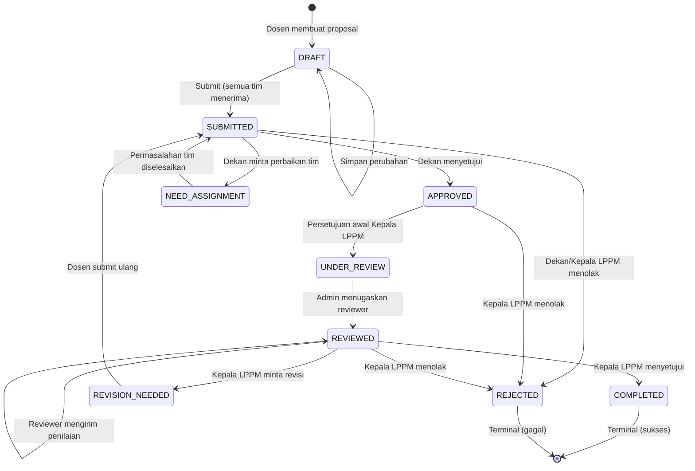
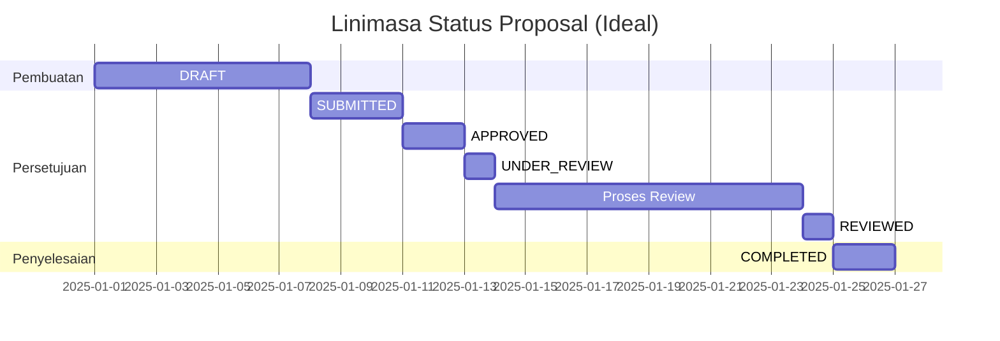
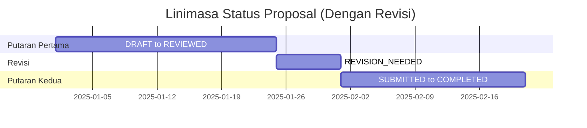

# Transisi Status Proposal v2.0 (Bahasa Indonesia)
## SIM LPPM ITSNU – Siklus Status & State Machine

**Versi Dokumen:** 2.0  
**Terakhir Diperbarui:** 2025-11-09  
**Enum:** `App\Enums\ProposalStatus`

---

## Enum ProposalStatus (9 Status)

```php
enum ProposalStatus: string
{
    case DRAFT = 'draft';
    case SUBMITTED = 'submitted';
    case NEED_ASSIGNMENT = 'need_assignment';
    case APPROVED = 'approved';
    case UNDER_REVIEW = 'under_review';
    case REVIEWED = 'reviewed';
    case REVISION_NEEDED = 'revision_needed';
    case COMPLETED = 'completed';
    case REJECTED = 'rejected';
}
```

---

## Diagram State Transition



---

## Matriks Transisi Valid

| Dari | Ke | Dipicu Oleh | Aturan Bisnis | Notifikasi |
|------|----|-------------|---------------|------------|
| **DRAFT** | SUBMITTED | Dosen | Semua anggota tim menerima | Dekan, Admin, Tim |
| **SUBMITTED** | APPROVED | Dekan | Dekan review dan setujui | Kepala LPPM, Pengusul, Tim |
| **SUBMITTED** | NEED_ASSIGNMENT | Dekan | Masalah persetujuan tim | Pengusul, Anggota Pending |
| **SUBMITTED** | REJECTED | Kepala LPPM | Penolakan awal (jarang) | Pengusul, Tim |
| **NEED_ASSIGNMENT** | SUBMITTED | Dosen | Masalah tim diselesaikan | Dekan, Admin, Tim |
| **APPROVED** | UNDER_REVIEW | Kepala LPPM | Persetujuan awal diberikan | Admin LPPM |
| **APPROVED** | REJECTED | Kepala LPPM | Tidak layak | Pengusul, Tim |
| **UNDER_REVIEW** | REVIEWED | Admin LPPM | Reviewer ditugaskan | Reviewer Ditugaskan |
| **REVIEWED** | COMPLETED | Kepala LPPM | Persetujuan akhir | Pengusul, Tim, Dekan, Admin |
| **REVIEWED** | REVISION_NEEDED | Kepala LPPM | Perlu perbaikan | Pengusul, Tim |
| **REVIEWED** | REJECTED | Kepala LPPM | Tidak layak | Pengusul, Tim |
| **REVISION_NEEDED** | SUBMITTED | Dosen | Revisi & submit ulang | Dekan, Admin, Tim |
| **COMPLETED** | - | - | Terminal | - |
| **REJECTED** | - | - | Terminal | - |

---

## Deskripsi Status

### DRAFT
**Label:** "Draft"  
**Warna:** `secondary` (abu-abu)  
**Deskripsi:** Proposal sedang disusun

**Editable:** ✅ Ya (hanya pemilik)  
**Deletable:** ✅ Ya (hanya pemilik)  
**Status Tim:** Bisa mengundang anggota  
**Langkah Berikut:** Lengkapi proposal, pastikan semua anggota menerima, lalu submit

---

### SUBMITTED
**Label:** "Diajukan"  
**Warna:** `info` (biru)  
**Deskripsi:** Menunggu persetujuan Dekan

**Editable:** ❌ Tidak  
**Deletable:** ❌ Tidak  
**Menunggu:** Persetujuan Dekan  
**Durasi:** 3-5 hari

**Transisi Valid:**
- → APPROVED (Dekan menyetujui)
- → NEED_ASSIGNMENT (Dekan minta perbaikan tim)
- → REJECTED (Ditolak oleh Dekan/Kepala LPPM)

---

### NEED_ASSIGNMENT
**Label:** "Perlu Persetujuan Anggota"  
**Warna:** `warning` (kuning)  
**Deskripsi:** Proposal membutuhkan persetujuan anggota tim

**Editable:** ✔️ Anggota tim dapat terima/tolak  
**Deletable:** ❌ Tidak  
**Menunggu:** Aksi anggota tim  
**Pemicu:** Penolakan anggota tim ATAU permintaan Dekan

**Resolusi:**
- Hapus anggota yang menolak
- Undang anggota baru
- Tunggu semua menerima
- Submit ulang saat siap

**Transisi Valid:**
- → SUBMITTED (Masalah tim selesai)

---

### APPROVED
**Label:** "Disetujui Dekan"  
**Warna:** `primary` (hijau)  
**Deskripsi:** Disetujui Dekan, menunggu persetujuan awal Kepala LPPM

**Editable:** ❌ Tidak  
**Deletable:** ❌ Tidak  
**Menunggu:** Persetujuan awal Kepala LPPM  
**Durasi:** 2-3 hari

**Transisi Valid:**
- → UNDER_REVIEW (Persetujuan awal Kepala LPPM)
- → REJECTED (Ditolak Kepala LPPM)

---

### UNDER_REVIEW
**Label:** "Menunggu Penugasan Reviewer"  
**Warna:** `cyan` (biru muda)  
**Deskripsi:** Disetujui Kepala LPPM untuk direview, menunggu Admin LPPM menugaskan reviewer

**Editable:** ❌ Tidak  
**Deletable:** ❌ Tidak  
**Menunggu:** Admin LPPM menugaskan reviewer  
**Durasi:** 1-2 hari (fase penugasan)

**Fase:**
Admin LPPM meninjau proposal dan menugaskan reviewer sesuai keahlian. Setelah reviewer ditugaskan, status otomatis berubah menjadi REVIEWED.

**Transisi Valid:**
- → REVIEWED (Reviewer ditugaskan dan mulai review)

---

### REVIEWED
**Label:** "Sedang Direview"  
**Warna:** `orange`  
**Deskripsi:** Proposal dalam proses review oleh reviewer yang ditugaskan

**Editable:** ❌ Tidak  
**Deletable:** ❌ Tidak  
**Menunggu:** Semua reviewer menyelesaikan evaluasi  
**Durasi:** 7-14 hari (periode review)

**Fase:**
Reviewer mengevaluasi konten, metodologi/solusi, anggaran, dan kualifikasi tim. Setiap reviewer mengirim catatan dan rekomendasi (approved/revision_needed/rejected). Ketika semua reviewer selesai, Admin LPPM dan Kepala LPPM diberi tahu.

**Perilaku Sistem:**
Proposal tetap di REVIEWED selama proses review. Setelah semua reviewer menyelesaikan (`proposal_reviewer.status = 'completed'`), Kepala LPPM diberi tahu untuk membuat keputusan akhir.

**Transisi Valid:**
- → COMPLETED (Kepala LPPM menyetujui)
- → REVISION_NEEDED (Kepala LPPM minta revisi)
- → REJECTED (Kepala LPPM menolak)

---

### REVISION_NEEDED
**Label:** "Perlu Revisi"  
**Warna:** `yellow`  
**Deskripsi:** Proposal membutuhkan perbaikan sebelum disetujui

**Editable:** ✅ Ya (pemilik dapat revisi)  
**Deletable:** ❌ Tidak  
**Menunggu:** Revisi oleh Dosen  
**Aksi Diperlukan:** Tinjau umpan balik, perbaiki, submit ulang

**Proses Revisi:**
1. Dosen melihat umpan balik reviewer
2. Memperbarui isi proposal
3. Submit ulang (status → SUBMITTED)
4. Mengulangi alur persetujuan

**Transisi Valid:**
- → SUBMITTED (Dosen submit ulang)

---

### COMPLETED
**Label:** "Selesai"  
**Warna:** `success` (hijau)  
**Deskripsi:** Proposal disetujui dan selesai

**Editable:** ❌ Tidak  
**Deletable:** ❌ Tidak  
**Terminal:** ✅ Ya  
**Langkah Berikut:** Mulai aktivitas penelitian/PKM, ajukan laporan kemajuan

---

### REJECTED
**Label:** "Ditolak"  
**Warna:** `danger` (merah)  
**Deskripsi:** Proposal ditolak

**Editable:** ❌ Tidak  
**Deletable:** ❌ Tidak  
**Terminal:** ✅ Ya  
**Dapat Menolak:** Dekan, Kepala LPPM

**Tahap Penolakan:**
- Penolakan awal (SUBMITTED → REJECTED): Jarang, biasanya gunakan NEED_ASSIGNMENT
- Setelah persetujuan Dekan (APPROVED → REJECTED): Penolakan strategis Kepala LPPM
- Pasca-review (REVIEWED → REJECTED): Penolakan berdasarkan hasil review

---

## Aturan Bisnis

### Aturan 1: Persetujuan Tim Wajib
**Status Terdampak:** DRAFT → SUBMITTED

```php
public function canSubmit(Proposal $proposal): bool
{
    return $proposal->allTeamMembersAccepted();
}
```

**Validasi:**
- Semua `proposal_user.status` harus `'accepted'`
- Tidak boleh submit jika ada `'pending'` atau `'rejected'`
- Otomatis pindah ke NEED_ASSIGNMENT jika ada penolakan tim

---

### Aturan 2: Persetujuan Berurutan
**Status:** SUBMITTED → APPROVED → UNDER_REVIEW → REVIEWED → COMPLETED

**Tidak Boleh Lewati Tahap:**
- Wajib melalui persetujuan Dekan (SUBMITTED → APPROVED)
- Lalu persetujuan awal Kepala LPPM (APPROVED → UNDER_REVIEW)
- Lalu penugasan dan evaluasi reviewer
- Terakhir keputusan akhir Kepala LPPM

---

### Aturan 3: Pemicu Penugasan Reviewer
**Transisi:** UNDER_REVIEW → REVIEWED

```php
// Auto-transisi saat reviewer pertama ditugaskan
if ($proposal->reviewers()->count() > 0) {
    $proposal->update(['status' => ProposalStatus::REVIEWED]);
}
```

**Validasi:**
- Minimal satu reviewer ditugaskan
- Sistem otomatis memperbarui status saat Admin LPPM menugaskan reviewer
- Memicu notifikasi ke reviewer yang ditugaskan

#### Aturan 3a: Notifikasi Selesai Review
**Status:** REVIEWED (tetap di status ini)

```php
// Notifikasi Kepala LPPM saat semua reviewer selesai
if ($proposal->allReviewersCompleted()) {
    notify($kepalaLppm, 'Semua review selesai');
}
```

**Validasi:**
- Semua `proposal_reviewer.status` harus `'completed'`
- Status TIDAK berubah otomatis
- Memicu notifikasi ke Kepala LPPM untuk keputusan akhir

---

### Aturan 4: Dua Tahap Persetujuan Kepala LPPM
**Tahap:**
1. **Awal:** APPROVED → UNDER_REVIEW (approve for review)
2. **Akhir:** REVIEWED → COMPLETED/REVISION_NEEDED/REJECTED

**Validasi:**
- Tidak dapat memutuskan akhir sebelum status = REVIEWED
- Tidak dapat approve for review jika status ≠ APPROVED

---

### Aturan 5: Siklus Revisi
**Lintasan:** REVISION_NEEDED → SUBMITTED → ... → REVIEWED → (keputusan)

**Validasi:**
- Proposal revisi kembali ke SUBMITTED
- Wajib ulang seluruh alur persetujuan
- Jumlah siklus revisi tidak dibatasi (konfigurable)

---

### Aturan 6: Status Terminal
**Status:** COMPLETED, REJECTED

**Aturan:**
- Tidak ada transisi lanjutan dari status terminal
- Tidak dapat diubah tanpa intervensi level sistem (superadmin saja)

---

### Aturan 7: Pemicu Penolakan Tim
**Status apa pun → NEED_ASSIGNMENT (saat ada anggota tim menolak)**

```php
if ($teamMember->rejects()) {
    $proposal->update(['status' => ProposalStatus::NEED_ASSIGNMENT]);
}
```

**Berlaku Untuk:** Semua status non-terminal

---

## Implementasi Validasi

```php
public function canTransitionTo(ProposalStatus $newStatus): bool
{
    return match ($this) {
        self::DRAFT => in_array($newStatus, [self::SUBMITTED]),
        
        self::SUBMITTED => in_array($newStatus, [
            self::APPROVED,
            self::NEED_ASSIGNMENT,
            self::REJECTED
        ]),
        
        self::NEED_ASSIGNMENT => in_array($newStatus, [self::SUBMITTED]),
        
        self::APPROVED => in_array($newStatus, [
            self::UNDER_REVIEW,
            self::REJECTED
        ]),
        
        self::UNDER_REVIEW => in_array($newStatus, [self::REVIEWED]),
        
        self::REVIEWED => in_array($newStatus, [
            self::COMPLETED,
            self::REVISION_NEEDED,
            self::REJECTED
        ]),
        
        self::REVISION_NEEDED => in_array($newStatus, [self::SUBMITTED]),
        
        self::COMPLETED => false, // Terminal
        self::REJECTED => false,  // Terminal
    };
}
```

---

## Notifikasi Perubahan Status

| Perubahan Status | Penerima | Subjek |
|------------------|----------|--------|
| → SUBMITTED | Dekan, Admin LPPM, Tim | "Proposal Baru Diajukan" |
| → NEED_ASSIGNMENT | Pengusul, Anggota Pending | "Perbaikan Tim Diperlukan" |
| → APPROVED | Kepala LPPM, Pengusul, Tim | "Proposal Disetujui Dekan" |
| → UNDER_REVIEW | Admin LPPM | "Tugaskan Reviewer" |
| → REVIEWED | Reviewer Ditugaskan | "Anda Ditugaskan Review Proposal" |
| Semua Review Selesai (di REVIEWED) | Kepala LPPM | "Semua Review Selesai" |
| → COMPLETED | Pengusul, Tim, Dekan, Admin | "Proposal Disetujui" |
| → REVISION_NEEDED | Pengusul, Tim | "Revisi Diperlukan" |
| → REJECTED | Pengusul, Tim | "Proposal Ditolak" |

---

## Linimasa Transisi

**Durasi Rata-rata (tanpa revisi):**



**Total:** ~26 hari (3-4 minggu)

**Dengan Satu Siklus Revisi:**



**Total:** ~51 hari (7-8 minggu)

---

## Pemantauan Distribusi Status

**Metrik Dashboard:**
- Proposal per status (pie chart)
- Rata-rata waktu di tiap status (bar chart)
- Identifikasi bottleneck (status terlama)
- Tingkat penyelesaian (COMPLETED / Total × 100%)
- Tingkat penolakan (REJECTED / Total × 100%)
- Tingkat revisi (pernah melalui REVISION_NEEDED × 100%)

---

**Akhir Dokumen**
