# Dokumentasi Alur Kerja v2.0 (Bahasa Indonesia)
## SIM LPPM ITSNU – Alur Proses Lengkap

**Versi Dokumen:** 2.0  
**Terakhir Diperbarui:** 2025-11-09

---

## Daftar Isi
1. [Siklus Proposal Lengkap](#siklus-proposal-lengkap)
2. [Alur Dosen](#alur-dosen)
3. [Alur Dekan](#alur-dekan)
4. [Alur Kepala LPPM](#alur-kepala-lppm)
5. [Alur Admin LPPM](#alur-admin-lppm)
6. [Alur Reviewer](#alur-reviewer)
7. [Ringkasan Eksekutif](#ringkasan-eksekutif)

---

## Siklus Proposal Lengkap

### Diagram Ikhtisar


### Tabel Progres Status

| Tahap | Status                                 | Aktor       | Durasi     | Langkah Berikutnya           |
| ----- | -------------------------------------- | ----------- | ---------- | ---------------------------- |
| 1     | DRAFT                                  | Dosen       | Variabel   | Undangan tim                 |
| 2     | NEED_ASSIGNMENT                        | Dosen/Tim   | 1-2 minggu | Persetujuan tim              |
| 3     | SUBMITTED                              | Dekan       | 3-5 hari   | Review Dekan                 |
| 4     | APPROVED                               | Kepala LPPM | 2-3 hari   | Persetujuan awal Kepala LPPM |
| 5     | UNDER_REVIEW                           | Admin LPPM  | 1-2 hari   | Penugasan reviewer           |
| 6     | UNDER_REVIEW                           | Reviewer    | 7-14 hari  | Penyelesaian review          |
| 7     | REVIEWED                               | Kepala LPPM | 2-3 hari   | Keputusan akhir              |
| 8     | COMPLETED / REVISION_NEEDED / REJECTED | -           | -          | Terminal atau loop revisi    |

**Durasi Rata-rata Total:** 2-3 minggu (tanpa revisi)

---

## Ringkasan Workflow Keseluruhan

### Gambaran Umum Proses

Sistem SIM LPPM ITSNU mengimplementasikan alur persetujuan multi-tahap yang menyeluruh untuk mengelola siklus hidup proposal penelitian dan pengabdian kepada masyarakat. Proses ini dirancang untuk memastikan transparansi, kolaborasi tim yang efektif, dan evaluasi berkualitas tinggi sebelum persetujuan final.

#### Workflow Lengkap Antar Role

```mermaid
sequenceDiagram
    participant D as Dosen
    participant T as Anggota Tim
    participant Dekan
    participant KL as Kepala LPPM
    participant A as Admin LPPM
    participant R as Reviewer
    participant S as Sistem

    %% Fase 1: Dosen - Draft & Undangan Tim
    Note over D,S: Fase 1: DRAFT & Tim Assembly (Dosen)
    D->>S: Buat proposal → DRAFT
    D->>S: Undang anggota tim
    S->>T: Kirim undangan
    
    %% Fase 2: Tim Persetujuan
    Note over T,S: Fase 2: Persetujuan Tim
    loop Setiap anggota
        T->>S: Terima/Tolak
        alt Tolak
            S->>D: Status → NEED_ASSIGNMENT
        end
    end
    
    %% Fase 3: Dosen Submit
    Note over D,Dekan: Fase 3: Submit & Review Dekan
    D->>S: Submit proposal (semua terima) → SUBMITTED
    S->>Dekan: Notifikasi: Review proposal
    
    %% Fase 4: Dekan Approval
    Dekan->>S: Review proposal
    alt Dekan: Setujui
        S->>S: Status → APPROVED
    else Dekan: Perbaiki Tim
        S->>D: Status → NEED_ASSIGNMENT
        D->>S: Perbaiki tim & resubmit
    else Dekan: Tolak
        S->>S: Status → REJECTED
    end
    
    %% Fase 5: Kepala LPPM Awal
    Note over KL,Admin: Fase 4: Persetujuan Awal Kepala LPPM
    S->>KL: Notifikasi: Persetujuan awal
    KL->>S: Review & setujui
    S->>S: Status → UNDER_REVIEW
    
    %% Fase 6: Admin & Reviewer
    Note over A,R: Fase 5: Penugasan & Review
    S->>A: Notifikasi: Tugaskan reviewer
    A->>S: Tugaskan reviewer
    S->>R: Notifikasi: Anda ditugaskan
    
    loop Setiap reviewer
        R->>S: Review proposal
        R->>S: Submit rekomendasi
    end
    S->>S: Semua selesai → REVIEWED
    
    %% Fase 7: Kepala LPPM Final
    Note over KL,S: Fase 6: Keputusan Akhir Kepala LPPM
    S->>KL: Notifikasi: Semua review selesai
    KL->>S: Review hasil review
    alt Setujui
        S->>S: Status → COMPLETED
    else Revisi
        S->>D: Status → REVISION_NEEDED
        D->>S: Revisi & resubmit → SUBMITTED
    else Tolak
        S->>S: Status → REJECTED
    end
```

#### Status Workflow & Transisi

```
DRAFT
  ↓
NEED_ASSIGNMENT ← (jika ada penolakan tim)
  ↓
SUBMITTED → APPROVED → UNDER_REVIEW → REVIEWED → COMPLETED
  ↓           ↓           ↓              ↓
  REJECTED  REJECTED  REJECTED    REJECTED
  REVISION_NEEDED (from REVIEWED, loop ke SUBMITTED)
```

---

### Workflow Berdasarkan Role

#### 1. DOSEN - Peran Pemrakarsa & Revisi


**Aksi Utama Dosen:**
- Membuat proposal (DRAFT)
- Mengundang anggota tim → semua harus menerima
- Submit proposal (SUBMITTED)
- Menerima feedback dari reviewer
- Revisi jika diminta (loop ke SUBMITTED)
- Submit laporan kemajuan (untuk proposal COMPLETED)

---

#### 2. DEKAN - Persetujuan Pertama

```mermaid
sequenceDiagram
    participant Dekan
    participant S as Sistem
    participant D as Dosen
    participant N as Notifikasi

    %% Tahap 1: Menerima Notifikasi
    Note over Dekan,S: Tahap 1: Notifikasi & Akses Proposal
    N->>Dekan: Proposal disubmit dari fakultas Anda
    Dekan->>S: Login & buka notifikasi
    Dekan->>S: Lihat daftar proposal SUBMITTED dari fakultas
    
    %% Tahap 2: Review
    Note over Dekan,S: Tahap 2: Meninjau Proposal (3-5 hari)
    Dekan->>S: Buka detail proposal
    S->>Dekan: Tampilkan proposal lengkap:
    Note over S,Dekan: - Judul, ringkasan, tujuan
    Note over S,Dekan: - Metodologi / solusi
    Note over S,Dekan: - Anggaran & item biaya
    Note over S,Dekan: - Komposisi tim & kualifikasi
    Note over S,Dekan: - Jadwal kegiatan
    
    Dekan->>S: Evaluasi kelayakan & keselarasan
    
    %% Tahap 3: Keputusan
    Note over Dekan,S: Tahap 3: Membuat Keputusan
    alt Setujui
        Dekan->>S: Klik "Approve"
        S->>S: Status → APPROVED
        N->>D: Email: Proposal disetujui Dekan
        N->>Dekan: Konfirmasi: Approval berhasil
    else Perlu Perbaikan Tim
        Dekan->>S: Klik "Need Assignment"
        S->>S: Status → NEED_ASSIGNMENT
        N->>D: Email: Perbaiki komposisi tim
        N->>Dekan: Keputusan tercatat
    else Tolak (Jarang)
        Dekan->>S: Klik "Reject" + alasan
        S->>S: Status → REJECTED
        N->>D: Email: Proposal ditolak
    end
    
    %% Tahap 4: Selesai
    Note over Dekan,S: Tahap 4: Proposal Berlanjut ke Kepala LPPM
    Dekan->>S: Proposal diperbarui (ditinjau)
    S->>S: Dashboard update count
```

**Aksi Utama Dekan:**
- Menerima notifikasi proposal dari fakultas sendiri
- Meninjau proposal dalam 3-5 hari
- Memutuskan: Setujui → APPROVED | Perbaikan Tim → NEED_ASSIGNMENT | Tolak (jarang)
- Hanya melihat proposal dari fakultasnya

---

#### 3. KEPALA LPPM - Dua Tahap Persetujuan


**Aksi Utama Kepala LPPM:**
- **Tahap 1 (Awal):** Menerima proposal APPROVED → verifikasi → UNDER_REVIEW
- **Tahap 2 (Monitor):** Monitoring penugasan reviewer (koordinasi dgn Admin LPPM)
- **Tahap 3 (Akhir):** Menerima proposal REVIEWED → review hasil → keputusan final
  - COMPLETED: Siap eksekusi
  - REVISION_NEEDED: Dosen revisi, resubmit
  - REJECTED: Terminal

---

#### 4. ADMIN LPPM - Koordinator Operasional

```mermaid
sequenceDiagram
    participant A as Admin LPPM
    participant S as Sistem
    participant DB as Database
    participant R as Reviewer
    participant KL as Kepala LPPM
    participant N as Notifikasi

    %% Tahap 1: Menerima Notifikasi
    Note over A,S: Tahap 1: Menerima Request Penugasan
    N->>A: Proposal UNDER_REVIEW - Tugaskan reviewer
    A->>S: Login & buka proposal
    S->>A: Tampilkan detail proposal
    
    %% Tahap 2: Memilih Reviewer
    Note over A,S: Tahap 2: Memilih Reviewer Tepat
    A->>S: Query reviewer tersedia
    S->>DB: Cari reviewer by expertise/focus area
    DB->>S: Kembalikan daftar reviewer
    A->>S: Evaluasi: Tidak ada conflict of interest?
    A->>S: Pilih 1-3 reviewer sesuai keahlian
    
    %% Tahap 3: Penugasan
    Note over A,R: Tahap 3: Menugaskan Reviewer
    loop Setiap reviewer
        A->>S: Tugaskan reviewer + deadline (7-14 hari)
        S->>DB: INSERT proposal_reviewer (status: pending)
        N->>R: Email: Anda ditugaskan review proposal X
        N->>R: Deadline: [date]
    end
    N->>A: Konfirmasi: Semua reviewer ditugaskan
    
    %% Tahap 4: Monitoring
    Note over A,S: Tahap 4: Monitoring Progres Review
    A->>S: Dashboard: Status review setiap reviewer
    S->>DB: Query proposal_reviewer WHERE status != 'completed'
    
    loop Setiap hari
        A->>S: Cek: Ada yang overdue?
        alt 3 Hari Sebelum Deadline
            N->>R: Pengingat: Review jatuh tempo 3 hari
        end
        alt 1 Hari Setelah Deadline
            N->>R: Overdue: Batas waktu terlewati
            N->>A: Alert: Reviewer X terlambat
        end
    end
    
    %% Tahap 5: Review Selesai
    Note over A,S: Tahap 5: Menunggu Semua Review Selesai
    loop Setiap reviewer
        R->>S: Submit review
        S->>DB: Update status = 'completed'
        N->>A: Reviewer X selesai review
    end
    
    alt Semua Selesai
        S->>S: Status proposal → REVIEWED
        N->>KL: Notifikasi: Semua reviewer selesai
        N->>A: Ringkasan: Review summary
    end
```

**Aksi Utama Admin LPPM:**
- Menerima notifikasi penugasan reviewer
- Memilih reviewer tepat (expertise, no conflict)
- Menugaskan reviewer (1-3 orang) dengan deadline
- Monitoring progres review (reminder, overdue alerts)
- Dokumentasi hasil penugasan

---

#### 5. REVIEWER - Evaluator Ahli


**Aksi Utama Reviewer:**
- Menerima notifikasi penugasan + deadline
- Mengakses dan membaca proposal
- Melakukan evaluasi detail (metodologi, anggaran, feasibility)
- Mengisi review + memilih rekomendasi
- Submit review (final, tidak bisa diubah)
- Menunggu notifikasi keputusan akhir

---

#### Blokir Kritis dalam Workflow

| Kondisi                    | Impact                | Solusi                | Role Terkait        |
| -------------------------- | --------------------- | --------------------- | ------------------- |
| Ada anggota tim menolak    | Tidak bisa submit     | Hapus/ganti anggota   | **Dosen**           |
| Ada anggota tim pending    | Tidak bisa submit     | Tunggu respons semua  | **Dosen, Anggota**  |
| Dekan belum approve        | Terhenti di SUBMITTED | Review dalam 3-5 hari | **Dekan**           |
| Ada reviewer belum selesai | Status UNDER_REVIEW   | Selesaikan review     | **Reviewer, Admin** |
| Kepala LPPM minta revisi   | Loop ke SUBMITTED     | Revisi & resubmit     | **Dosen**           |

---

## Alur Dosen

**Peran:** Pemrakarsa & Perevisi Proposal  
**Tanggung Jawab:** Membuat proposal, mengundang tim, submit, dan revisi jika diminta

### Flowchart Workflow Dosen Lengkap


### Detail Alur 1: Buat & Submit Proposal

**Tahapan:**

1. **Membuat Proposal (DRAFT)**
   - Dosen login dan klik "Buat Proposal Baru"
   - Isi informasi dasar (judul, ringkasan, durasi)
   - Pilih taksonomi (focus area → tema → topik)
   - **Jenis Proposal:**
     - **Penelitian:** isi metodologi, TKT target, state-of-the-art, roadmap
     - **PKM:** isi isu mitra, solusi, organisasi mitra
   - Tambah item anggaran (sistem auto-hitung: volume × unit_price)
   - Tambah jadwal kegiatan, luaran, kata kunci
   - **Simpan sebagai DRAFT** (bisa disimpan berkali-kali)

2. **Undang Anggota Tim**
   - Dosen klik "Tambah Anggota Tim"
   - Pilih email anggota, tentukan peran (ketua/anggota), dan tugas
   - Sistem kirim email + notifikasi aplikasi ke setiap anggota
   - Status awal tim: **PENDING**

3. **Tunggu Respons Tim**
   - Anggota tim login dan menerima/menolak undangan
   - Jika **MENERIMA** → status tim: **ACCEPTED**
   - Jika **MENOLAK** → proposal otomatis → **NEED_ASSIGNMENT**
   - Dosen notifikasi jika ada penolakan

4. **Submit Proposal**
   - Dosen cek: semua anggota sudah **ACCEPTED**?
   - Jika ya → Klik "Submit Proposal"
   - Sistem validasi kelengkapan → status: **SUBMITTED**
   - Notifikasi otomatis ke Dekan, Admin LPPM, Tim
   - **Proposal siap di-review Dekan**

**Blokir Kritis:**
-  **Tidak bisa submit** jika ada anggota PENDING atau REJECTED
-  **Harus perbaiki tim** sebelum submit ulang

---

### Detail Alur 2: Tangani Penolakan Tim & Resubmit

```mermaid
flowchart TD
    A["Anggota Menolak<br/>Status: NEED_ASSIGNMENT"] --> B["Dosen Terima Notifikasi"]
    B --> C["Buka Detail Proposal"]
    C --> D["Lihat Status Tim:<br/>- Anggota yang menolak<br/>- Alasan (optional)"]
    
    D --> E["Hapus Anggota Penolak"]
    E --> F["Undang Anggota Baru"]
    F --> G["⏳ Tunggu Penerimaan"]
    
    G --> H{Anggota Baru<br/>Menerima?}
    H -->|Tidak| F
    H -->|Ya| I["Semua Tim Menerima"]
    
    I --> J["Resubmit Proposal"]
    J --> K["Status: SUBMITTED (ulang)"]
    K --> L["Notifikasi ke Dekan"]
    
    style A fill:#fff3cd,stroke:#856404,stroke-width:2px,color:#333
    style I fill:#4CAF50,stroke:#2d5a2d,stroke-width:2px,color:#1b3a1b
    style H fill:#fff3cd,stroke:#856404,stroke-width:2px,color:#333

```

**Poin Penting:**
- Anggota yang menolak WAJIB diganti
- Dosen bisa undang anggota baru atau dari daftar yang ada
- Resubmit otomatis masuk alur review normal dari SUBMITTED
- Tidak ada limit jumlah resubmit

---

### Detail Alur 3: Revisi & Submit Ulang

```mermaid
flowchart TD
    A["Terima Keputusan: REVISION_NEEDED"] --> B["Email + Notifikasi<br/>dengan catatan reviewer"]
    B --> C["Buka Proposal & Catatan"]
    C --> D["Baca Catatan Reviewer:<br/>- Masukan metodologi<br/>- Saran anggaran<br/>- Feedback luaran"]
    
    D --> E["Edit Proposal<br/>Sesuai Masukan"]
    E --> F["Simpan Perubahan"]
    F --> G["Review Ulang"]
    G --> H{"Sudah<br/>Sesuai?"}
    
    H -->|Belum| E
    H -->|Ya| I[" Submit Ulang Proposal"]
    
    I --> J[" Status: SUBMITTED"]
    J --> K[" Notifikasi ke Dekan"]
    K --> L["⏳ Ulang Alur Review"]
    L --> M["(Dekan → Kepala LPPM → Reviewer → Keputusan)"]


```

**Poin Penting:**
- Proposal revisi kembali ke status **SUBMITTED**
- Harus melalui seluruh alur persetujuan lagi (Dekan → Kepala LPPM → Reviewer)
- Dosen dapat melihat semua umpan balik reviewer sebelum revisi
- Tidak ada batasan jumlah siklus revisi
- Catatan reviewer sangat membantu dalam revisi

---

### Detail Alur 4: Submit Laporan Kemajuan

```mermaid
flowchart TD
    A["🟢 Proposal Status: COMPLETED<br/>Kegiatan sedang berjalan"] --> B["Buka Menu Laporan Kemajuan"]
    B --> C["Pilih Periode Laporan<br/>- Semester 1<br/>- Semester 2<br/>- Tahunan"]
    
    C --> D["Isi Ringkasan Pembaruan<br/>- Progress kegiatan<br/>- Pencapaian<br/>- Kendala"]
    
    D --> E["Tambah Luaran Wajib<br/>(Berdasarkan rencana)"]
    E --> F["Upload Bukti Luaran<br/>- Dokumen<br/>- Foto<br/>- Video"]
    
    F --> G["Tambah Luaran Tambahan<br/>(Opsional - achievement)"]
    G --> H["Upload Bukti<br/>Luaran Tambahan"]
    
    H --> I["Tambah Kata Kunci<br/>Terkait hasil laporan"]
    I --> J{Simpan atau<br/>Submit?}
    
    J -->|DRAFT| K["Laporan DRAFT<br/>Bisa dilanjutkan nanti"]
    J -->|SUBMIT| L["Submit Laporan Kemajuan<br/>Status: SUBMITTED"]
    
    L --> M["Notifikasi ke Admin LPPM"]
    M --> N["⏳ Menunggu Review Admin"]
    
    K --> O["Tersimpan<br/>Bisa edit kapan saja"]
    
    style A fill:#4CAF50,stroke:#2d5a2d,stroke-width:2px,color:#1b3a1b
    style L fill:#4CAF50,stroke:#2d5a2d,stroke-width:2px,color:#1b3a1b
    style J fill:#fff3cd,stroke:#856404,stroke-width:2px,color:#333

```

**Poin Penting:**
- Laporan kemajuan **hanya** untuk proposal yang **COMPLETED**
- Tipe periode: semester 1, semester 2, atau tahunan
- **Luaran Wajib:** harus diisi (berdasarkan luaran yang direncanakan)
- **Luaran Tambahan:** opsional (untuk pencapaian ekstra/di luar rencana)
- Laporan bisa disimpan sebagai DRAFT dulu, kemudian submit nanti
- Bukti luaran harus di-upload (dokumen, foto, video, dll.)
- Admin LPPM akan review dan verifikasi laporan

---

## Alur Dekan

**Peran:** Pemberi Persetujuan Pertama (Tingkat Fakultas)  
**Tanggung Jawab:** Review proposal dari dosen fakultasnya dan memberikan persetujuan awal

### Flowchart Workflow Dekan Lengkap

```mermaid
flowchart TD
    A["🟢 START: Dekan Login<br/>Dengan Role Dekan"] --> B["Terima Notifikasi<br/>Proposal SUBMITTED"]
    B --> C["Buka Daftar Proposal<br/>Dari Fakultas Sendiri"]
    C --> D["Pilih Proposal untuk Review"]
    
    D --> E["Baca Detail Proposal:<br/>- Judul & ringkasan<br/>- Tujuan & metodologi<br/>- Anggaran & item biaya<br/>- Komposisi tim<br/>- Jadwal & luaran"]
    
    E --> F["Evaluasi Kelayakan:<br/>- Kesesuaian dengan<br/>  visi/misi fakultas<br/>- Kualifikasi tim<br/>- Kewajaran anggaran<br/>- Feasibility"]
    
    F --> G{Keputusan<br/>Dekan?}
    
    G -->|Setujui| H["Klik Approve<br/>Status: APPROVED"]
    H --> I["Notifikasi ke<br/>Kepala LPPM"]
    I --> J["🟢 Proposal Lanjut<br/>ke Kepala LPPM"]
    
    G -->|Perbaiki Tim| K["Klik Need Assignment<br/>Status: NEED_ASSIGNMENT"]
    K --> L["Notifikasi ke Dosen<br/>Perbaiki komposisi tim"]
    L --> M["Dosen Perbaiki Tim<br/>& Resubmit"]
    
    G -->|Tolak| N["Klik Reject<br/>Status: REJECTED"]
    N --> O["Notifikasi ke Dosen<br/>Proposal Ditolak"]
    O --> P["🔴 SELESAI - Ditolak"]
    
    style A fill:#4CAF50,stroke:#2d5a2d,stroke-width:3px,color:#1b3a1b
    style J fill:#4CAF50,stroke:#2d5a2d,stroke-width:2px,color:#1b3a1b
    style P fill:#f44336,stroke:#8b0000,stroke-width:2px,color:#fff
    style G fill:#fff3cd,stroke:#856404,stroke-width:2px,color:#333

```


```

### Detail Alur 5: Review & Keputusan Dekan

**Tahapan:**

1. **Menerima Notifikasi & Akses Proposal**
   - Dekan menerima notifikasi: Proposal SUBMITTED dari fakultasnya
   - Dekan login ke sistem
   - Sistem otomatis filter: hanya proposal dari fakultas Dekan yang ditampilkan
   - Status awal proposal: **SUBMITTED**

2. **Meninjau Proposal (3-5 hari)**
   - Dekan membuka detail proposal lengkap
   - Baca: judul, ringkasan, tujuan, metodologi/solusi
   - Lihat: anggaran & item biaya, komposisi tim, jadwal & luaran

3. **Melakukan Analisis Mendalam**
   - Evaluasi **orisinalitas ide** dan kebaruan konsep
   - Evaluasi **metodologi** apakah sound dan achievable
   - Evaluasi **kelayakan timeline** dan resources
   - Evaluasi **kewajaran anggaran** (tidak ada inflasi)

4. **Mengevaluasi Komposisi Tim**
   - Cek **kualifikasi** anggota tim
   - Lihat **pengalaman** relevan dari CV
   - Pastikan **peran tim jelas** sesuai keahlian

5. **Cek Kelengkapan Data**
   - Semua field wajib terisi?
   - Dokumen pendukung lengkap?
   - Format sesuai template?

6. **Membuat Keputusan**
   - Analisis: apakah proposal **layak**?
   - Pertimbangan: apakah selaras dengan visi/misi fakultas?
   - Catat **alasan keputusan** untuk audit trail

7. **Memberikan Persetujuan / Penolakan**
   - Jika **LAYAK**: Klik "Approve" → Status: **APPROVED**
   - Jika **Masalah Tim**: Klik "Need Assignment" → Status: **NEED_ASSIGNMENT** (Dosen perbaiki)
   - Jika **Substansi Jelek**: Klik "Reject" → Status: **REJECTED** (terminal)

8. **Notifikasi & Lanjut Alur**
   - **Jika APPROVED:** Notifikasi ke Kepala LPPM untuk persetujuan awal
   - **Jika NEED_ASSIGNMENT:** Notifikasi ke Dosen untuk perbaiki komposisi tim
   - **Jika REJECTED:** Notifikasi ke Dosen bahwa proposal ditolak

### Detail Alur 6: Penyaringan Tingkat Fakultas

**Fitur Scoping Dekan:**

```mermaid
flowchart TD
    A["Dekan Login<br/>Role: Dekan"] --> B["Role Check:<br/>Dekan + Faculty = X"]
    B --> C["Dashboard Dekan<br/>Filter by Faculty"]
    
    C --> D["Daftar Proposal yang<br/>Disiapkan Otomatis:<br/>WHERE submitter.faculty = X"]
    
    D --> E{Proposal<br/>dari Fakultas<br/>lain?}
    
    E -->|Ya| F["🔴 HIDDEN - Tidak ditampilkan"]
    E -->|Tidak| G["🟢 VISIBLE - Ditampilkan"]
    
    G --> H["Statistik Dashboard:<br/>- Submitted: 5<br/>- Approved: 3<br/>- Rejected: 1<br/>- Need Assignment: 1"]
    
    style E fill:#fff3cd,stroke:#856404,stroke-width:2px,color:#333
    style F fill:#f44336,stroke:#8b0000,stroke-width:2px,color:#fff
    style G fill:#4CAF50,stroke:#2d5a2d,stroke-width:2px,color:#1b3a1b


```

**Poin Penting:**
-  Hanya lihat proposal dari **fakultas sendiri**
-  Filter otomatis berdasarkan `submitter.faculty_id = dekan.faculty_id`
-  Dashboard menampilkan statistik lingkup fakultas
-  Tidak bisa mengakses proposal dari fakultas lain
-  Notifikasi hanya untuk proposal dari fakultasnya

---

## Alur Kepala LPPM

**Peran:** Pengawas Strategis & Pemberi Persetujuan Akhir  
**Tanggung Jawab:** Persetujuan awal (trigger reviewer assignment), monitoring, dan keputusan akhir

### Flowchart Workflow Kepala LPPM Lengkap

```mermaid
flowchart TD
    A["🟢 START: Kepala LPPM Login"] --> B["Dashboard Kepala LPPM:<br/>- Waiting Initial Approval<br/>- Waiting Final Decision"]
    
    B --> C["PHASE 1: INITIAL APPROVAL<br/>(APPROVED → UNDER_REVIEW)"]
    
    C --> D["Notifikasi Baru:<br/>Proposal disetujui Dekan"]
    D --> E["Buka Detail Proposal"]
    E --> F["Review Singkat:<br/>- Kelayakan strategis<br/>- Kewajaran anggaran<br/>- Keselarasan LPPM"]
    
    F --> G{Setujui untuk<br/>Ditugaskan<br/>Reviewer?}
    
    G -->|Ya| H["Approve for Review<br/>Status: UNDER_REVIEW"]
    H --> I["Notifikasi ke<br/>Admin LPPM<br/>Tugaskan reviewer"]
    I --> J["⏳ Phase 1 SELESAI<br/>Menunggu Phase 2"]
    
    G -->|Tidak| K["Reject Proposal<br/>Status: REJECTED"]
    K --> L["Notifikasi ke Dosen"]
    L --> M["🔴 SELESAI - Ditolak"]
    
    J --> N["PHASE 2: FINAL DECISION<br/>(REVIEWED → COMPLETED/REVISION)"]
    N --> O["⏳ Admin LPPM<br/>menugaskan reviewer"]
    O --> P["⏳ Reviewer<br/>melakukan evaluasi"]
    P --> Q["⏳ Semua selesai<br/>Status: REVIEWED"]
    
    Q --> R["Notifikasi Baru:<br/>Semua review selesai"]
    R --> S["Buka Ringkasan Review:<br/>Skor & rekomendasi"]
    
    S --> T["Analisis:<br/>- Konsistensi reviewer<br/>- Kualitas review<br/>- Rekomendasi umum"]
    
    T --> U{Keputusan<br/>Akhir?}
    
    U -->|Setujui| V["Approve Proposal<br/>Status: COMPLETED"]
    V --> W["Notifikasi ke<br/>Dosen: Disetujui!<br/>Siap eksekusi"]
    W --> X["🟢 SELESAI - COMPLETED"]
    
    U -->|Revisi| Y["Request Revision<br/>Status: REVISION_NEEDED"]
    Y --> Z["Notifikasi + Catatan Reviewer<br/>ke Dosen"]
    Z --> AA["Dosen melakukan revisi"]
    AA --> AB["Proposal resubmit<br/>Ulang ke Dekan"]
    
    U -->|Tolak| AC["Reject Proposal<br/>Status: REJECTED"]
    AC --> AD["Notifikasi ke Dosen"]
    AD --> M
    
    style A fill:#4CAF50,stroke:#2d5a2d,stroke-width:3px,color:#1b3a1b
    style X fill:#4CAF50,stroke:#2d5a2d,stroke-width:2px,color:#1b3a1b
    style M fill:#f44336,stroke:#8b0000,stroke-width:2px,color:#fff
    style G fill:#fff3cd,stroke:#856404,stroke-width:2px,color:#333
    style U fill:#fff3cd,stroke:#856404,stroke-width:2px,color:#333

```


```

### Detail Alur 7: Persetujuan Awal (APPROVED → UNDER_REVIEW)

```mermaid
flowchart TD
    A["Terima Proposal APPROVED<br/>dari Dekan"] --> B["Kepala LPPM Login"]
    B --> C["Buka Notifikasi<br/>Proposal siap review"]
    
    C --> D["Baca Detail Proposal:<br/>- Judul & ringkasan<br/>- Metodologi/solusi<br/>- Tim & kualifikasi<br/>- Anggaran & item"]
    
    D --> E["⏱ Timeline:<br/>2-3 hari"]
    E --> F["Evaluasi:<br/>- Keselarasan strategi LPPM<br/>- Kewajaran anggaran<br/>- Keaslian ide<br/>- Implementability"]
    
    F --> G{Kelayakan<br/>untuk<br/>Reviewer?}
    
    G -->|Ya| H["Klik: Approve for Review"]
    H --> I["Validation:<br/>status = APPROVED<br/>Transisi valid?"]
    I --> J["Update Status<br/>APPROVED → UNDER_REVIEW"]
    J --> K["Send Trigger:<br/>ReviewerAssignment"]
    
    G -->| Tidak| L[" Klik: Reject"]
    L --> M["Update Status<br/>APPROVED → REJECTED"]
    M --> N["Send Notification<br/>ke Dosen"]
    
    K --> O[" Email ke Admin LPPM:<br/>Siap menugaskan reviewer"]
    O --> P[" Phase 1 APPROVED<br/>Menunggu Penugasan Reviewer"]
    
    N --> Q[" REJECTED<br/>Terminal"]



```

### Detail Alur 8: Keputusan Akhir (REVIEWED → COMPLETED/REVISION_NEEDED)

```mermaid
flowchart TD
    A[" Status = REVIEWED<br/>Semua reviewer selesai"] --> B[" Notifikasi Kepala LPPM"]
    B --> C[" Buka Detail Proposal<br/>+ Ringkasan Review"]
    
    C --> D[" Tampilkan:<br/>- Skor reviewer<br/>- Rekomendasi per reviewer<br/>- Catatan penting<br/>- Summary scoring"]
    
    D --> E["⏱ Timeline:<br/>2-3 hari"]
    E --> F[" Analisis Mendalam:<br/>- Apakah konsisten?<br/>- Kualitas argumentasi?<br/>- Ada red flag?<br/>- Kelayakan eksekusi?"]
    
    F --> G{Keputusan<br/>Akhir?}
    
    G -->| APPROVED| H[" Klik: Approve"]
    H --> I["Input: Catatan akhir<br/>(opsional)"]
    I --> J["Update Status<br/>REVIEWED → COMPLETED"]
    J --> K["Send Notification:<br/>FinalDecisionMade"]
    K --> L["Notify:<br/>- Dosen: DISETUJUI!<br/>- Tim: DISETUJUI!<br/>- Dekan: Info<br/>- Admin LPPM: Info"]
    L --> M[" STATUS: COMPLETED<br/>Siap Eksekusi<br/>Kegiatan dapat dimulai"]
    
    G -->| REVISION| N[" Klik: Request Revision"]
    N --> O["Input: Catatan Revisi<br/>(Wajib)"]
    O --> P["Update Status<br/>REVIEWED → REVISION_NEEDED"]
    P --> Q["Send Notification:<br/>FinalDecisionMade + notes"]
    Q --> R["Notify:<br/>- Dosen: Perlu revisi<br/>- Tim: Perlu revisi<br/>dengan catatan reviewer"]
    R --> S[" STATUS: REVISION_NEEDED<br/>Dosen revisi & resubmit<br/>Ulang alur dari SUBMITTED"]
    
    G -->|REJECTED| T["Klik: Reject"]
    T --> U["Input: Alasan penolakan<br/>(Wajib)"]
    U --> V["Update Status<br/>REVIEWED → REJECTED"]
    V --> W["Send Notification:<br/>FinalDecisionMade"]
    W --> X["Notify:<br/>- Dosen: DITOLAK<br/>- Tim: DITOLAK<br/>dengan alasan"]
    X --> Y["🔴 STATUS: REJECTED<br/>Terminal - Tidak lanjut<br/>Tidak bisa eksekusi"]
    
    style G fill:#fff3cd,stroke:#856404,stroke-width:2px,color:#333


```

**Poin Penting:**
- **2 Tahap Persetujuan:**
  1. **AWAL:** APPROVED → UNDER_REVIEW (trigger reviewer assignment)
  2. **AKHIR:** REVIEWED → COMPLETED/REVISION_NEEDED/REJECTED
- **Hanya Kepala LPPM** yang bisa buat keputusan final
- **Tidak terlibat** dalam penugasan reviewer (tugas Admin LPPM)
- **Monitoring:** Dapat melihat progres review kapan saja
- **Catatan:** Semua keputusan dapat disertai catatan untuk alur terusan

---

## Alur Admin LPPM

**Peran:** Koordinator Operasional  
**Tanggung Jawab:** Menugaskan reviewer, monitoring progres review, mengelola master data

### Flowchart Workflow Admin LPPM Lengkap

```mermaid
flowchart TD
    A["🟢 START: Admin LPPM Login"] --> B["Terima Notifikasi<br/>Proposal UNDER_REVIEW<br/>Siap penugasan reviewer"]
    
    B --> C["Buka Detail Proposal"]
    C --> D["Analisis Proposal:<br/>- Jenis (Penelitian/PKM)<br/>- Focus area & tema<br/>- Keahlian yg diperlukan"]
    
    D --> E["Pilih Reviewer:<br/>1-3 orang sesuai<br/>keahlian & no conflict"]
    
    E --> F["Validasi<br/>Reviewer terpilih"]
    F --> G["Tugaskan Reviewer<br/>Set deadline 7-14 hari"]
    
    G --> H["Notifikasi Reviewer:<br/>Email + app notification"]
    H --> I["Penugasan SELESAI"]
    
    I --> J["Dashboard Monitoring<br/>Progres Review"]
    
    J --> K["⏳ Monitoring Harian:<br/>- Mana yg sudah mulai?<br/>- Mana yg belum?<br/>- Ada yg overdue?"]
    
    K --> L{Ada Review<br/>yang<br/>Overdue?}
    
    L -->|Ya| M["Follow-up ke Reviewer<br/>Ingatkan deadline"]
    M --> N["Kirim Reminder Email"]
    N --> K
    
    L -->|Tidak| O["Tunggu selesai"]
    O --> P{Semua Review<br/>Selesai?}
    
    P -->|Belum| K
    P -->|Ya| Q["Semua Reviewer Selesai"]
    
    Q --> R["Notifikasi Kepala LPPM:<br/>Siap keputusan akhir"]
    R --> S["Notifikasi Dosen:<br/>Review Completed"]
    S --> T["🟢 MONITORING SELESAI"]
    
    style A fill:#4CAF50,stroke:#2d5a2d,stroke-width:3px,color:#1b3a1b
    style T fill:#4CAF50,stroke:#2d5a2d,stroke-width:2px,color:#1b3a1b
    style L fill:#fff3cd,stroke:#856404,stroke-width:2px,color:#333
    style P fill:#fff3cd,stroke:#856404,stroke-width:2px,color:#333

```


```

### Detail Alur 9: Menugaskan Reviewer

```mermaid
flowchart TD
    A["Notifikasi:<br/>Proposal UNDER_REVIEW"] --> B["Admin LPPM Login"]
    B --> C["Buka Proposal Detail"]
    
    C --> D["Ekstrak Informasi:<br/>- Jenis proposal<br/>- Focus area/tema<br/>- Keahlian yg diperlukan<br/>- Proposal type"]
    
    D --> E["Query Reviewer:<br/>WHERE role = reviewer<br/>ORDER BY expertise"]
    
    E --> F["Tampilkan Daftar<br/>Reviewer Tersedia:<br/>- Nama<br/>- Keahlian<br/>- Proposal reviewed<br/>- Status busy/free"]
    
    F --> G["Evaluasi Reviewer:<br/>1. Ada keahlian sesuai?<br/>2. Tidak ada conflict?<br/>3. Capacity available?"]
    
    G --> H["Pilih Reviewer<br/>Target: 1-3 orang"]
    
    H --> I["⏱ Set Deadline<br/>7-14 hari tergantung<br/>kompleksitas proposal"]
    
    I --> J["Save & Confirm"]
    J --> K["Untuk setiap reviewer:"]
    
    K --> L["INSERT proposal_reviewer<br/>status: pending<br/>deadline: [date]<br/>created_at: now"]
    
    L --> M["Trigger Notification:<br/>ReviewerAssigned"]
    M --> N["Send Email:<br/>Anda ditugaskan review<br/>Proposal: [title]<br/>Deadline: [date]"]
    
    N --> O["Notify In-App:<br/>Notifikasi database"]
    O --> P["🟢 Reviewer Ditugaskan"]
    
    P --> Q["Tunggu Reviewer<br/>Akses Proposal"]
    
    style A fill:#fff3cd,stroke:#856404,stroke-width:2px,color:#333
    style P fill:#4CAF50,stroke:#2d5a2d,stroke-width:2px,color:#1b3a1b

```

### Detail Alur 10: Monitoring Progres Review


**Poin Penting:**
- **Penugasan:** Pilih 1-3 reviewer sesuai keahlian
- **Deadline:** 7-14 hari (configurable)
- **Notifikasi Otomatis:**
  - Penugasan (immediate)
  - Reminder 3 hari sebelum deadline
  - Alert 1 hari setelah deadline
- **Follow-up Manual:** Hubungi reviewer yang overdue
- **Escalation:** Jika reviewer tidak responsif, report ke Kepala LPPM
- **Koordinasi:** Monitor dashboard dan update Kepala LPPM

---

## Alur Reviewer

**Peran:** Evaluator Ahli / Penilai Independen  
**Tanggung Jawab:** Review proposal dan memberikan rekomendasi berdasarkan keahlian
    
    J --> K["Pilih Rekomendasi"]
    K --> L{Rekomendasi?}
    
    L -->|APPROVED| M["✅ Recommended for approval<br/>Proposal layak"]
    L -->|REVISION| N["⚠️ Recommended with revisions<br/>Perlu perbaikan minor"]
    L -->|REJECTED| O["❌ Not recommended<br/>Proposal tidak layak"]
    
    M --> P["Submit Review<br/>Save & confirm"]
    N --> P
    O --> P
    
    P --> Q["Status: completed<br/>proposal_reviewer"]
    Q --> R["Sistem Check:<br/>Semua reviewer selesai?"]
    
    R -->|Belum| S["⏳ Menunggu reviewer lain"]
    S --> T["Sistem Hold<br/>Status proposal tetap<br/>UNDER_REVIEW"]
    
    R -->|Ya| U["Semua Selesai<br/>Update proposal.status<br/>= REVIEWED"]
    
    U --> V["Notify Reviewer:<br/>Review complete"]
    V --> W["Notify Kepala LPPM:<br/>Semua review selesai<br/>Siap keputusan akhir"]
    
    W --> X["🟢 REVIEW SELESAI<br/>Menunggu keputusan Kepala LPPM"]
    
    style A fill:#4CAF50,stroke:#2d5a2d,stroke-width:3px,color:#1b3a1b
    style X fill:#4CAF50,stroke:#2d5a2d,stroke-width:2px,color:#1b3a1b
    style M fill:#c8e6c9,stroke:#2d5a2d,stroke-width:2px,color:#1b3a1b
    style L fill:#fff3cd,stroke:#856404,stroke-width:2px,color:#333
    style R fill:#fff3cd,stroke:#856404,stroke-width:2px,color:#333

```


```

### Detail Alur 11: Proses Review Proposal

```mermaid
flowchart TD
    A[" Terima Penugasan<br/>Email + in-app notification"] --> B["⏱ Deadline: 7-14 hari<br/>dari tanggal penugasan"]
    B --> C[" Login ke Sistem"]
    
    C --> D[" Buka Proposal yang<br/>Ditugaskan"]
    D --> E[" Check Access:<br/>Hanya proposal<br/>yg ditugaskan ke Anda"]
    
    E --> F[" Baca Proposal Lengkap:<br/>1. Judul & ringkasan<br/>2. Background & objectives<br/>3. Metodologi/solusi<br/>4. Tim & kualifikasi<br/>5. Anggaran & item<br/>6. Jadwal & timeline<br/>7. Luaran rencana<br/>8. Kelayakan eksekusi"]
    
    F --> G["Mulai Review<br/>Status = reviewing"]
    G --> H["Buat Catatan Detail:<br/>(Private notes)"]
    H --> I["- Kekuatan utama<br/>- Kelemahan signifikan<br/>- Saran perbaikan<br/>- Red flags (jika ada)<br/>- Overall impression"]
    
    I --> J["Evaluasi Aspek:<br/>1⃣ NOVELTY (Orisinalitas)"]
    J --> K["- Ada ide baru?<br/>- Improvement from SOTA?<br/>- Kontribusi original?"]
    
    K --> L["2⃣ METHODOLOGY<br/>- Sound approach?<br/>- Reachable objectives?<br/>- Doable methods?"]
    
    L --> M["3⃣ BUDGET<br/>- Reasonable?<br/>- Adequate for scope?<br/>- No red flags?"]
    
    M --> N["4⃣ TEAM<br/>- Qualified untuk execute?<br/>- Ada track record?<br/>- Roles jelas?"]
    
    N --> O["5⃣ FEASIBILITY<br/>- Doable dalam timeline?<br/>- Resources available?<br/>- Risk management?"]
    
    O --> P["6⃣ OUTPUTS<br/>- Quality luaran?<br/>- Clearly defined?<br/>- Valuable untuk field?"]
    
    P --> Q["Analisis Lengkap"]
    Q --> R["Buat Keputusan:<br/>RECOMMENDED?"]

```

### Detail Alur 12: Submit Review & Recommendation

```mermaid
flowchart TD
    A["Analisis Lengkap<br/>Semua aspek sudah dievaluasi"] --> B["Tentukan<br/>Rekomendasi Akhir"]
    
    B --> C{Berdasarkan<br/>Evaluasi:<br/>Layak?}
    
    C -->|Ya, BAGUS| D["✅ APPROVED<br/>Recommended for approval"]
    C -->|Agak, perbaiki| E["⚠️ REVISION_NEEDED<br/>Recommended with revisions"]
    C -->|Tidak, kurang| F["❌ REJECTED<br/>Not recommended"]
    
    D --> G["Isi Summary:<br/>Catatan 2-3 paragraf"]
    E --> G
    F --> G
    
    G --> H["Buat Final Notes<br/>untuk Dosen/Kepala LPPM"]
    
    H --> I["Form Review:<br/>- Catatan reviewer<br/>- Rekomendasi<br/>- Supporting evidence"]
    
    style C fill:#fff3cd,stroke:#856404,stroke-width:2px,color:#333
    style D fill:#c8e6c9,stroke:#2d5a2d,stroke-width:2px,color:#1b3a1b
    
    I --> J[" Review Lengkap<br/>Siap submit"]
    J --> K[" Konfirmasi:<br/>Sudah sesuai?<br/>Final check"]
    
    K --> L{Benar?}
    L -->|Edit| H
    L -->|OK, Submit| M[" SUBMIT REVIEW"]
    
    M --> N[" Save to Database:<br/>INSERT/UPDATE<br/>proposal_reviewer"]
    N --> O["SET:<br/>status = 'completed'<br/>recommendation = [value]<br/>notes = [text]<br/>submitted_at = now"]
    
    O --> P[" IMMUTABLE<br/>Review tidak bisa<br/>diubah setelah submit"]
    
    P --> Q[" System Check:<br/>Semua reviewer<br/>selesai?"]
    
    Q -->|Belum| R["⏳ Menunggu reviewer lain"]
    Q -->|Ya| S[" Update proposal<br/>status = REVIEWED"]
    
    S --> T[" Notify:<br/>- Kepala LPPM<br/>- Admin LPPM<br/>- Reviewer (confirm)"]
    
    T --> U[" REVIEW SUBMITTED<br/>Waiting for final decision"]


```

**Poin Penting Reviewer:**
- **Akses:** Hanya proposal yang ditugaskan
- **Deadline:** 7-14 hari dari penugasan (harus tepat waktu)
- **Evaluasi Utama:**
  1. Orisinalitas ide
  2. Metodologi sound
  3. Kewajaran anggaran
  4. Feasibility timeline
  5. Kualitas luaran
  6. Kelayakan eksekusi
- **Rekomendasi:**
  -  APPROVED (recommended)
  -  REVISION_NEEDED (with comments)
  -  REJECTED (not recommended)
- **Submit:** Final dan immutable (tidak bisa edit)
- **Impact:** Proposal menjadi REVIEWED saat **semua reviewer** selesai
- **Notifikasi:** Menerima update keputusan akhir dari Kepala LPPM

---

## Alur Roles Lainnya (Rektor & Superadmin)

### Alur 13: Rektor (Strategic Oversight & Escalation)

**Peran:** Pengawas Strategis & Escalation Point  
**Tanggung Jawab:** Monitoring, escalation, dan strategic decisions

```mermaid
flowchart TD
    A[" START: Rektor Login<br/>Read-only Dashboard"] --> B[" Dashboard Analytics:<br/>- Total Proposal per tahun<br/>- Status distribution<br/>- Approval rate<br/>- Timeline average<br/>- Faculty breakdown"]
    
    B --> C[" Filter & Search<br/>Proposal by:<br/>- Status<br/>- Faculty<br/>- Type<br/>- Year<br/>- Submitter"]
    
    C --> D[" Buka Detail Proposal<br/>View-only mode<br/>(No editing/commenting)"]
    
    D --> E[" Baca Lengkap:<br/>- Proposal detail<br/>- Review summary<br/>- Decision trail<br/>- Timeline<br/>- Notification log"]
    
    E --> F[" Escalation Point?<br/>Ada masalah atau<br/>conflict?"]
    
    F -->|Ya| G[" Send Escalation<br/>ke Kepala LPPM"]
    G --> H["Cc: Admin LPPM"]
    H --> I["⏳ Menunggu<br/>Tindak lanjut"]
    
    F -->|Tidak| J[" Monitor Status<br/>Proposal terus"]
    J --> K[" Lihat Report<br/>Tahunan/bulanan"]
    
    K --> L[" Strategic Insight:<br/>- Trends<br/>- Bottlenecks<br/>- Success rate"]
    
    L --> M[" FYI Notification:<br/>Proposal COMPLETED<br/>atau REJECTED"]
    
    M --> N[" SELESAI<br/>Monitoring Berkelanjutan"]


```

### Alur 14: Superadmin (IT/System Administrator)

**Peran:** Administrator Sistem & Technical Support  
**Tanggung Jawab:** System management, user management, technical support

```mermaid
flowchart TD
    A[" START: Superadmin Login<br/>Full System Access"] --> B[" Admin Dashboard:<br/>- System status<br/>- User management<br/>- Role management<br/>- Settings & configs"]
    
    B --> C{"Task?"}
    
    C -->| User| D[" User Management"]
    D --> E["- Create user<br/>- Edit profile<br/>- Assign roles<br/>- Reset password<br/>- Deactivate account"]
    
    C -->| Role| F[" Role Management"]
    F --> G["- View all roles<br/>- Assign roles to users<br/>- Manage permissions<br/>- Role scoping<br/>- Custom permissions"]
    
    C -->| System| H[" System Configuration"]
    H --> I["- Settings<br/>- Email configuration<br/>- File storage<br/>- Database backup<br/>- API integrations<br/>- Authentication"]
    
    C -->| Monitoring| J[" System Monitoring"]
    J --> K["- System logs<br/>- Error tracking<br/>- Performance metrics<br/>- Backup status<br/>- Security audit"]
    
    C -->| Support| L[" Support & Debugging"]
    L --> M["- Debug issues<br/>- Fix bugs<br/>- Data correction<br/>- Import/Export data<br/>- Manual fixes"]
    
    C -->| Report| N[" System Reports"]
    N --> O["- User reports<br/>- Activity logs<br/>- Database stats<br/>- Performance report<br/>- Security report"]
    
    E --> P[" Save Changes"]
    G --> P
    I --> P
    K --> P
    M --> P
    O --> P
    
    P --> Q[" Continuous<br/>System Maintenance<br/>& Optimization"]


```

---

## Ringkasan Eksekutif

### Tabel Ringkas Workflow Setiap Role

| Role                    | Status Masuk         | Aksi Utama               | Status Keluar                          | Deadline   |
| ----------------------- | -------------------- | ------------------------ | -------------------------------------- | ---------- |
| **Dosen**               | DRAFT                | Buat, undang tim, submit | SUBMITTED                              | Variabel   |
| **Anggota Tim**         | PENDING              | Terima/tolak undangan    | ACCEPTED/REJECTED                      | 1-2 minggu |
| **Dekan**               | SUBMITTED            | Review & setujui         | APPROVED / NEED_ASSIGNMENT / REJECTED  | 3-5 hari   |
| **Kepala LPPM** (Awal)  | APPROVED             | Validasi strategis       | UNDER_REVIEW                           | 2-3 hari   |
| **Admin LPPM**          | UNDER_REVIEW         | Tugaskan reviewer        | UNDER_REVIEW (monitored)               | 1-2 hari   |
| **Reviewer**            | UNDER_REVIEW         | Evaluasi & rekomendasi   | REVIEWED (ketika semua selesai)        | 7-14 hari  |
| **Kepala LPPM** (Akhir) | REVIEWED             | Keputusan final          | COMPLETED / REVISION_NEEDED / REJECTED | 2-3 hari   |
| **Rektor**              | COMPLETED / REJECTED | Monitoring & strategic   | FYI Only                               | On-demand  |
| **Superadmin**          | All States           | System admin & support   | All States                             | On-demand  |

### Diagram Alur Persetujuan Utama

```mermaid
graph LR
    A[" Dosen<br/>DRAFT"] -->|Create & Submit| B[" SUBMITTED"]
    B -->|Dekan Review| C[" APPROVED<br/>atau<br/> NEED_ASSIGNMENT"]
    
    C -->|Kepala Awal| D[" UNDER_REVIEW"]
    D -->|Admin Assign| E[" Reviewer"]
    E -->|Review| F[" REVIEWED<br/>All Done"]
    
    F -->|Kepala Akhir| G{"Final<br/>Decision?"}
    
    G -->| Yes| H[" COMPLETED<br/>Execute"]
    G -->| Revise| I[" REVISION_NEEDED<br/>Back to Dosen"]
    G -->| No| J[" REJECTED<br/>Terminal"]
    
    I -->|Revise & Resubmit| B
    
    H --> K[" Progress Report<br/>+ Outputs"]
    K --> L[" FINAL SUCCESS"]
    
    C -->|No| M[" NEED_ASSIGNMENT<br/>Fix Team"]
    M -->|Resubmit| B


```

### Matrix Tanggung Jawab (RACI)

```
Action/Fase                    Dosen  Dekan  Kepala LPPM  Admin LPPM  Reviewer  Rektor

Buat Proposal                   A      -         -           -          -        I
Undang Tim                       A      -         -           -          -        -
Tim Approval                     R      -         -           -          -        -
Submit Proposal                  A      -         -           -          -        -
Dekan Review                      I      A         -           -          -        -
Kepala LPPM Initial Approve      I      -         A           -          -        -
Assign Reviewer                  I      -         C           A          -        -
Review Proposal                  -      -         -           C          A        -
Kepala LPPM Final Decision       I      C         A           C          -        -
Revisi Proposal                  A      -         -           -          -        -
Progress Report                  A      -         C           C          -        I
Final Approval                   -      -         A           C          -        C

Legend:
A = Accountable (owns the decision/work)
R = Responsible (does the work)
C = Consulted (provides input)
I = Informed (receives updates)
```

### Rantai Persetujuan Lengkap

**Urutan yang Benar:**

```
1. DRAFT → Dosen membuat proposal
2. Undangan Tim → Semua harus MENERIMA sebelum submit
3. SUBMITTED → Dosen submit (jika semua menerima)
4. APPROVED → Dekan menyetujui (persetujuan pertama)
5. UNDER_REVIEW → Persetujuan awal Kepala LPPM (kedua)
6. Penugasan Reviewer → Admin LPPM menugaskan reviewer
7. Review → Reviewer menilai dan merekomendasikan
8. REVIEWED → Semua reviewer selesai (otomatis)
9. COMPLETED/REVISION_NEEDED → Keputusan akhir Kepala LPPM (ketiga)
```

### Aktor & Tanggung Jawab Utama

| Aktor           | Tanggung Jawab Utama         | Aksi Kritis                                                                                         |
| --------------- | ---------------------------- | --------------------------------------------------------------------------------------------------- |
| **Dosen**       | Pembuatan & submit proposal  | Buat, undang tim, submit, revisi, laporan kemajuan                                                  |
| **Anggota Tim** | Penerimaan kolaborasi        | Terima/tolak undangan                                                                               |
| **Dekan**       | Persetujuan tingkat fakultas | Setujui proposal (SUBMITTED → APPROVED)                                                             |
| **Kepala LPPM** | Pengawasan strategis         | Persetujuan awal (APPROVED → UNDER_REVIEW) + keputusan akhir (REVIEWED → COMPLETED/REVISION_NEEDED) |
| **Admin LPPM**  | Koordinasi operasional       | Tugaskan reviewer, kelola master data, monitoring progres                                           |
| **Reviewer**    | Evaluasi ahli                | Review proposal, beri rekomendasi                                                                   |
| **Rektor**      | Strategic oversight          | Monitoring, escalation point, strategic decisions                                                   |
| **Superadmin**  | System management            | User management, roles, technical support, system configuration                                     |

### Pemicu Notifikasi

| Kejadian                     | Penerima                    | Kanal      |
| ---------------------------- | --------------------------- | ---------- |
| Proposal Disubmit            | Dekan, Admin LPPM, Tim      | Email + DB |
| Undangan Tim                 | Anggota yang diundang       | Email + DB |
| Penerimaan Tim               | Pengusul                    | DB         |
| Penolakan Tim                | Pengusul                    | DB         |
| Persetujuan Dekan            | Kepala LPPM, Pengusul, Tim  | Email + DB |
| Persetujuan Awal Kepala LPPM | Admin LPPM                  | Email + DB |
| Reviewer Ditugaskan          | Reviewer                    | Email + DB |
| Review Selesai (satu)        | Admin LPPM                  | DB         |
| Semua Review Selesai         | Kepala LPPM, Admin LPPM     | Email + DB |
| Keputusan Akhir              | Pengusul, Tim, Dekan, Admin | Email + DB |
| Pengingat Review             | Reviewer                    | Email      |
| Review Overdue               | Reviewer, Admin LPPM        | Email      |
| Progress Report Submitted    | Admin LPPM, Kepala LPPM     | Email + DB |
| Escalation Issue             | Kepala LPPM, Rektor         | Email + DB |

### Jalur Alternatif

**Jalur Penolakan:**
```
SUBMITTED → (Dekan tolak) → REJECTED (terminal)
APPROVED → (Kepala LPPM tolak di awal) → REJECTED (terminal)
REVIEWED → (Kepala LPPM tolak akhir) → REJECTED (terminal)
```

**Jalur Revisi:**
```
REVIEWED → (Kepala LPPM minta revisi) → REVISION_NEEDED
REVISION_NEEDED → (Dosen revisi) → SUBMITTED (ulang alur)
```

**Jalur Perbaikan Tim:**
```
SUBMITTED → (Dekan minta perbaikan tim) → NEED_ASSIGNMENT
NEED_ASSIGNMENT → (Dosen perbaiki tim) → SUBMITTED (lanjut alur)
Kapan saja → (Anggota tim menolak) → NEED_ASSIGNMENT
```

### Waktu Proses Rata-rata

| Tahap                         | Durasi         | Risiko Bottleneck                  |
| ----------------------------- | -------------- | ---------------------------------- |
| Pembuatan Proposal            | 3-7 hari       | Beban Dosen                        |
| Persetujuan Tim               | 1-2 minggu     | Respons anggota                    |
| Review Dekan                  | 3-5 hari       | Beban fakultas                     |
| Persetujuan Awal Kepala       | 2-3 hari       | Waktu telaah strategis             |
| Penugasan Reviewer            | 1-2 hari       | Koordinasi Admin                   |
| Evaluasi Reviewer             | 7-14 hari      | **TINGGI** - Ketersediaan reviewer |
| Keputusan Akhir Kepala        | 2-3 hari       | Analisis hasil review              |
| **TOTAL (tanpa revisi)**      | **2-3 minggu** | -                                  |
| **Dengan satu siklus revisi** | **4-6 minggu** | -                                  |

### Otomasi Sistem

**Aksi Otomatis:**
1. Transisi ke NEED_ASSIGNMENT saat ada penolakan tim
2. Transisi ke REVIEWED saat semua reviewer selesai
3. Pengiriman notifikasi di setiap tahap alur
4. Perhitungan total anggaran (volume × unit_price)
5. Pengingat tenggat review (3 hari sebelum)
6. Pemberitahuan review terlambat (1 hari sesudah)
7. Laporan ringkas harian/mingguan ke Admin/Kepala

**Aksi Manual:**
1. Pembuatan dan pengisian proposal
2. Keputusan terima/tolak undangan tim
3. Keputusan persetujuan Dekan
4. Persetujuan awal Kepala LPPM
5. Penugasan reviewer oleh Admin
6. Evaluasi & rekomendasi oleh Reviewer
7. Keputusan akhir Kepala LPPM
8. Pengajuan laporan kemajuan

**Urutan yang Benar:**

```
1. DRAFT → Dosen membuat proposal
2. Undangan Tim → Semua harus MENERIMA sebelum submit
3. SUBMITTED → Dosen submit (jika semua menerima)
4. APPROVED → Dekan menyetujui (persetujuan pertama)
5. UNDER_REVIEW → Persetujuan awal Kepala LPPM (kedua)
6. Penugasan Reviewer → Admin LPPM menugaskan reviewer
7. Review → Reviewer menilai dan merekomendasikan
8. REVIEWED → Semua reviewer selesai (otomatis)
9. COMPLETED/REVISION_NEEDED → Keputusan akhir Kepala LPPM (ketiga)
```

### Aktor & Tanggung Jawab Utama

| Aktor           | Tanggung Jawab Utama         | Aksi Kritis                                                                                         |
| --------------- | ---------------------------- | --------------------------------------------------------------------------------------------------- |
| **Dosen**       | Pembuatan & submit proposal  | Buat, undang tim, submit, revisi, laporan kemajuan                                                  |
| **Anggota Tim** | Penerimaan kolaborasi        | Terima/tolak undangan                                                                               |
| **Dekan**       | Persetujuan tingkat fakultas | Setujui proposal (SUBMITTED → APPROVED)                                                             |
| **Kepala LPPM** | Pengawasan strategis         | Persetujuan awal (APPROVED → UNDER_REVIEW) + keputusan akhir (REVIEWED → COMPLETED/REVISION_NEEDED) |
| **Admin LPPM**  | Koordinasi operasional       | Tugaskan reviewer, kelola master data, kelola pengguna                                              |
| **Reviewer**    | Evaluasi ahli                | Review proposal, beri rekomendasi                                                                   |

### Pemicu Notifikasi

| Kejadian                     | Penerima                    | Kanal      |
| ---------------------------- | --------------------------- | ---------- |
| Proposal Disubmit            | Dekan, Admin LPPM, Tim      | Email + DB |
| Undangan Tim                 | Anggota yang diundang       | Email + DB |
| Penerimaan Tim               | Pengusul                    | DB         |
| Penolakan Tim                | Pengusul                    | DB         |
| Persetujuan Dekan            | Kepala LPPM, Pengusul, Tim  | Email + DB |
| Persetujuan Awal Kepala LPPM | Admin LPPM                  | Email + DB |
| Reviewer Ditugaskan          | Reviewer                    | Email + DB |
| Review Selesai (satu)        | Admin LPPM                  | DB         |
| Semua Review Selesai         | Kepala LPPM, Admin LPPM     | Email + DB |
| Keputusan Akhir              | Pengusul, Tim, Dekan, Admin | Email + DB |
| Pengingat Review             | Reviewer                    | Email      |
| Review Overdue               | Reviewer, Admin LPPM        | Email      |

### Jalur Alternatif

**Jalur Penolakan:**
```
SUBMITTED → (Dekan tolak) → REJECTED (terminal)
APPROVED → (Kepala LPPM tolak) → REJECTED (terminal)
REVIEWED → (Kepala LPPM tolak) → REJECTED (terminal)
```

**Jalur Revisi:**
```
REVIEWED → (Kepala LPPM minta revisi) → REVISION_NEEDED
REVISION_NEEDED → (Dosen revisi) → SUBMITTED (ulang alur)
```

**Jalur Perbaikan Tim:**
```
SUBMITTED → (Dekan minta perbaikan tim) → NEED_ASSIGNMENT
NEED_ASSIGNMENT → (Dosen perbaiki tim) → SUBMITTED (lanjut alur)
Status apa pun → (Anggota tim menolak) → NEED_ASSIGNMENT
```

### Waktu Proses Rata-rata

| Tahap                         | Durasi         | Risiko Bottleneck                  |
| ----------------------------- | -------------- | ---------------------------------- |
| Pembuatan Proposal            | 3-7 hari       | Beban Dosen                        |
| Persetujuan Tim               | 1-2 minggu     | Respons anggota                    |
| Review Dekan                  | 3-5 hari       | Beban fakultas                     |
| Persetujuan Awal Kepala       | 2-3 hari       | Waktu telaah strategis             |
| Penugasan Reviewer            | 1-2 hari       | Koordinasi Admin                   |
| Evaluasi Reviewer             | 7-14 hari      | **TINGGI** - Ketersediaan reviewer |
| Keputusan Akhir Kepala        | 2-3 hari       | Analisis hasil review              |
| **TOTAL (tanpa revisi)**      | **2-3 minggu** | -                                  |
| **Dengan satu siklus revisi** | **4-6 minggu** | -                                  |

### Otomasi Sistem

**Aksi Otomatis:**
1. Transisi ke NEED_ASSIGNMENT saat ada penolakan tim
2. Transisi ke REVIEWED saat semua reviewer selesai
3. Pengiriman notifikasi di setiap tahap alur
4. Perhitungan total anggaran (volume × unit_price)
5. Pengingat tenggat review (3 hari sebelum)
6. Pemberitahuan review terlambat (1 hari sesudah)
7. Laporan ringkas harian/mingguan ke Admin/Kepala

**Aksi Manual:**
1. Pembuatan dan pengisian proposal
2. Keputusan terima/tolak undangan tim
3. Keputusan persetujuan Dekan
4. Persetujuan awal Kepala LPPM
5. Penugasan reviewer oleh Admin
6. Evaluasi & rekomendasi oleh Reviewer
7. Keputusan akhir Kepala LPPM
8. Pengajuan laporan kemajuan

---

**Akhir Dokumen**
