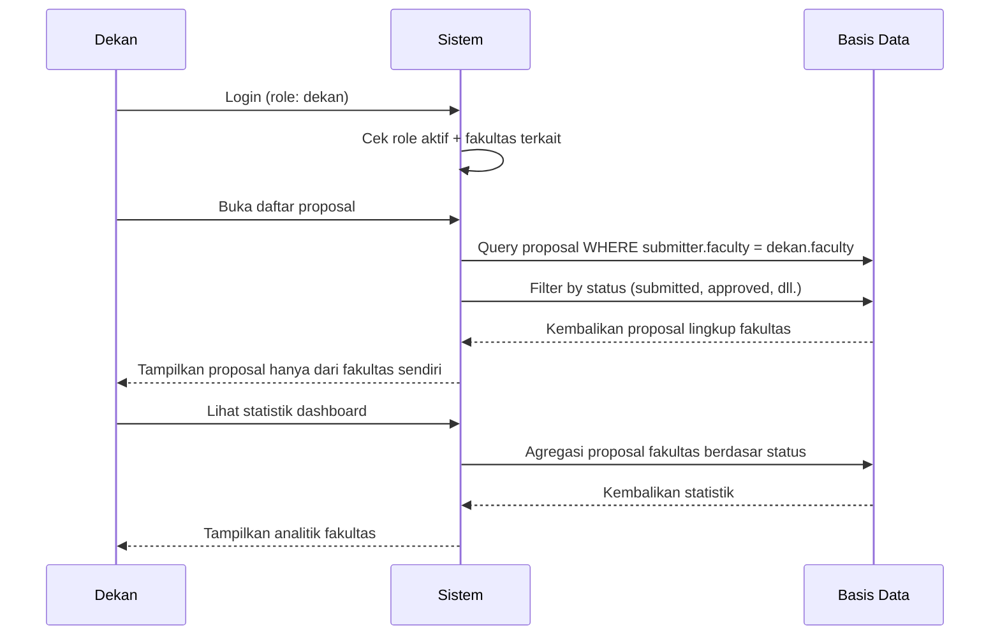

# Dokumentasi Alur Kerja v2.0 (Bahasa Indonesia)
## SIM LPPM ITSNU – Alur Proses Lengkap

**Versi Dokumen:** 2.0  
**Terakhir Diperbarui:** 2025-11-09

---

## Daftar Isi
1. [Siklus Proposal Lengkap](#siklus-proposal-lengkap)
2. [Alur Dosen](#alur-dosen)
3. [Alur Dekan](#alur-dekan)
4. [Alur Kepala LPPM](#alur-kepala-lppm)
5. [Alur Admin LPPM](#alur-admin-lppm)
6. [Alur Reviewer](#alur-reviewer)
7. [Ringkasan Eksekutif](#ringkasan-eksekutif)

---

## Siklus Proposal Lengkap

### Diagram Ikhtisar


### Tabel Progres Status

| Tahap | Status                                 | Aktor       | Durasi     | Langkah Berikutnya           |
| ----- | -------------------------------------- | ----------- | ---------- | ---------------------------- |
| 1     | DRAFT                                  | Dosen       | Variabel   | Undangan tim                 |
| 2     | NEED_ASSIGNMENT                        | Dosen/Tim   | 1-2 minggu | Persetujuan tim              |
| 3     | SUBMITTED                              | Dekan       | 3-5 hari   | Review Dekan                 |
| 4     | APPROVED                               | Kepala LPPM | 2-3 hari   | Persetujuan awal Kepala LPPM |
| 5     | UNDER_REVIEW                           | Admin LPPM  | 1-2 hari   | Penugasan reviewer           |
| 6     | UNDER_REVIEW                           | Reviewer    | 7-14 hari  | Penyelesaian review          |
| 7     | REVIEWED                               | Kepala LPPM | 2-3 hari   | Keputusan akhir              |
| 8     | COMPLETED / REVISION_NEEDED / REJECTED | -           | -          | Terminal atau loop revisi    |

**Durasi Rata-rata Total:** 2-3 minggu (tanpa revisi)

---

## Ringkasan Workflow Keseluruhan

### Gambaran Umum Proses

Sistem SIM LPPM ITSNU mengimplementasikan alur persetujuan multi-tahap yang menyeluruh untuk mengelola siklus hidup proposal penelitian dan pengabdian kepada masyarakat. Proses ini dirancang untuk memastikan transparansi, kolaborasi tim yang efektif, dan evaluasi berkualitas tinggi sebelum persetujuan final.

#### Workflow Lengkap Antar Role


#### Status Workflow & Transisi

```
DRAFT
  ↓
NEED_ASSIGNMENT ← (jika ada penolakan tim)
  ↓
SUBMITTED → APPROVED → UNDER_REVIEW → REVIEWED → COMPLETED
  ↓           ↓           ↓              ↓
  ├─REJECTED  ├─REJECTED  └─REJECTED    ├─REJECTED
  └─REVISION_NEEDED (from REVIEWED, loop ke SUBMITTED)
```

---

### Workflow Berdasarkan Role

#### 1. DOSEN - Peran Pemrakarsa & Revisi


**Aksi Utama Dosen:**
- Membuat proposal (DRAFT)
- Mengundang anggota tim → semua harus menerima
- Submit proposal (SUBMITTED)
- Menerima feedback dari reviewer
- Revisi jika diminta (loop ke SUBMITTED)
- Submit laporan kemajuan (untuk proposal COMPLETED)

---

#### 2. DEKAN - Persetujuan Pertama


**Aksi Utama Dekan:**
- Menerima notifikasi proposal dari fakultas sendiri
- Meninjau proposal dalam 3-5 hari
- Memutuskan: Setujui → APPROVED | Perbaikan Tim → NEED_ASSIGNMENT | Tolak (jarang)
- Hanya melihat proposal dari fakultasnya

---

#### 3. KEPALA LPPM - Dua Tahap Persetujuan


**Aksi Utama Kepala LPPM:**
- **Tahap 1 (Awal):** Menerima proposal APPROVED → verifikasi → UNDER_REVIEW
- **Tahap 2 (Monitor):** Monitoring penugasan reviewer (koordinasi dgn Admin LPPM)
- **Tahap 3 (Akhir):** Menerima proposal REVIEWED → review hasil → keputusan final
  - COMPLETED: Siap eksekusi
  - REVISION_NEEDED: Dosen revisi, resubmit
  - REJECTED: Terminal

---

#### 4. ADMIN LPPM - Koordinator Operasional


**Aksi Utama Admin LPPM:**
- Menerima notifikasi penugasan reviewer
- Memilih reviewer tepat (expertise, no conflict)
- Menugaskan reviewer (1-3 orang) dengan deadline
- Monitoring progres review (reminder, overdue alerts)
- Dokumentasi hasil penugasan

---

#### 5. REVIEWER - Evaluator Ahli


**Aksi Utama Reviewer:**
- Menerima notifikasi penugasan + deadline
- Mengakses dan membaca proposal
- Melakukan evaluasi detail (metodologi, anggaran, feasibility)
- Mengisi review + memilih rekomendasi
- Submit review (final, tidak bisa diubah)
- Menunggu notifikasi keputusan akhir

---

#### Blokir Kritis dalam Workflow

| Kondisi                    | Impact                | Solusi                | Role Terkait        |
| -------------------------- | --------------------- | --------------------- | ------------------- |
| Ada anggota tim menolak    | Tidak bisa submit     | Hapus/ganti anggota   | **Dosen**           |
| Ada anggota tim pending    | Tidak bisa submit     | Tunggu respons semua  | **Dosen, Anggota**  |
| Dekan belum approve        | Terhenti di SUBMITTED | Review dalam 3-5 hari | **Dekan**           |
| Ada reviewer belum selesai | Status UNDER_REVIEW   | Selesaikan review     | **Reviewer, Admin** |
| Kepala LPPM minta revisi   | Loop ke SUBMITTED     | Revisi & resubmit     | **Dosen**           |

---

## Alur Dosen

### Alur 1: Buat & Submit Proposal


**Poin Penting:**
- DRAFT bisa disimpan berkali-kali sebelum submit
- Persetujuan anggota tim WAJIB sebelum submit
- Status menjadi NEED_ASSIGNMENT jika ada anggota menolak
- Submit memicu notifikasi ke Dekan, Admin LPPM, dan Tim

---

### Alur 2: Tangani Penolakan Tim & Resubmit


**Poin Penting:**
- Anggota yang menolak harus diganti sebelum submit ulang
- Status otomatis menjadi NEED_ASSIGNMENT saat ada penolakan
- Dosen dapat menghapus dan mengundang anggota baru
- Resubmit mengikuti alur submit normal

---

### Alur 3: Revisi & Submit Ulang


**Poin Penting:**
- Proposal revisi kembali ke SUBMITTED
- Harus melalui seluruh alur persetujuan lagi (Dekan → Kepala LPPM → Reviewer)
- Dosen dapat melihat semua umpan balik reviewer sebelum revisi
- Tidak ada batas jumlah siklus revisi (dapat ditetapkan sebagai kebijakan)

---

### Alur 4: Submit Laporan Kemajuan


**Poin Penting:**
- Laporan kemajuan dapat semester 1, semester 2, atau tahunan
- Luaran wajib harus diisi (berdasarkan luaran rencana)
- Luaran tambahan untuk pencapaian ekstra
- Laporan bisa disimpan sebagai draft dan disubmit kemudian
- Admin LPPM menerima notifikasi untuk review/persetujuan

---

## Alur Dekan

### Alur 5: Review & Setujui Proposal


**Poin Penting:**
- Dekan adalah pemberi persetujuan PERTAMA (setelah submit)
- Dapat menyetujui atau meminta perbaikan tim
- Tidak dapat menolak langsung (penolakan oleh Kepala LPPM)
- Transisi: SUBMITTED → APPROVED atau NEED_ASSIGNMENT
- Notifikasi ke Kepala LPPM, Pengusul, dan Tim

---

### Alur 6: Penyaringan Tingkat Fakultas



**Poin Penting:**
- Dekan hanya dapat melihat proposal dari fakultasnya
- Sistem otomatis memfilter berdasarkan afiliasi fakultas
- Dashboard menampilkan statistik lingkup fakultas

---

## Alur Kepala LPPM

### Alur 7: Persetujuan Awal (APPROVED → UNDER_REVIEW)


**Poin Penting:**
- Kepala LPPM memberi PERSETUJUAN AWAL setelah Dekan
- Transisi: APPROVED → UNDER_REVIEW
- Memicu Admin LPPM menugaskan reviewer
- Kepala LPPM dapat menolak di tahap ini (jarang)
- Tidak menugaskan reviewer langsung (tugas Admin LPPM)

---

### Alur 8: Keputusan Akhir (REVIEWED → COMPLETED/REVISION_NEEDED)


**Poin Penting:**
- Keputusan akhir oleh Kepala LPPM SETELAH semua review selesai
- Hanya dapat dilakukan saat status = REVIEWED
- Opsi: Setujui (COMPLETED), Minta Revisi, atau Tolak
- Proposal disetujui siap dieksekusi (kegiatan penelitian/PKM)
- Revisi mengembalikan ke Dosen, lalu ulang alur

---

## Alur Admin LPPM

### Alur 9: Menugaskan Reviewer


**Poin Penting:**
- Admin LPPM menugaskan reviewer SETELAH persetujuan awal Kepala LPPM
- Dapat menugaskan beberapa reviewer untuk satu proposal
- Pemilihan reviewer berdasarkan keahlian (focus area, tipe riset)
- Sistem mencegah penugasan duplikat (unique constraint)
- Admin dapat memantau progres review
- Dapat melepas/menugaskan ulang sebelum review selesai

---

## Alur Reviewer

### Alur 11: Review Proposal


**Poin Penting:**
- Reviewer hanya dapat melihat proposal yang ditugaskan
- Status review: 'pending' → 'reviewing' → 'completed'
- Catatan review berisi umpan balik untuk Dosen & Kepala LPPM
- Rekomendasi wajib (approved/revision_needed/rejected)
- Status proposal menjadi REVIEWED hanya ketika SEMUA reviewer selesai
- Kepala LPPM diberi tahu saat semua review selesai

---

### Alur 12: Sistem Pengingat Review


**Poin Penting:**
- Pengingat otomatis (pekerjaan terjadwal)
- Pengingat 3 hari sebelum deadline
- Notifikasi overdue 1 hari setelah deadline
- Admin LPPM diberi tahu untuk tindak lanjut
- Reviewer dapat meminta perpanjangan ke Admin

---

## Ringkasan Eksekutif

### Rantai Persetujuan Lengkap

**Urutan yang Benar:**

```
1. DRAFT → Dosen membuat proposal
2. Undangan Tim → Semua harus MENERIMA sebelum submit
3. SUBMITTED → Dosen submit (jika semua menerima)
4. APPROVED → Dekan menyetujui (persetujuan pertama)
5. UNDER_REVIEW → Persetujuan awal Kepala LPPM (kedua)
6. Penugasan Reviewer → Admin LPPM menugaskan reviewer
7. Review → Reviewer menilai dan merekomendasikan
8. REVIEWED → Semua reviewer selesai (otomatis)
9. COMPLETED/REVISION_NEEDED → Keputusan akhir Kepala LPPM (ketiga)
```

### Aktor & Tanggung Jawab Utama

| Aktor           | Tanggung Jawab Utama         | Aksi Kritis                                                                                         |
| --------------- | ---------------------------- | --------------------------------------------------------------------------------------------------- |
| **Dosen**       | Pembuatan & submit proposal  | Buat, undang tim, submit, revisi, laporan kemajuan                                                  |
| **Anggota Tim** | Penerimaan kolaborasi        | Terima/tolak undangan                                                                               |
| **Dekan**       | Persetujuan tingkat fakultas | Setujui proposal (SUBMITTED → APPROVED)                                                             |
| **Kepala LPPM** | Pengawasan strategis         | Persetujuan awal (APPROVED → UNDER_REVIEW) + keputusan akhir (REVIEWED → COMPLETED/REVISION_NEEDED) |
| **Admin LPPM**  | Koordinasi operasional       | Tugaskan reviewer, kelola master data, kelola pengguna                                              |
| **Reviewer**    | Evaluasi ahli                | Review proposal, beri rekomendasi                                                                   |

### Pemicu Notifikasi

| Kejadian                     | Penerima                    | Kanal      |
| ---------------------------- | --------------------------- | ---------- |
| Proposal Disubmit            | Dekan, Admin LPPM, Tim      | Email + DB |
| Undangan Tim                 | Anggota yang diundang       | Email + DB |
| Penerimaan Tim               | Pengusul                    | DB         |
| Penolakan Tim                | Pengusul                    | DB         |
| Persetujuan Dekan            | Kepala LPPM, Pengusul, Tim  | Email + DB |
| Persetujuan Awal Kepala LPPM | Admin LPPM                  | Email + DB |
| Reviewer Ditugaskan          | Reviewer                    | Email + DB |
| Review Selesai (satu)        | Admin LPPM                  | DB         |
| Semua Review Selesai         | Kepala LPPM, Admin LPPM     | Email + DB |
| Keputusan Akhir              | Pengusul, Tim, Dekan, Admin | Email + DB |
| Pengingat Review             | Reviewer                    | Email      |
| Review Overdue               | Reviewer, Admin LPPM        | Email      |

### Jalur Alternatif

**Jalur Penolakan:**
```
SUBMITTED → (Dekan tolak) → REJECTED (terminal)
APPROVED → (Kepala LPPM tolak) → REJECTED (terminal)
REVIEWED → (Kepala LPPM tolak) → REJECTED (terminal)
```

**Jalur Revisi:**
```
REVIEWED → (Kepala LPPM minta revisi) → REVISION_NEEDED
REVISION_NEEDED → (Dosen revisi) → SUBMITTED (ulang alur)
```

**Jalur Perbaikan Tim:**
```
SUBMITTED → (Dekan minta perbaikan tim) → NEED_ASSIGNMENT
NEED_ASSIGNMENT → (Dosen perbaiki tim) → SUBMITTED (lanjut alur)
Status apa pun → (Anggota tim menolak) → NEED_ASSIGNMENT
```

### Waktu Proses Rata-rata

| Tahap                         | Durasi         | Risiko Bottleneck                  |
| ----------------------------- | -------------- | ---------------------------------- |
| Pembuatan Proposal            | 3-7 hari       | Beban Dosen                        |
| Persetujuan Tim               | 1-2 minggu     | Respons anggota                    |
| Review Dekan                  | 3-5 hari       | Beban fakultas                     |
| Persetujuan Awal Kepala       | 2-3 hari       | Waktu telaah strategis             |
| Penugasan Reviewer            | 1-2 hari       | Koordinasi Admin                   |
| Evaluasi Reviewer             | 7-14 hari      | **TINGGI** - Ketersediaan reviewer |
| Keputusan Akhir Kepala        | 2-3 hari       | Analisis hasil review              |
| **TOTAL (tanpa revisi)**      | **2-3 minggu** | -                                  |
| **Dengan satu siklus revisi** | **4-6 minggu** | -                                  |

### Otomasi Sistem

**Aksi Otomatis:**
1. Transisi ke NEED_ASSIGNMENT saat ada penolakan tim
2. Transisi ke REVIEWED saat semua reviewer selesai
3. Pengiriman notifikasi di setiap tahap alur
4. Perhitungan total anggaran (volume × unit_price)
5. Pengingat tenggat review (3 hari sebelum)
6. Pemberitahuan review terlambat (1 hari sesudah)
7. Laporan ringkas harian/mingguan ke Admin/Kepala

**Aksi Manual:**
1. Pembuatan dan pengisian proposal
2. Keputusan terima/tolak undangan tim
3. Keputusan persetujuan Dekan
4. Persetujuan awal Kepala LPPM
5. Penugasan reviewer oleh Admin
6. Evaluasi & rekomendasi oleh Reviewer
7. Keputusan akhir Kepala LPPM
8. Pengajuan laporan kemajuan

---

**Akhir Dokumen**
